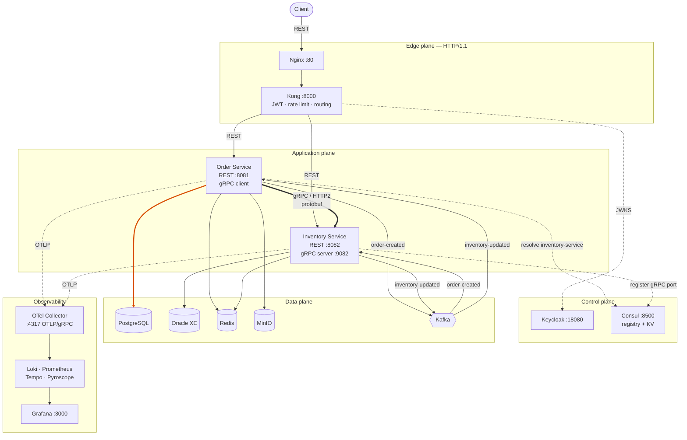
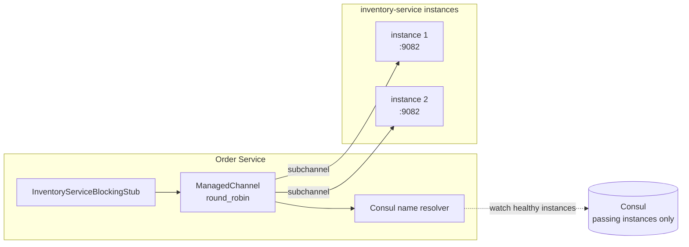
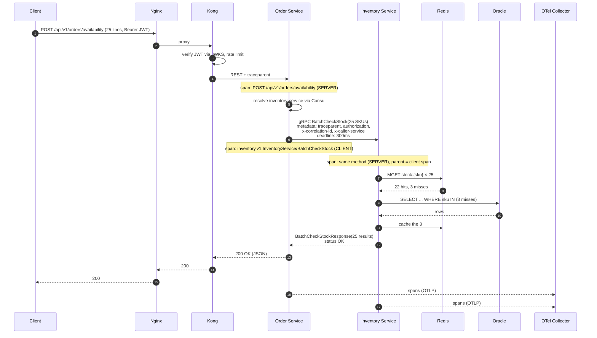
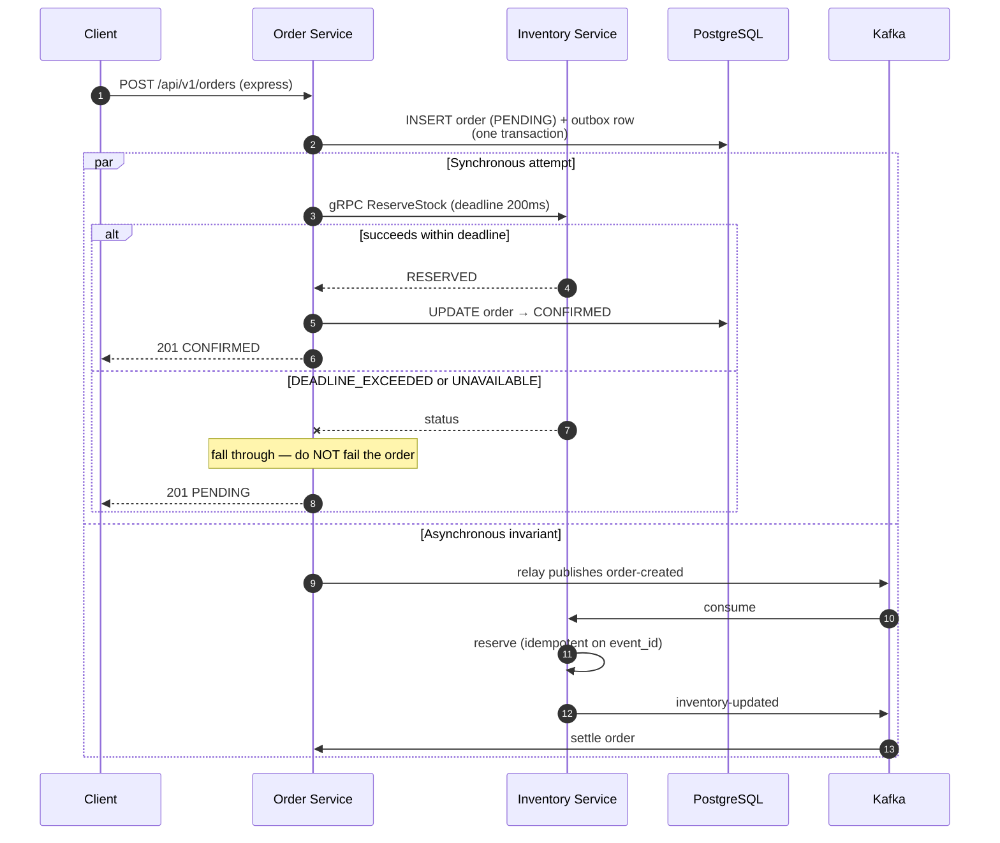
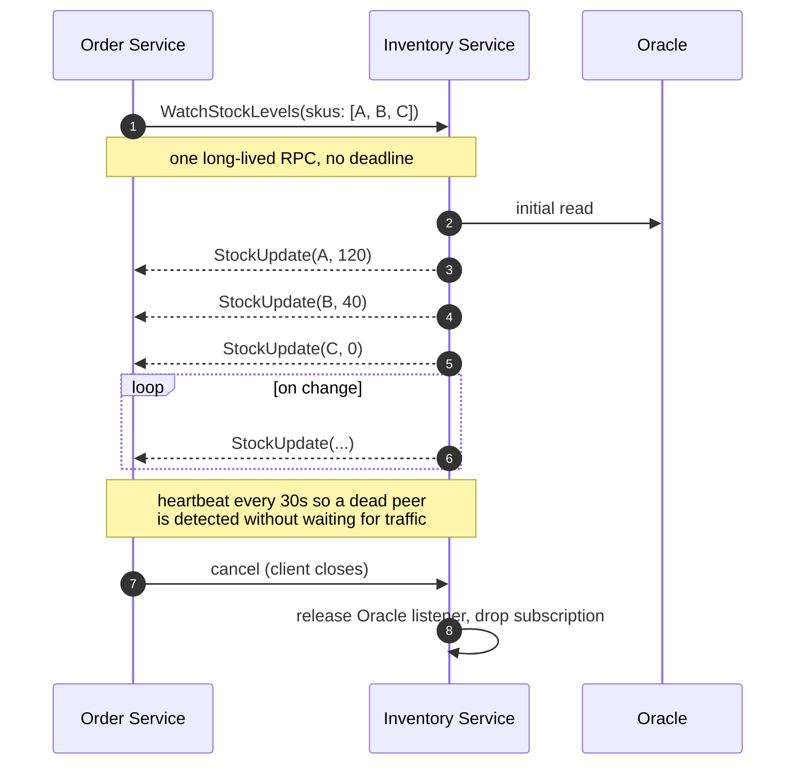
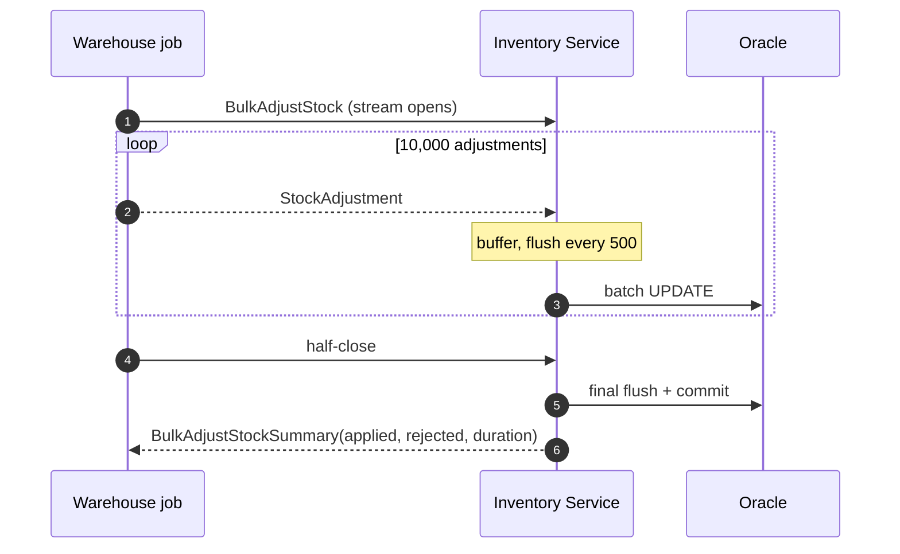

# gRPC Architecture

How gRPC fits into the Enterprise Microservice Observability Lab: the communication matrix, the
channel design, propagation, and the flows that exercise each RPC type.

Prerequisite reading: [GRPC_ENHANCEMENT_ANALYSIS.md](GRPC_ENHANCEMENT_ANALYSIS.md), which justifies
the decision. This document specifies it.

---

## 1. Communication matrix

Every hop in the system, and the protocol it uses. **Protocol choice follows the coupling the hop
can tolerate**, not preference.

| # | Hop | Protocol | Sync | Purpose | Why this protocol |
| --- | --- | --- | :---: | --- | --- |
| 1 | Client → Nginx | HTTP/1.1 | ✓ | Network entry, TLS termination | Universal client support |
| 2 | Nginx → Kong | HTTP/1.1 | ✓ | Proxy to API policy layer | Kong's plugin stack is HTTP-native |
| 3 | Kong → Service | HTTP/1.1 REST + JSON | ✓ | Public API routing | Gateway policy — JWT, rate limit — operates on HTTP |
| 4 | Kong → Keycloak | HTTPS (JWKS) | ✓ | Signature verification keys | OIDC is an HTTP standard |
| 5 | **Order → Inventory** | **gRPC / HTTP/2 + protobuf** | ✓ | **Stock queries, express reservation** | **Internal, latency-sensitive, contract-enforced, streaming-capable** |
| 6 | Order → Kafka → Inventory | Kafka + JSON | ✗ | `order-created`: authoritative reservation | Must survive Inventory being down |
| 7 | Inventory → Kafka → Order | Kafka + JSON | ✗ | `inventory-updated`: settlement | Same — decoupled availability |
| 8 | Service → Consul | HTTP | ✓ | Registration, health, KV config | Consul's API |
| 9 | Service → PostgreSQL / Oracle | JDBC | ✓ | System of record | — |
| 10 | Service → Redis | RESP | ✓ | Cache | — |
| 11 | Service → MinIO | HTTP (S3) | ✓ | Invoice objects | S3 compatibility |
| 12 | Service → OTel Collector | **gRPC / OTLP** | ✗ | Telemetry egress | Already gRPC today — see §1.1 |
| 13 | Prometheus → Service | HTTP | ✓ | Metric scrape | Pull model |
| 14 | Service → Pyroscope | HTTP | ✗ | Profile push | — |

### 1.1 gRPC is already in this system

Row 12 is worth pausing on. **The services already speak gRPC** — OTLP over gRPC on port 4317 is how
every trace leaves the process today. What is new is gRPC as an *application* protocol, between two
services this system owns, with a contract this system maintains.

### 1.2 The rule, stated once

> **REST at the edge. gRPC between services when the caller must wait. Kafka when it must not.**

| If the caller… | Use |
| --- | --- |
| is an external client, browser or partner | REST |
| must have the answer to continue, and can tolerate the callee being a hard dependency | gRPC |
| must keep working when the callee is down | Kafka |
| needs many unrelated consumers to react | Kafka |
| needs to stream, either direction | gRPC |

---

## 2. Target architecture

The thick edge is the new hop. Everything else is unchanged.

## 3. Port allocation

gRPC needs its own listener. Reusing the HTTP port would mean running gRPC over the servlet
container, which forfeits HTTP/2 flow control and the Netty transport gRPC is tuned for.

| Service | HTTP (REST) | gRPC | Rationale |
| --- | --- | --- | --- |
| Order Service | 8081 | 9081 *(reserved)* | Client only today; the port is reserved so the numbering stays symmetric if Order ever serves gRPC |
| Inventory Service | 8082 | **9082** | `90xx` mirrors `80xx`, so the pairing is obvious at a glance |

Both remain bound to `127.0.0.1`. Neither gRPC port is exposed through Kong: **gRPC is internal
only**, which is a security property, not an oversight.

## 4. Channel design

### 4.1 Discovery and load balancing

**Client-side load balancing, not proxy-based.** This is the single most important operational
difference between gRPC and the current REST setup, and the most common way gRPC deployments go
wrong.

A gRPC channel opens a **long-lived HTTP/2 connection** and multiplexes every RPC over it. A layer-4
proxy in front of a gRPC service therefore balances *connections*, not *requests* — so one instance
receives every RPC from a given client for the lifetime of that connection, while its peers idle.

The channel must therefore resolve and balance itself:

- The resolver watches Consul for `inventory-service` instances whose health check is **passing**
  (the existing `query-passing: true` already enforces this).
- The channel keeps one subchannel per instance and applies `round_robin` **per RPC**.
- Instances appearing or disappearing update the subchannel set without dropping in-flight calls.

### 4.2 Channel configuration

| Setting | Value | Why |
| --- | --- | --- |
| `keepAliveTime` | 30 s | Detects a silently dead peer. Without keepalive a half-open connection is discovered only when an RPC hangs until its deadline. |
| `keepAliveTimeout` | 10 s | How long to wait for the keepalive ack before declaring the connection dead. |
| `keepAliveWithoutCalls` | true | An idle channel must still notice a dead peer, or the first RPC after a quiet period pays the discovery cost. |
| `idleTimeout` | 5 min | Release connections to instances no longer receiving traffic. |
| `maxInboundMessageSize` | 4 MiB | Default. A batch response for 50 SKUs is kilobytes; a larger limit is a memory-exhaustion vector. |
| `defaultLoadBalancingPolicy` | `round_robin` | Not `pick_first` — the default would use one instance and ignore the rest. |
| `enableRetry` | true | With a service config that retries only safe status codes. See [GRPC_ERROR_HANDLING.md](GRPC_ERROR_HANDLING.md). |

One channel per target service, shared across the application. A channel is expensive to create and
cheap to share; creating one per call is the gRPC equivalent of opening a new database connection per
query.

## 5. Metadata propagation

gRPC metadata is the HTTP/2 header set. Everything the current system propagates over HTTP headers
propagates here, with one addition.

| Key | Direction | Source | Purpose |
| --- | --- | --- | --- |
| `traceparent` | client → server | OTel agent, automatically | W3C trace context |
| `tracestate` | client → server | OTel agent | Vendor trace state |
| `authorization` | client → server | Token relay interceptor | End-user identity, same as the Feign relay today |
| `x-correlation-id` | client → server | Correlation interceptor | Business transaction id |
| `x-request-id` | client → server | Correlation interceptor | Single request id |
| `x-caller-service` | client → server | Correlation interceptor | **New.** Which service made the call |
| `grpc-timeout` | client → server | gRPC runtime, from the deadline | Remaining budget, in the protocol itself |

**`x-caller-service` is new and worth its own line.** With REST the caller is inferable from the
network path. With gRPC and client-side balancing, several callers may share the same connection
pattern. Making the caller explicit means the Inventory Service can answer "who is generating this
load" from its own logs and metrics, without correlating against a trace.

**`grpc-timeout` has no HTTP equivalent.** The caller's remaining budget travels with the call. The
server can see it, and can decline to start work it cannot finish — which is the difference between
shedding load and doing work nobody is waiting for.

---

## 6. Flows

### 6.1 Batch stock check — the N+1 fix

The flow that motivated the change. One RPC replaces one HTTP call per basket line.

**One round trip instead of 25.** The Oracle query becomes a single `IN` predicate rather than 25
point lookups, and the cache is consulted once with `MGET`.

### 6.2 Express reservation — gRPC and Kafka on the same flow

Synchronous when possible, asynchronous always. The Kafka path is the invariant.

**Why this is safe.** Both paths carry the same `event_id`. The Inventory Service's existing
`processed_events` table deduplicates, so whichever arrives second is a no-op that replays the
recorded decision. The synchronous attempt is a latency optimisation that cannot change the outcome.

**Why the deadline is 200 ms.** Shorter than the caller's own budget, so a slow Inventory surfaces as
a fast `PENDING` rather than as a slow request. See [GRPC_ERROR_HANDLING.md §1](GRPC_ERROR_HANDLING.md#1-timeouts-and-deadlines).

### 6.3 Server streaming — live stock watch

**A streaming RPC breaks the unary span model**, which is the reason it earns a place in this lab. A
span covering a stream open for an hour tells you nothing useful. The treatment is in
[GRPC_OBSERVABILITY.md §3.4](GRPC_OBSERVABILITY.md#34-streaming-rpcs-break-the-unary-model).

### 6.4 Client streaming — bulk reconciliation

**Flow control comes free.** HTTP/2 back-pressure means a slow Oracle slows the producer rather than
filling a buffer until the process dies — the failure mode a REST endpoint accepting a 10,000-element
JSON array would have.

---

## 7. What each protocol carries, side by side

The same conceptual operation — "does this SKU have stock" — travels three ways in this system. That
is the comparison the lab exists to make.

| | REST (`GET /api/v1/stock/{sku}`) | gRPC (`CheckStock`) | Kafka (`order-created`) |
| --- | --- | --- | --- |
| Caller waits | Yes | Yes | No |
| Contract | OpenAPI, hand-copied DTO | `.proto`, generated both sides | JSON, hand-copied record |
| Encoding | JSON text | Protobuf binary | JSON text |
| Transport | HTTP/1.1, one request per connection | HTTP/2, multiplexed | TCP, batched |
| Typical payload (25 SKUs) | ~25 × 250 B + 25 envelopes | ~1 × 900 B | n/a |
| Round trips (25 SKUs) | 25 | 1 | 1 publish |
| Failure of callee | 5xx, caller degrades | `UNAVAILABLE`, caller degrades | No effect — event is durable |
| Authoritative | No (advisory) | No (advisory) / Yes (`ReserveStock`) | **Yes** |
| Streaming | No | Yes | Log semantics |
| Public | Yes | No | No |

---

## 8. Deployment and configuration

| Concern | Approach |
| --- | --- |
| Registration | Inventory registers its gRPC port in Consul as a second port on the same service, tagged `grpc`. The HTTP health check on `/actuator/health` remains authoritative for both. |
| Health checking | gRPC's own `grpc.health.v1.Health` service is exposed for gRPC-native clients, and reports the same state as the actuator endpoint. Two protocols, one source of truth. |
| Reflection | Enabled under `local` and `dev` so `grpcurl` works without the `.proto`. **Disabled under `prod`** — reflection publishes the full service schema to anyone who can reach the port. |
| TLS | Plaintext in the lab, as everywhere else here; every port binds to loopback. A real deployment uses mTLS between services, which gRPC supports natively and which is where a service mesh would take over. |
| Compression | gzip enabled for responses above 1 KiB. Below that the CPU cost exceeds the transfer saving. |

## 9. Design decisions

| ID | Decision | Rationale | Consequence |
| --- | --- | --- | --- |
| ADR-11 | gRPC for Order → Inventory synchronous calls | A measurable N+1 on the checkout path, a class of silent contract bug, and three access patterns REST expresses poorly | A second transport to operate and observe; the comparison is the teaching material |
| ADR-12 | Separate gRPC port, not the servlet container | Keeps HTTP/2 flow control and the Netty transport gRPC is tuned for | One more port, one more listener to health-check |
| ADR-13 | Client-side load balancing via Consul, no proxy | A gRPC channel is long-lived; an L4 proxy pins all RPCs to one instance | The client owns balancing; instance changes must reach the resolver |
| ADR-14 | Kafka remains authoritative for reservation | Availability decoupling is the property gRPC cannot provide | Two paths to the same effect; idempotency makes it safe |
| ADR-15 | Inventory's REST API is retained | It is public, gateway-routed, and used by clients that will never speak gRPC | Two transports over one application service — deliberate, and the behaviour is shared |
| ADR-16 | Proto owned by the provider, additive-only | A consumer-owned or shared-by-committee schema becomes a distributed monolith | Breaking changes require a new versioned package, never an edit |
