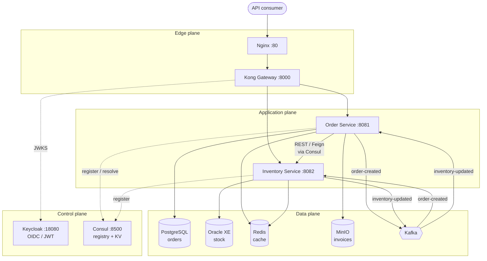

# gRPC Enhancement — Architecture Analysis

**Status:** design proposal
**Scope:** introduce production-grade gRPC service-to-service communication into the Enterprise
Microservice Observability Lab, without removing or weakening any existing pattern.

This document is the analysis that precedes the change. It records what exists today, what is
genuinely missing, and why gRPC — rather than "more REST" or "more Kafka" — is the right answer to
a specific problem this system already has.

Companion documents:
[GRPC_ARCHITECTURE.md](GRPC_ARCHITECTURE.md) ·
[GRPC_PROTO_DESIGN.md](GRPC_PROTO_DESIGN.md) ·
[GRPC_OBSERVABILITY.md](GRPC_OBSERVABILITY.md) ·
[GRPC_ERROR_HANDLING.md](GRPC_ERROR_HANDLING.md) ·
[GRPC_FAILURE_SIMULATION.md](GRPC_FAILURE_SIMULATION.md) ·
[SYSTEM_ARCHITECTURE.md](SYSTEM_ARCHITECTURE.md)

---

# Part 1 — Current Architecture Review

## 1.1 Existing service topology

Two Spring Boot 3.5 services on Java 21, each owning its own system of record, behind a two-tier
edge, with a full four-signal observability stack.



| Service | Context | System of record | Port |
| --- | --- | --- | --- |
| Order Service | Ordering | PostgreSQL | 8081 |
| Inventory Service | Stock | Oracle XE | 8082 |

## 1.2 Current communication methods

| # | Path | Protocol | Sync/Async | Purpose | Implementation |
| --- | --- | --- | --- | --- | --- |
| 1 | Client → Nginx → Kong → service | HTTP/1.1 REST + JSON | Sync | Public API | Kong routes, JWT plugin |
| 2 | Order → Inventory | HTTP/1.1 REST + JSON (Feign) | Sync | Availability pre-check | `@FeignClient(name="inventory-service")`, resolved through Consul by Spring Cloud LoadBalancer, bearer-token relay |
| 3 | Order → Kafka → Inventory | Kafka, JSON | Async | `order-created`, authoritative stock reservation | Transactional outbox + relay |
| 4 | Inventory → Kafka → Order | Kafka, JSON | Async | `inventory-updated`, settlement | Synchronous publish before offset commit |

Two properties of the existing design are load-bearing and must survive any change:

- **The Kafka path is the authoritative one.** An order is accepted as `PENDING` and settled later.
  This is what lets the Order Service keep accepting orders while the Inventory Service is down.
- **The REST path is explicitly advisory.** `POST /api/v1/orders/availability` reserves nothing. It
  exists so a client can show "in stock" before checkout.

## 1.3 Existing observability

| Signal | Pipeline | Store | Notes |
| --- | --- | --- | --- |
| Logs | Logback JSON → Promtail / Fluent Bit → Loki; Fluentd → OpenSearch | Loki, OpenSearch | 8 correlation fields per line, incl. `trace_id`, `span_id`, `correlation_id` |
| Metrics | Micrometer → `/actuator/prometheus` → Prometheus → remote-write | Prometheus, VictoriaMetrics | Common tags `service`/`environment`/`version`; RED-shaped histograms |
| Traces | OpenTelemetry **Java agent** → OTLP → Collector | Tempo, Jaeger, Zipkin | Collector fans out to all three |
| Profiles | Pyroscope agent (async-profiler) | Pyroscope | CPU, alloc, live heap, lock contention |

All four are linked in Grafana: log → trace → profile, and trace → logs/metrics.

Critically for this proposal: **traces are produced by the OpenTelemetry Java agent, not by hand-written
instrumentation.** The agent already ships gRPC client and server instrumentation. This materially
changes the cost of adopting gRPC — see §2.4.

---

# Part 2 — The Gap

## 2.1 The concrete problem: an N+1 remote call on the checkout path

The advisory availability check is implemented as **one sequential HTTP call per basket line**:

```java
// AvailabilityService — current implementation
public List<AvailabilityView> check(List<CreateOrderCommand.Line> lines) {
    return lines.stream().map(this::checkOne).toList();   // one HTTP round trip per line
}
```

The code comment is honest about it:

> *"One call per SKU, sequentially. Honest for the handful of lines an order carries."*

That assumption does not survive contact with a real basket. The cost is linear in basket size, and
every term in the sum is a full HTTP/1.1 request:

| Basket lines | Round trips | Approx. added latency @ 3 ms/call | JSON envelopes parsed |
| --- | --- | --- | --- |
| 1 | 1 | 3 ms | 1 |
| 10 | 10 | 30 ms | 10 |
| 25 | 25 | 75 ms | 25 |
| 50 | 50 | 150 ms | 50 |

Against a stated non-functional target of **p95 < 300 ms end to end**, a 25-line basket spends a
quarter of its entire budget on a pre-check that reserves nothing.

This is not a hypothetical. It is a measurable defect in the system as built, and it is exactly the
shape of problem gRPC exists to solve.

## 2.2 Why "just add a REST batch endpoint" is the wrong fix

The obvious counter-proposal — `POST /api/v1/stock/batch` taking a list of SKUs — would fix the round
trips and nothing else. It leaves five problems untouched:

| Problem | Still present with REST batch |
| --- | --- |
| **No enforced contract.** The Order Service hand-maintains `StockLevelResponse` as a copy of a contract it does not own. Step 09 shipped a defect where it decoded the API envelope into the payload type and silently produced `availableQuantity: 0` for every SKU — a stock-out that never happened. | Yes |
| **No type safety across the boundary.** A field rename on the producer is a runtime surprise on the consumer. | Yes |
| **Text encoding on the hot path.** JSON parse/serialise cost per element, plus field names repeated on the wire for every item. | Yes |
| **No streaming.** A live stock feed or a bulk warehouse upload has no natural representation. | Yes |
| **HTTP/1.1 head-of-line blocking.** One connection carries one request at a time; concurrency means more connections. | Yes |

The envelope-decoding defect deserves emphasis: it was **invisible**. The call returned `200 OK`, the
response deserialised without error, and every field was zero. A schema-enforced contract makes that
class of bug a compile-time failure instead of a silent wrong answer in production.

## 2.3 Observability gaps

| Gap | Consequence today |
| --- | --- |
| **No protocol dimension in metrics.** `http_server_requests_seconds_*` covers external and internal traffic identically. | Cannot answer "is internal service-to-service latency degrading" separately from "is the public API degrading". |
| **Internal calls are indistinguishable from external.** Both are HTTP to `/api/v1/stock/{sku}`. | Rate limits, SLOs and alerts cannot be set differently for the two, though they have completely different characteristics and owners. |
| **No status-code taxonomy for internal failures.** HTTP 500 covers "bad argument", "not found", "downstream timeout" and "bug". | The Feign error decoder has to reverse-engineer intent from a status code that was never designed to carry it. |
| **No contract-level observability.** Nothing reports which version of the stock contract a caller is using. | A breaking change is discovered by a caller failing, not by a dashboard showing old-version traffic. |

## 2.4 Why the cost of adopting gRPC here is unusually low

The OpenTelemetry Java agent — already attached to both services — ships instrumentation for
`grpc-java` on both client and server. That means:

- gRPC spans appear in Tempo/Jaeger/Zipkin **with no code change**.
- `traceparent` propagates into gRPC metadata **automatically**, via the same W3C propagator already
  in use for HTTP and Kafka.
- The existing `trace_id` / `span_id` MDC injection continues to work, so gRPC server logs correlate
  with everything else out of the box.

Micrometer likewise ships a `grpc-server`/`grpc-client` metrics binding. The observability integration
is configuration, not new instrumentation code — which is precisely why this is a realistic
enterprise move rather than a rewrite.

---

# Part 3 — Proposed gRPC Integration

## 3.1 Which services communicate over gRPC

**Order Service (client) → Inventory Service (server).** One new gRPC listener on the Inventory
Service; one new gRPC client in the Order Service.

Nothing else changes protocol. Specifically:

- The **public API stays REST.** Clients, the gateway, and Inventory's own REST endpoints are untouched.
- The **Kafka reservation flow stays exactly as it is.** It remains the authoritative path.
- Inventory's existing **REST API remains** and is still reachable through the gateway.

## 3.2 The business scenario

> **Checkout stock validation for a multi-line basket.**
>
> A customer with 25 items in their basket presses *Checkout*. Before the order is accepted, the
> storefront needs a per-line availability answer fast enough to render a page. The answer is
> advisory — the authoritative reservation still happens asynchronously — but it must be *quick* and
> it must be *correct per line*.
>
> Additionally, the merchandising team needs a live feed of stock levels for a watchlist of
> reservation-critical SKUs, and the warehouse system needs to push nightly reconciliation
> adjustments in bulk.

Those three needs map onto three gRPC method shapes, which is the honest test of whether gRPC is
warranted: if only one unary call were needed, REST batch would be a defensible alternative.

| Need | RPC | Type | Why this shape |
| --- | --- | --- | --- |
| Per-line checkout validation | `BatchCheckStock` | Unary | One round trip regardless of basket size; the direct fix for §2.1 |
| Single-SKU lookup (product page) | `CheckStock` | Unary | The simple case; also the migration target for the current Feign call |
| Live watchlist | `WatchStockLevels` | Server streaming | Server pushes on change; polling would be either stale or expensive |
| Nightly reconciliation | `BulkAdjustStock` | Client streaming | Thousands of adjustments as one flow-controlled call, one transaction boundary |
| Express-path reservation | `ReserveStock` | Unary, short deadline | Complements — does not replace — the Kafka path. See §3.4 |

## 3.3 Why gRPC rather than REST *for this hop specifically*

| Property | Why it matters here |
| --- | --- |
| **Contract-first, schema-enforced** | The `.proto` is owned by Inventory and generates both server stubs and client stubs. The envelope-decoding defect from step 09 becomes impossible: there is no hand-maintained copy to drift. |
| **Binary encoding** | Protobuf is materially smaller and cheaper to parse than JSON. For a 50-line batch response this is the difference between a few hundred bytes and several kilobytes. |
| **HTTP/2 multiplexing** | Many concurrent RPCs share one connection; no head-of-line blocking, no connection-pool tuning per call site. |
| **First-class streaming** | Server, client and bidirectional streaming are protocol features, not a WebSocket bolted on beside the API. |
| **A status taxonomy designed for RPC** | `NOT_FOUND` vs `INVALID_ARGUMENT` vs `RESOURCE_EXHAUSTED` vs `DEADLINE_EXCEEDED` vs `UNAVAILABLE` — distinctions HTTP status codes genuinely cannot express. Retry policy can key off them. |
| **Deadlines propagate** | A deadline set by the caller travels with the call and is visible to the server, which can abandon work nobody is waiting for. HTTP has no equivalent. |

## 3.4 Why REST and Kafka both remain

This is the part that makes the design enterprise-shaped rather than a protocol swap.

**REST stays at the edge** because the edge has different requirements from an internal hop:

- Browsers and mobile clients speak HTTP/JSON natively; gRPC-Web needs a proxy.
- Kong's policy stack — JWT verification, rate limiting, request transformation — operates on HTTP.
- Public APIs are read by humans, tried in `curl`, and documented in OpenAPI.
- Third parties integrate over REST; a `.proto` is a heavier onboarding cost for an external partner.

**Kafka stays for state changes** because gRPC cannot do what it does:

- **Availability decoupling.** `order-created` survives Inventory being down. A gRPC call does not.
  This is the single most important reason the reservation flow must not move to gRPC.
- **Fan-out.** A third consumer of `order-created` requires no change to the producer.
- **Replay.** The topic is a durable log; a consumer can be rewound.
- **Buffering.** A traffic spike queues instead of applying back-pressure to the caller.

The resulting rule, which every service in this system follows:

> **REST at the edge. gRPC between services when the caller must wait. Kafka when it must not.**

## 3.5 Sync/async on one flow

The express-path `ReserveStock` deserves explanation, because "synchronous reservation" sounds like
it contradicts §3.4.

It does not replace the Kafka flow — it races it, with a deadline:

- The Order Service issues `ReserveStock` with a **200 ms deadline** for orders on the express path.
- If it succeeds, the order is confirmed synchronously and the customer sees `CONFIRMED` immediately.
- If it returns `DEADLINE_EXCEEDED` or `UNAVAILABLE`, the order is accepted as `PENDING` exactly as
  today, and the Kafka path settles it.

This is a real and common enterprise pattern: **synchronous when possible, asynchronous when
necessary**, with the asynchronous path as the invariant rather than the fallback nobody tested.
Idempotency makes it safe — both paths carry the same `event_id`, and the Inventory Service's
existing `processed_events` deduplication means a reservation cannot be applied twice.

## 3.6 What this adds to the lab as a learning system

| Capability | Newly observable |
| --- | --- |
| Protocol comparison | The *same* logical operation over REST and over gRPC, on identical traffic — payload size, latency distribution, connection behaviour |
| Contract management | Proto versioning, backward compatibility, breaking-change detection |
| Streaming telemetry | How a long-lived streaming RPC appears in traces and metrics, where a unary span model does not fit |
| RPC status semantics | Retry policy driven by status code, and what happens when the mapping is wrong |
| Deadline propagation | A deadline crossing a service boundary, and a server abandoning work whose caller has gone |
| Client-side load balancing | gRPC resolving Consul and balancing across instances itself, rather than a proxy doing it |

## 3.7 Risks and how the design addresses them

| Risk | Mitigation |
| --- | --- |
| Two code paths for stock reads (REST and gRPC) | Deliberate and documented. The REST endpoint stays public; the gRPC path is internal. Both delegate to the same application service — one behaviour, two transports. |
| gRPC is not human-debuggable like `curl` | Server reflection enabled in `local`/`dev` so `grpcurl` works; disabled in `prod`. |
| Binary payloads are opaque in logs | Never log payloads (see [GRPC_OBSERVABILITY.md](GRPC_OBSERVABILITY.md)); log method, status, duration and correlation ids. |
| Proto becomes a distributed monolith | The proto is owned by the Inventory Service, versioned, and additive-only. Breaking changes require a new package version. |
| Load balancing is subtler than HTTP | gRPC holds long-lived connections, so a naive L4 proxy pins all traffic to one instance. Addressed explicitly in [GRPC_ERROR_HANDLING.md §Load balancing](GRPC_ERROR_HANDLING.md#5-load-balancing). |

---

## 4. Recommendation

Adopt gRPC for Order → Inventory synchronous communication, as specified in
[GRPC_ARCHITECTURE.md](GRPC_ARCHITECTURE.md).

The decision is justified not by gRPC being modern, but by a measurable defect (§2.1), a class of
silent bug the current design permits (§2.2), and three access patterns REST cannot express well
(§3.2). REST and Kafka both remain, each doing the job it is actually better at.
