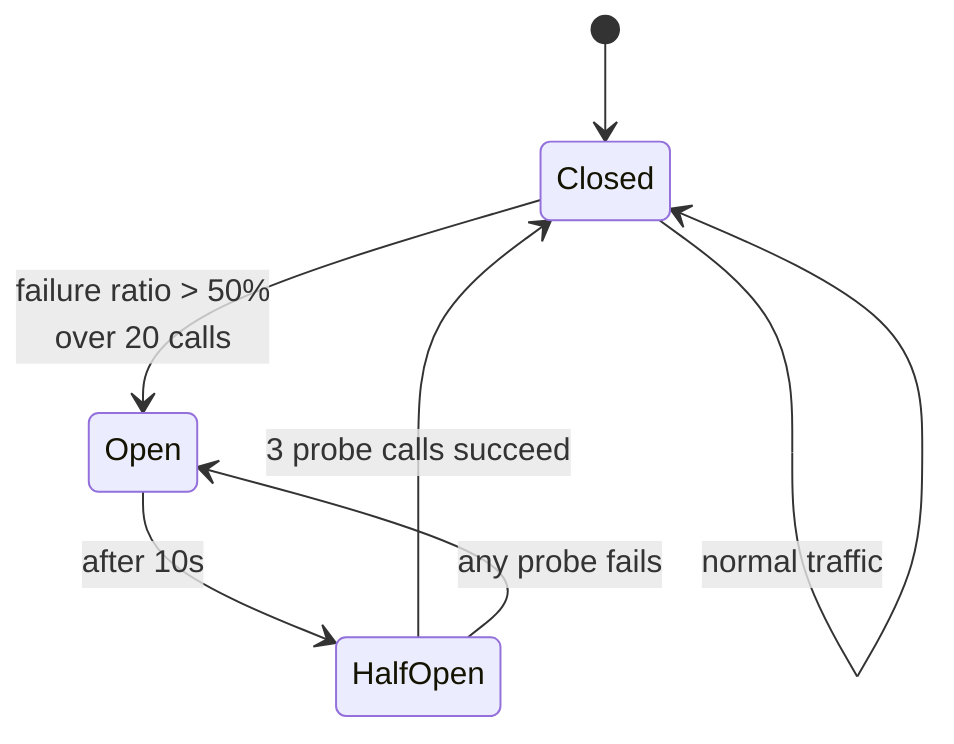

# gRPC Error Handling and Reliability

Status codes, deadlines, retries, circuit breaking and load balancing for the Order → Inventory gRPC
hop.

The status taxonomy is the part most teams get wrong, and getting it wrong is expensive in a specific
way: **the retry policy keys off the status code**. A database timeout reported as `INTERNAL` is not
retried and the request fails; reported as `UNAVAILABLE` it is retried against another instance and
succeeds. The mapping is not documentation — it is control flow.

---

# 1. Status codes

## 1.1 The taxonomy

gRPC defines 17 statuses. This is what each means and when this system uses it.

| Status | Meaning | Retryable | Used here for |
| --- | --- | :---: | --- |
| `OK` | Success | — | Every successful call |
| `INVALID_ARGUMENT` | The request is malformed **regardless of system state** | ❌ | Empty `product_sku`; batch larger than 100; negative quantity |
| `FAILED_PRECONDITION` | Well-formed, but the **current state** forbids it | ❌ | Reserving against an order already `CANCELLED` |
| `OUT_OF_RANGE` | A value outside a valid range; a caller can detect the end | ❌ | Pagination past the end (not currently used) |
| `NOT_FOUND` | The named entity does not exist | ❌ | A SKU inventory does not track |
| `ALREADY_EXISTS` | Creating something that is already there | ❌ | Registering a SKU that exists |
| `PERMISSION_DENIED` | Authenticated, but not allowed | ❌ | A caller without the `ADMIN` role calling `BulkAdjustStock` |
| `UNAUTHENTICATED` | No valid credentials | ❌ | Missing or expired bearer token in metadata |
| `RESOURCE_EXHAUSTED` | A quota or capacity limit was hit | ✅ with backoff | Per-caller rate limit; gRPC executor queue full |
| `ABORTED` | Concurrency conflict — optimistic lock, transaction abort | ✅ | Optimistic lock failure on `stock_levels` |
| `UNAVAILABLE` | The service is unreachable or not accepting work **right now** | ✅ | Shutting down; Oracle unreachable; circuit open |
| `DEADLINE_EXCEEDED` | The deadline passed before completion | ⚠️ only if budget remains | Oracle query slower than the caller's budget |
| `CANCELLED` | The caller went away | ❌ | Client disconnected mid-stream |
| `INTERNAL` | **A bug.** An invariant this service guarantees was broken | ❌ | Unexpected exception, serialisation failure |
| `UNKNOWN` | An error with no better classification | ❌ | Exception escaping without a mapping — treat any occurrence as a defect in the mapping |
| `DATA_LOSS` | Unrecoverable data corruption | ❌ | Not used |
| `UNIMPLEMENTED` | Method not implemented on this server | ❌ | Client calling a v2 method against a v1 server |

## 1.2 The three distinctions that matter

### `INVALID_ARGUMENT` vs `FAILED_PRECONDITION`

> Would the request be valid if the system were in a different state?

- **No** → `INVALID_ARGUMENT`. An empty `product_sku` is wrong whatever the database contains.
- **Yes** → `FAILED_PRECONDITION`. Reserving against a cancelled order would have worked a minute ago.

This matters because the caller's response differs: `INVALID_ARGUMENT` means *fix the request*,
`FAILED_PRECONDITION` means *re-read state and reconsider*.

### `UNAVAILABLE` vs `INTERNAL` — the expensive one

> Is there any chance a different instance, or the same one later, would succeed?

- **Yes** → `UNAVAILABLE`. Retryable, and safe to retry against another instance.
- **No** → `INTERNAL`. A bug. Retrying only multiplies the load.

The example the task specification calls out, and why it matters:

```
A database query exceeds its timeout.

WRONG:   INTERNAL
         ⇒ not retried, request fails, and the alert points at the
           Inventory Service as if it had a bug

RIGHT:   UNAVAILABLE   (this instance cannot serve right now)
   or:   DEADLINE_EXCEEDED  (the caller's budget ran out)
         ⇒ retried against a healthy instance, or surfaced honestly
           as a timeout
```

### `DEADLINE_EXCEEDED` vs `UNAVAILABLE`

Both mean "no answer", and the difference is **whose budget ran out**:

- `DEADLINE_EXCEEDED` — the deadline the *caller set* expired. Retrying only makes sense if the
  caller's remaining budget allows it, which usually it does not.
- `UNAVAILABLE` — the *server* declined. Retrying against another instance is exactly right.

Blurring these produces a retry storm against an already-slow service — the classic way a partial
degradation becomes a full outage.

## 1.3 Exception mapping

The service throws domain exceptions; a single interceptor maps them. Handlers never construct a
`StatusRuntimeException` themselves — one mapping in one place, or the taxonomy drifts per method.

| Existing exception | gRPC status | Note |
| --- | --- | --- |
| `ValidationException` | `INVALID_ARGUMENT` | Field violations go in the error details |
| `ResourceNotFoundException` | `NOT_FOUND` | |
| `BusinessException` | `FAILED_PRECONDITION` | State-dependent refusal |
| `BusinessException` (duplicate) | `ALREADY_EXISTS` | By error code |
| `UnauthorizedException` | `UNAUTHENTICATED` | |
| `ForbiddenException` | `PERMISSION_DENIED` | |
| `OptimisticLockingFailureException` | `ABORTED` | Retryable — a concurrency conflict, not a fault |
| `QueryTimeoutException`, `CannotAcquireLockException` | `UNAVAILABLE` | **Not `INTERNAL`.** §1.2 |
| `DataAccessResourceFailureException` | `UNAVAILABLE` | Database unreachable |
| `IntegrationException` (timeout) | `DEADLINE_EXCEEDED` | |
| `TechnicalException`, anything unmapped | `INTERNAL` | Logged at `ERROR` with a stack trace |

This mirrors the HTTP `GlobalExceptionHandler` deliberately: **one exception hierarchy, two transport
mappings.** The same refusal is a 422 over REST and `FAILED_PRECONDITION` over gRPC, and neither
counts as a fault.

## 1.4 Error details, not error messages

gRPC carries structured error detail alongside the status, via `google.rpc.Status`. Use it — a
message string forces the client to parse English.

```
status:  INVALID_ARGUMENT
message: "request validation failed"
details: [
  BadRequest {
    field_violations: [
      { field: "items[3].product_sku", description: "must not be blank" },
      { field: "items",               description: "at most 100 items" }
    ]
  }
]
```

Two rules:

- **Never put an error in a successful response.** A `status: OK` carrying `error_message` means
  every client must check two places, and one of them will be forgotten.
- **Never leak internals.** No SQL, no stack traces, no hostnames in the message. The client gets the
  status, a generic message and the trace id; the detail is in the logs, behind access control. Same
  policy as the existing HTTP error envelope.

---

# 2. Timeouts and deadlines

## 2.1 Deadlines, not timeouts

A timeout is local: "I will wait 300 ms." A **deadline is absolute and propagates**: "this call must
complete by 10:00:00.300."

The difference matters across more than one hop. With timeouts, a chain of three services each
waiting 300 ms can take 900 ms. With deadlines, the budget travels in `grpc-timeout` metadata and each
hop sees what remains — and a server can decline work whose caller has already given up.

**Every gRPC call in this system sets a deadline. A call without one is a defect**, because a hung
call holds a thread until the connection dies.

## 2.2 The budget

| Call | Deadline | Reasoning |
| --- | --- | --- |
| `CheckStock` | 200 ms | Single point read, cache-backed |
| `BatchCheckStock` | 300 ms | One `IN` query; larger batch, same shape |
| `ReserveStock` (express) | **200 ms** | Deliberately tight — this is an optimisation. Missing it costs nothing but a fall-through to `PENDING` |
| `WatchStockLevels` | none | A long-lived stream; a deadline would kill it. Bounded by keepalive instead |
| `BulkAdjustStock` | 5 min | Thousands of records; the ceiling is a stuck-job guard, not a latency target |

**Deadlines shrink as you go inward.** The caller's budget must exceed the callee's, or the callee's
timeout never fires and the caller times out first — losing the more specific error:

```
Client HTTP request budget        3000 ms
  └─ Order Service handler        1000 ms
      └─ gRPC BatchCheckStock      300 ms   ← callee budget
          └─ Oracle query          250 ms   ← smaller still
```

This is the same principle already applied to the Feign client, whose 5 s read timeout is documented
as *"deliberately shorter than this service's own request budget, so a slow dependency surfaces as a
504 here rather than as a timeout experienced by our caller."*

## 2.3 Server-side deadline awareness

The server can read the remaining budget and decline work it cannot finish:

```java
if (Context.current().getDeadline() != null
        && Context.current().getDeadline().timeRemaining(MILLISECONDS) < 50) {
    // Not enough budget left to be worth starting. Fail fast rather than
    // spending an Oracle connection on a result nobody will receive.
    responseObserver.onError(Status.DEADLINE_EXCEEDED
            .withDescription("insufficient remaining deadline")
            .asRuntimeException());
    return;
}
```

Under load this is the difference between shedding load and doing work that is thrown away — which is
how a slow service becomes an unavailable one.

---

# 3. Retries

## 3.1 What may be retried

Two conditions, both required:

1. **The status is retryable** — `UNAVAILABLE`, `RESOURCE_EXHAUSTED`, `ABORTED`.
2. **The operation is idempotent, or carries an idempotency key.**

| RPC | Retryable | Why |
| --- | :---: | --- |
| `CheckStock` | ✅ | Read-only |
| `BatchCheckStock` | ✅ | Read-only |
| `ReserveStock` | ✅ | **Because of `event_id`.** The same key yields the same outcome; the existing `processed_events` table makes a duplicate a replay |
| `WatchStockLevels` | ✅ re-subscribe | Client re-establishes; may need to reconcile missed updates |
| `BulkAdjustStock` | ❌ | Client-streaming, non-idempotent. Retry means re-running the job with a new correlation id |

`ReserveStock` is worth dwelling on. It mutates state and is still safe to retry — **not because
retrying is harmless, but because idempotency was designed in.** The `event_id` is the same key the
Kafka path uses, which is what lets both paths race without double-reserving. Idempotency is what
makes retries possible; without it, a retryable status on a mutating call is a correctness bug.

## 3.2 Policy

gRPC's built-in retry, configured in the channel's service config — so the policy is data, not code
scattered across call sites.

```json
{
  "methodConfig": [{
    "name": [{ "service": "inventory.v1.InventoryService" }],
    "retryPolicy": {
      "maxAttempts": 3,
      "initialBackoff": "0.05s",
      "maxBackoff": "0.5s",
      "backoffMultiplier": 2.0,
      "retryableStatusCodes": ["UNAVAILABLE", "RESOURCE_EXHAUSTED", "ABORTED"]
    }
  }]
}
```

| Setting | Value | Reasoning |
| --- | --- | --- |
| `maxAttempts` | 3 | Two retries. Beyond that the deadline expires anyway, and more attempts multiply load on a struggling dependency |
| `initialBackoff` | 50 ms | Must fit inside the deadline. 50 + 100 = 150 ms of backoff inside a 300 ms budget leaves room for the attempts themselves |
| `backoffMultiplier` | 2.0 | Exponential. Linear backoff does not shed enough load fast enough |
| `retryableStatusCodes` | 3 only | **`DEADLINE_EXCEEDED` is deliberately absent.** The budget is already gone; retrying guarantees another failure while adding load |

**Retries are bounded by the deadline, not only by the attempt count.** When the deadline expires
mid-backoff the call fails immediately — which is the property that stops retries turning a slow
dependency into an outage.

## 3.3 Jitter and the thundering herd

Exponential backoff alone synchronises: every client that failed at the same instant retries at the
same instant. **Jitter is not optional at scale.**

gRPC's built-in retry applies randomisation between attempts. Where retry is implemented in
application code — the express-reservation fall-through, for example — jitter must be added
explicitly, matching the platform rule already stated in
[docs/SystemDesign.md](docs/SystemDesign.md#7-resilience-design): *"Jitter prevents retry storms
synchronising into a thundering herd."*

## 3.4 Retry budget

A per-attempt policy still permits 3× amplification during a partial outage. A **retry budget** caps
retries as a fraction of total requests (typically 10–20%), so retries cannot exceed a small share of
traffic no matter how many calls fail.

Without it, retries make a struggling dependency worse in precisely the situation they were meant to
help — the single most common way a retry policy causes the outage it was defending against.

---

# 4. Circuit breaker

## 4.1 Why, on top of retries

Retries handle a *transient* failure. A circuit breaker handles a *sustained* one. Retrying against a
service that is down wastes the caller's threads and deadline, and adds load to a dependency already
failing.



| State | Behaviour |
| --- | --- |
| **Closed** | Calls pass through. Failures counted in a sliding window |
| **Open** | Calls fail immediately with `UNAVAILABLE`. **The dependency is not contacted at all** |
| **Half-open** | A few probes allowed. Success closes; failure re-opens |

## 4.2 Configuration

| Setting | Value | Reasoning |
| --- | --- | --- |
| Sliding window | 20 calls | Small enough to react quickly, large enough that 2 failures out of 3 does not trip it |
| Failure threshold | 50% | |
| Slow-call threshold | 80% slower than 250 ms | **Trips on slowness, not only errors.** A dependency answering every call in 5 s is as damaging as one returning errors, and a pure error-rate breaker never notices |
| Open duration | 10 s | Long enough to let a restart complete |
| Half-open probes | 3 | |
| **Counted as failure** | `UNAVAILABLE`, `DEADLINE_EXCEEDED`, `RESOURCE_EXHAUSTED` | |
| **Not counted** | `NOT_FOUND`, `INVALID_ARGUMENT`, `FAILED_PRECONDITION`, `PERMISSION_DENIED` | **Business outcomes must never open a circuit.** A catalogue full of untracked SKUs would otherwise trip the breaker and take out a healthy service |

That last row is the most common misconfiguration in practice, and it fails in the worst direction:
the breaker opens because the *data* is unusual, and a perfectly healthy dependency is cut off.

## 4.3 Fallback

An open circuit needs a defined behaviour, not an exception:

| Call | Fallback |
| --- | --- |
| `CheckStock` / `BatchCheckStock` | Return `tracked = false, sufficient = false` for every line, with a flag marking the answer degraded. The UI shows "availability unavailable" rather than a wrong "out of stock" |
| `ReserveStock` (express) | **Fall through to the Kafka path.** The order is accepted as `PENDING`. The customer waits slightly longer; nothing is lost |
| `WatchStockLevels` | Re-subscribe with backoff; the client shows stale data with an age indicator |

The express-reservation fallback is the design paying off: because the asynchronous path is the
invariant rather than a bolt-on, the circuit breaker has somewhere safe to fall back to. **A circuit
breaker with no fallback is just a faster failure.**

## 4.4 Observability

A breaker that opens silently is worse than none. Every transition is:

- A **metric**: `resilience4j_circuitbreaker_state`, `..._calls_total{kind="failed"}`
- A **log line** at `WARN`, with the from/to states and the failure ratio that caused it
- A **span event** on the call that triggered it

---

# 5. Load balancing

## 5.1 Why gRPC load balancing is different

This is the operational trap in gRPC, and it catches almost everyone once.

**A gRPC channel opens one long-lived HTTP/2 connection and multiplexes every RPC over it.** A
layer-4 load balancer therefore balances *connections*, not *requests*:

```
❌ L4 proxy in front of gRPC

Order Service ──one connection──► [L4 LB] ──► Inventory #1   ← every RPC
                                          ──► Inventory #2   ← idle
                                          ──► Inventory #3   ← idle
```

The connection is established once and pinned. Scaling out changes nothing, and the symptom — one hot
instance, the rest idle — looks like a scheduling problem rather than a protocol one.

## 5.2 Client-side balancing

The channel resolves instances itself and balances **per RPC**:

```
✅ Client-side balancing

                    ┌──► Inventory #1   ← ~33%
Order Service ──────┼──► Inventory #2   ← ~33%
  (round_robin)     └──► Inventory #3   ← ~33%
        │
        └── resolves via Consul (passing instances only)
```

| Aspect | Configuration |
| --- | --- |
| Resolver | Consul, watching `inventory-service` |
| Health filter | **Passing instances only** — the existing `query-passing: true` already enforces this |
| Policy | `round_robin`, **explicitly**. The gRPC default is `pick_first`, which uses one instance and ignores the rest |
| Subchannels | One per instance, kept warm |
| Update | Instance changes update the subchannel set without dropping in-flight calls |

Setting `round_robin` explicitly is not defensive tidiness. Leaving the default produces exactly the
failure mode in §5.1 while looking correctly configured.

## 5.3 In Kubernetes

The same trap, differently shaped. A standard `ClusterIP` Service is L4 — so gRPC clients pin to
whichever pod they connected to. The options:

| Approach | How |
| --- | --- |
| **Headless Service** | `clusterIP: None`. DNS returns all pod IPs; the gRPC resolver balances across them |
| **Service mesh** | Envoy sidecar does L7 balancing per RPC, transparently |
| **xDS** | gRPC speaks the control-plane protocol directly, no sidecar |

For this lab, Consul plays the role a headless Service or mesh would play in Kubernetes. The
principle is identical: **something must balance at layer 7, and by default nothing does.**

---

# 6. Summary

| Mechanism | Setting | Prevents |
| --- | --- | --- |
| Deadline | 200–300 ms unary | Unbounded waits holding threads |
| Deadline propagation | `grpc-timeout` metadata | Servers doing work nobody awaits |
| Retry | 3 attempts, exponential + jitter, retryable statuses only | Transient failures becoming user-visible |
| Retry budget | ≤ 20% of traffic | Retries amplifying an outage |
| Circuit breaker | 50% failures or 80% slow calls over 20 | Hammering a dependency that is already down |
| Fallback | Degraded answer, or the Kafka path | A breaker that only fails faster |
| Load balancing | Client-side `round_robin` via Consul | One instance taking all traffic |
| Idempotency | `event_id`, shared with the Kafka path | Retries double-reserving stock |

Each of these emits metrics, and each is deliberately breakable — see
[GRPC_FAILURE_SIMULATION.md](GRPC_FAILURE_SIMULATION.md). A resilience mechanism that has never been
observed working is an assumption.
