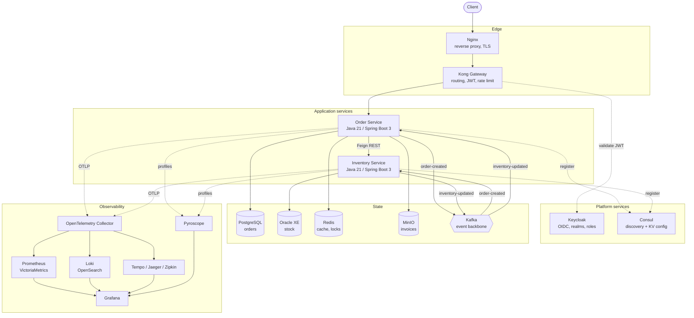

# Enterprise Microservice Observability Lab

A production-shaped microservice system built to be **observed**, not to be sold.

The business logic here is deliberately trivial — create an order, decrement stock. Everything around
it is not. The gateway, the identity provider, the service registry, the polyglot persistence, the
event backbone and the full logs/metrics/traces/profiles pipeline are wired the way a real production
system wires them, so that the interesting question stops being *"what does this code do?"* and
becomes *"how do I find out what this system is doing right now?"*

---

## What this is

- A learning platform for distributed systems, cloud-native architecture and production operations.
- A complete observability stack — logging, metrics, tracing and continuous profiling — with every
  pillar fed by real traffic from real services.
- A place where failure is a feature: endpoints that deliberately time out, leak memory, spike CPU,
  poison a Kafka topic or trip a circuit breaker, so the telemetry has something to show.

## What this is not

- Not a CRUD demo. The domain is small on purpose.
- Not a reference for business modelling. It is a reference for *operability*.
- Not a production deployment. It runs on one machine via Docker Compose, with credentials and
  resource limits sized for a laptop.

---

## Architecture at a glance



A fuller treatment — runtime topology, data ownership, the observability pipelines and the decision
log — is in [docs/Architecture.md](docs/Architecture.md).

---

## Technology stack

| Concern | Technology |
| --- | --- |
| Language / runtime | Java 21 |
| Framework | Spring Boot 3.5.16, Spring Cloud 2025.0.3 |
| Build | Maven (multi-module), Maven Wrapper |
| Reverse proxy | Nginx |
| API gateway | Kong Gateway |
| Identity | Keycloak (OIDC / JWT) |
| Discovery & config | Consul, Consul KV |
| Messaging | Apache Kafka, Kafka UI |
| Cache | Redis |
| Object storage | MinIO |
| Databases | PostgreSQL (Order), Oracle XE (Inventory) |
| Metrics | Micrometer, Prometheus, VictoriaMetrics |
| Logs | Logback JSON, Fluent Bit, Fluentd, Promtail, Loki, OpenSearch, Elasticsearch |
| Traces | OpenTelemetry SDK + Collector, Tempo, Jaeger, Zipkin |
| Profiles | Pyroscope agent + server |
| Dashboards | Grafana, Kibana, OpenSearch Dashboards |

Two databases and several overlapping backends per telemetry signal are intentional. Comparing Loki
against OpenSearch, or Tempo against Jaeger, on the *same* traffic is the point of the lab.

---

## Repository layout

```
.
├── pom.xml                      parent POM: toolchain contract, dependency governance
├── mvnw, mvnw.cmd, .mvn/        Maven wrapper, pins the build tool version
├── services/
│   ├── shared-library/          cross-service platform code, no business rules
│   ├── order-service/           order lifecycle, PostgreSQL system of record
│   └── inventory-service/       stock levels, Oracle system of record
├── infrastructure/              configuration for every platform and observability component
├── docker/                      Dockerfiles and Compose definitions
├── docs/                        architecture and operations documentation
└── scripts/                     build and operational scripts
```

`infrastructure/` holds *what a component is configured to do*; `docker/` holds *how it is built and
launched*. They are kept apart so either can be read without the other.

## Modules

| Module | Artifact | Port | Responsibility |
| --- | --- | --- | --- |
| `services/shared-library` | `shared-library` | — | API envelope, exception model, correlation/MDC utilities, tracing helpers, base entities. Depends on no service. |
| `services/order-service` | `order-service` | 8081 | Owns the order lifecycle. Origin of the distributed trace, producer of `order-created`. |
| `services/inventory-service` | `inventory-service` | 8082 | Owns stock levels. Consumes `order-created`, produces `inventory-updated`. |

---

## Prerequisites

| Tool | Version | Needed for |
| --- | --- | --- |
| JDK | 21 or newer | Building and running the services |
| Maven | 3.9+ (or use `./mvnw`) | Building |
| Docker + Compose | recent, **8 GB** allocated | Running the infrastructure |

Oracle accounts for most of that memory figure. 6 GB works; below that it will not start.

The build compiles to Java 21 bytecode and enforces the toolchain floor, so an older JDK fails fast
with a message rather than a confusing compilation error.

Check your machine:

```bash
./scripts/verify-toolchain.sh
```

## Build

```bash
./scripts/build.sh          # resolves a JDK 21 toolchain, then runs clean verify
```

or drive Maven directly if your `JAVA_HOME` already points at JDK 21:

```bash
./mvnw clean verify
```

This compiles all modules, runs the tests and produces an executable jar per service.

## Run the infrastructure

Ten containers — gateway, proxy, identity, registry, two databases, broker, cache and object storage
— come up as one stack:

```bash
./scripts/infra.sh up        # start and wait until every container is healthy
./scripts/infra.sh health    # one line per container
./scripts/infra.sh urls      # where every UI lives
./scripts/infra.sh down      # stop, keep the data
./scripts/infra.sh destroy   # stop and delete every volume (asks first)
```

First run pulls several GB and initialises Oracle from scratch, so expect a few minutes. Everything
binds to `127.0.0.1`, and configuration lives in `docker/compose/.env`, created automatically from
the tracked `.env.example`.

Operational detail — network tiers, init scripts, healthcheck timings, troubleshooting — is in
[docs/Infrastructure.md](docs/Infrastructure.md).

## Run a service

The infrastructure must be up first. The wrapper reads the effective ports from
`docker/compose/.env`, so it works even when the stack has been remapped around ports already in use
on the host:

```bash
./scripts/run-service.sh order-service
```

The Order Service starts on port 8081 with the `local` profile, applies its Flyway migrations and
connects to PostgreSQL, Redis and Kafka.

| Endpoint | Purpose |
| --- | --- |
| `POST /api/v1/orders` | Place an order. Returns 201 and publishes `order-created`. |
| `GET /api/v1/orders/{orderNumber}` | Read one order, served from Redis when warm. |
| `GET /api/v1/orders` | List orders, filterable by `customerId` and `status`, paginated. |
| `POST /api/v1/orders/{orderNumber}/cancel` | Cancel. 422 if the status does not allow it. |
| `DELETE /api/v1/orders/{orderNumber}` | Remove a cancelled or rejected order. |
| `GET /actuator/health` | Health, with `liveness` and `readiness` groups. |
| `GET /swagger-ui.html` | API documentation (disabled under `prod`). |

### Inventory Service

```bash
./scripts/run-service.sh inventory-service
```

Starts on port 8082 against Oracle, and consumes `order-created` from Kafka.

| Endpoint | Purpose |
| --- | --- |
| `POST /api/v1/stock` | Start tracking a product. |
| `GET /api/v1/stock/{productSku}` | Read one stock level, served from Redis when warm. |
| `GET /api/v1/stock` | List tracked products, paginated. |
| `POST /api/v1/stock/{productSku}/receive` | Units arrived. |
| `POST /api/v1/stock/{productSku}/release` | Undo a reservation. |
| `POST /api/v1/stock/{productSku}/adjust` | Operator correction. |
| `DELETE /api/v1/stock/{productSku}` | Stop tracking. Refused while units are reserved. |

### Seeing both services work together

With the stack and both services running:

```bash
# Track a product
curl -X POST http://localhost:8082/api/v1/stock \
  -H 'Content-Type: application/json' \
  -d '{"productSku":"SKU-1","initialQuantity":100}'

# Place an order for it
curl -X POST http://localhost:8081/api/v1/orders \
  -H 'Content-Type: application/json' \
  -d '{"customerId":"C-1","currency":"EUR",
       "items":[{"productSku":"SKU-1","quantity":2,"unitPrice":10.50}]}'

# The Inventory Service consumed order-created and reserved the units
curl http://localhost:8082/api/v1/stock/SKU-1
```

Every response carries `meta.requestId`, `meta.correlationId` and `meta.traceId`.

**The loop is deliberately not closed yet.** The Inventory Service records its decision in Oracle but
does not yet tell the Order Service, so orders remain `PENDING` even when stock was reserved. The
reply leg — publishing `inventory-updated` so an order becomes `CONFIRMED` or `REJECTED`, along with
retries, the dead-letter topic and the transactional outbox — is the integration step.

## Configuration profiles

Configuration is split so that environment-specific values never leak into the base file, and
secrets never enter the repository at all.

| Profile | Intent |
| --- | --- |
| `local` (default) | Developer workstation. Verbose application logging, stack traces available on request. |
| `dev` | Shared integration environment. Verbose application logs, framework noise suppressed, no stack traces to callers. |
| `prod` | Conservative. Nothing that leaks internals to a caller, nothing that floods the log pipeline. |

```bash
java -jar services/order-service/target/order-service-1.0.0-SNAPSHOT.jar --spring.profiles.active=dev
```

Every service also carries three identity values — `app.name`, `app.version`, `app.environment` —
that later steps stamp onto every log line, metric tag and span attribute so telemetry can be sliced
by service and environment.

---

## Documentation

| Document | Contents |
| --- | --- |
| [docs/Architecture.md](docs/Architecture.md) | Design principles, system context, runtime topology, communication patterns, observability architecture, decision log |
| [docs/SystemDesign.md](docs/SystemDesign.md) | Module and package design, configuration strategy, port allocation, API and error conventions, resilience and testing strategy |
| [docs/Infrastructure.md](docs/Infrastructure.md) | What runs in Docker, network topology, init scripts, healthchecks, data lifecycle, troubleshooting |

Deployment, Observability, Logging, Metrics, Tracing, Profiling, Kafka, Redis, Gateway, Keycloak,
Consul, MinIO, Runbook, Troubleshooting, Performance and Security guides are produced by the steps
that introduce each capability, and consolidated in step 16.

---

## Implementation roadmap

The lab is built in sequenced steps. Each step is self-contained, leaves the build green, and is
documented before the next one starts.

| Step | Scope | Status |
| --- | --- | --- |
| 01 | Repository foundation: parent POM, modules, docs skeleton | **Complete** |
| 02 | Infrastructure: Docker Compose, networks, volumes, healthchecks | **Complete** |
| 03 | Shared library: DTOs, exceptions, correlation, MDC, base entities | **Complete** |
| 04 | Order Service: CRUD, validation, actuator, OpenAPI, Kafka producer, Redis | **Complete** |
| 05 | Inventory Service: CRUD, validation, actuator, Kafka consumer, Redis | **Complete** |
| 06 | API gateway: Kong routing, rate limiting, JWT plugin; Nginx | Planned |
| 07 | Authentication: Keycloak realm, clients, roles, users, JWT flow | Planned |
| 08 | Service discovery: Consul registration, health, KV configuration | Planned |
| 09 | Integration: end-to-end order flow, Kafka events, MinIO upload, retry, DLQ | Planned |
| 10 | Logging: JSON logs, MDC, Fluent Bit, Fluentd, Promtail, Loki, OpenSearch | Planned |
| 11 | Metrics: Micrometer, Prometheus, VictoriaMetrics, business metrics | Planned |
| 12 | Tracing: OpenTelemetry SDK and Collector, Tempo, Jaeger, Zipkin | Planned |
| 13 | Profiling: Pyroscope agent and server, CPU/heap/alloc/lock profiles | Planned |
| 14 | Dashboards: production-quality Grafana dashboards per signal | Planned |
| 15 | Failure simulation: timeouts, leaks, CPU spikes, DLQ, circuit breakers | Planned |
| 16 | Documentation: runbook, guides, sequence diagrams, final README | Planned |

Specifications live in `PROMPT_MICROSERVICE_OBSERVABILITY_LAB.md` (what to build) and
`PROMPT_MICROSERVICE_OBSERVABILITY_STEPS.md` (the order to build it in).

---

## Conventions

- **Group id** `com.observability.lab`; base package matches, then the service name.
- **Version** is `1.0.0-SNAPSHOT` for every module, managed once in the parent POM.
- **The shared library depends on no service.** Every service depends on it. That direction is not
  negotiable — it is what keeps cross-cutting behaviour identical across services.
- **Dependency versions are never declared in a module.** They come from the Spring Boot BOM, the
  Spring Cloud BOM, or `dependencyManagement` in the parent.
- **Configuration is layered**: base file, then profile file, then environment. Secrets only ever
  come from the environment.
