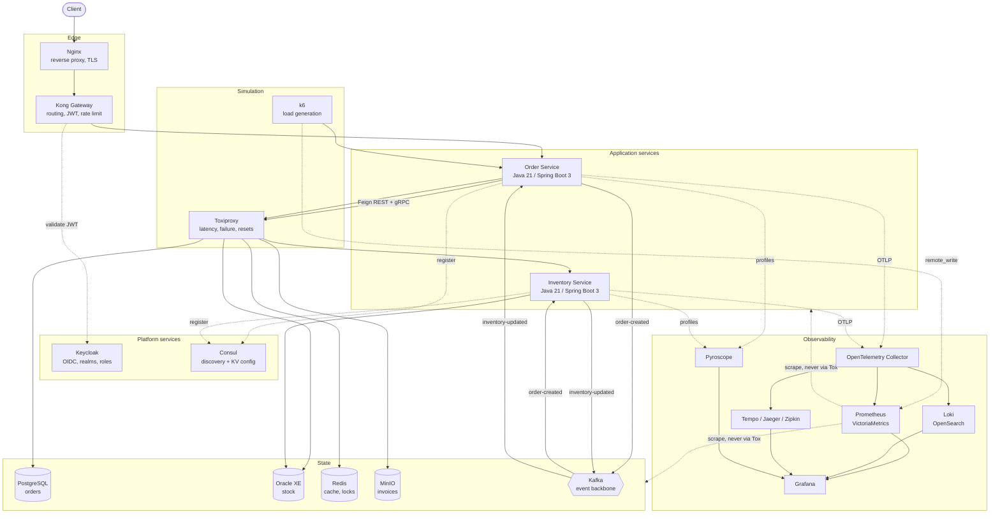

# Enterprise Microservice Observability Lab

A production-shaped microservice system built to be **observed**, not to be sold.

The business logic here is deliberately trivial — create an order, decrement stock. Everything around
it is not. The gateway, the identity provider, the service registry, the polyglot persistence, the
event backbone and the full logs/metrics/traces/profiles pipeline are wired the way a real production
system wires them, so that the interesting question stops being *"what does this code do?"* and
becomes *"how do I find out what this system is doing right now?"*

---

## What this is

- A learning platform for distributed systems, cloud-native architecture and production operations.
- A complete observability stack — logging, metrics, tracing and continuous profiling — with every
  pillar fed by real traffic from real services.
- A place where failure is a feature: endpoints that deliberately time out, leak memory, spike CPU,
  poison a Kafka topic or trip a circuit breaker, so the telemetry has something to show.

## What this is not

- Not a CRUD demo. The domain is small on purpose.
- Not a reference for business modelling. It is a reference for *operability*.
- Not a production deployment. It runs on one machine via Docker Compose, with credentials and
  resource limits sized for a laptop.

---

## Architecture at a glance

Everything below is a container on one Docker network, `lab-net`.



Two edges in that diagram carry most of the design.

Every **application** hop goes through Toxiproxy — including the service-to-service one, because the
Inventory Service registers itself in Consul as `toxiproxy`. With no toxics configured it is a
transparent TCP relay; the moment one is added, that hop is slow, lossy or dead, with no restart
involved.

Every **monitoring** hop does not. When a fault is injected, `postgres-exporter` keeps reporting a
healthy database while the service reports timeouts — and that disagreement is the diagnosis: the
fault is in the path, not the datastore.

A fuller treatment — runtime topology, data ownership, the observability pipelines and the decision
log — is in [docs/Architecture.md](docs/Architecture.md).

---

## Technology stack

| Concern | Technology |
| --- | --- |
| Language / runtime | Java 21 |
| Framework | Spring Boot 3.5.16, Spring Cloud 2025.0.3 |
| Build | Maven (multi-module), Maven Wrapper |
| Reverse proxy | Nginx |
| API gateway | Kong Gateway |
| Identity | Keycloak (OIDC / JWT) |
| Discovery & config | Consul, Consul KV |
| Internal RPC | gRPC, Protocol Buffers |
| Messaging | Apache Kafka, Kafka UI |
| Cache | Redis |
| Object storage | MinIO |
| Databases | PostgreSQL (Order), Oracle XE (Inventory) |
| Metrics | Micrometer, Prometheus, VictoriaMetrics |
| Alerting | Prometheus rules, Alertmanager, Grafana unified alerting, Mailpit |
| Exporters | node, postgres, oracledb, redis, kafka |
| Logs | Logback JSON, Fluent Bit, Fluentd, Promtail, Loki, OpenSearch, Elasticsearch |
| Traces | OpenTelemetry SDK + Collector, Tempo, Jaeger, Zipkin |
| Profiles | Pyroscope agent + server |
| Dashboards | Grafana, Kibana, OpenSearch Dashboards |

Two databases and several overlapping backends per telemetry signal are intentional. Comparing Loki
against OpenSearch, or Tempo against Jaeger, on the *same* traffic is the point of the lab.

---

## Repository layout

```
.
├── pom.xml                      parent POM: toolchain contract, dependency governance
├── mvnw, mvnw.cmd, .mvn/        Maven wrapper, pins the build tool version
├── proto/                       the gRPC contract: inventory/v1, owned by the provider
├── services/
│   ├── shared-library/          cross-service platform code, no business rules
│   ├── order-service/           order lifecycle, PostgreSQL system of record
│   └── inventory-service/       stock levels, Oracle system of record
├── infrastructure/              configuration for every component, including k6 and Toxiproxy
├── docker/                      the service Dockerfile and the five Compose files
├── docs/                        architecture and operations documentation
└── scripts/                     build, operational and simulation scripts
```

`infrastructure/` holds *what a component is configured to do*; `docker/` holds *how it is built and
launched*. They are kept apart so either can be read without the other.

## Modules

| Module | Artifact | Port | Responsibility |
| --- | --- | --- | --- |
| `services/shared-library` | `shared-library` | — | API envelope, exception model, correlation/MDC utilities, tracing helpers, base entities. Depends on no service. |
| `services/order-service` | `order-service` | 8081 | Owns the order lifecycle. Origin of the distributed trace, producer of `order-created`, gRPC **client**. |
| `services/inventory-service` | `inventory-service` | 8082 (REST)<br/>9082 (gRPC) | Owns stock levels. Consumes `order-created`, produces `inventory-updated`, gRPC **server**. |

---

## Prerequisites

| Tool | Version | Needed for |
| --- | --- | --- |
| Docker + Compose | recent, with BuildKit, **10 GB** allocated | Running the entire system |
| JDK | 21 or newer | *Optional* — building outside Docker, or the IDE debug path |
| Maven | 3.9+ (or use `./mvnw`) | *Optional* — same |

Docker is the only hard requirement. The services are compiled inside their image, so a fresh clone
needs nothing but Docker to bring the whole system up.

Oracle and the two services account for most of the memory figure. 8 GB works; below that Oracle will
not start.

The build compiles to Java 21 bytecode and enforces the toolchain floor, so an older JDK fails fast
with a message rather than a confusing compilation error.

Check your machine:

```bash
./scripts/verify-toolchain.sh
```

## Build

Building locally is **optional** — `./scripts/infra.sh up` compiles both services inside their image
and needs no JDK on the machine. Build here when you want the tests, or to iterate faster than an
image rebuild:

```bash
./scripts/build.sh          # resolves a JDK 21 toolchain, then runs clean verify
```

or drive Maven directly if your `JAVA_HOME` already points at JDK 21:

```bash
./mvnw clean verify
```

This compiles all modules, runs the tests and produces an executable jar per service.

## Run the system

**One command starts everything.** Both services, the gateway, identity, registry, two databases, the
broker, cache, object storage, the whole observability stack and the fault proxy — 35 containers, all
on one Docker network, `lab-net`. Nothing runs outside it.

```bash
./scripts/infra.sh up        # build, start, wait until every container is healthy
./scripts/infra.sh health    # one line per container
./scripts/infra.sh urls      # where every UI lives
./scripts/infra.sh build     # rebuild just the two service images
./scripts/infra.sh down      # stop, keep the data
./scripts/infra.sh destroy   # stop and delete every volume (asks first)
```

First run pulls several GB, compiles both services and initialises Oracle from scratch, so expect
about ten minutes. Later runs are much faster — the Maven repository lives in a BuildKit cache mount.

Everything binds to `127.0.0.1`, and configuration lives in `docker/compose/.env`, created
automatically from the tracked `.env.example`.

Published ports exist **for a person** — a browser opening Grafana, a `curl` against an API. Nothing
in the stack talks to anything else through them: every component addresses every other by its
compose name on `lab-net`.

Operational detail — the single network and what it cost, init scripts, healthcheck timings,
troubleshooting — is in [docs/Infrastructure.md](docs/Infrastructure.md).

## Simulate load, failure and slow responses

The reason the whole system is inside one network. Neither of these is possible against a service
running on a laptop.

```bash
./scripts/load.sh smoke                   # 1 VU — is the system wired up?
./scripts/load.sh load                    # 10 orders/s for 5 minutes
./scripts/load.sh stress                  # climb to 100/s until something gives
./scripts/load.sh spike                   # idle, then 80/s in ten seconds
./scripts/load.sh soak                    # 5/s for two hours — finds what accumulates

./scripts/chaos.sh slow postgres 400      # +400ms on every database response
./scripts/chaos.sh slow inventory-grpc 800  # a slow dependency, past its deadline
./scripts/chaos.sh blackhole oracle       # accept connections, answer nothing
./scripts/chaos.sh down redis             # refuse connections outright
./scripts/chaos.sh reset                  # undo everything
```

k6 runs **inside** the network, so it experiences the same network the services do. Toxiproxy sits in
front of every dependency hop — including the service-to-service one — so latency and failure are
injectable at runtime with no restart. k6 remote-writes its metrics into the same Prometheus that
scrapes the platform, which puts a load test and its effect on one time axis.

Combine them; a fault under load behaves nothing like a fault on an idle system:

```bash
./scripts/load.sh load &
sleep 60 && ./scripts/chaos.sh slow postgres 400
```

Scenarios written out signal by signal — what each one *should* show in metrics, logs, traces and
profiles — are in **[docs/Simulation.md](docs/Simulation.md)**.

## The services

Both run as containers and are started by `infra.sh up`. The Order Service is on port 8081 with the
`dev` profile, applies its Flyway migrations, and connects to PostgreSQL, Redis and Kafka.

| Endpoint | Purpose |
| --- | --- |
| `POST /api/v1/orders` | Place an order. Returns 201 `PENDING` and enqueues `order-created` in the outbox. |
| `GET /api/v1/orders/{orderNumber}` | Read one order, served from Redis when warm. |
| `GET /api/v1/orders` | List orders, filterable by `customerId` and `status`, paginated. |
| `POST /api/v1/orders/availability` | Advisory stock check. `?transport=GRPC` (default) is one round trip for the whole basket; `?transport=REST` is one request per line. Reserves nothing. |
| `GET /api/v1/orders/{orderNumber}/invoice` | A short-lived signed URL to the invoice in MinIO. Rebuilds it if absent. |
| `POST /api/v1/orders/{orderNumber}/cancel` | Cancel. 422 if the status does not allow it. |
| `DELETE /api/v1/orders/{orderNumber}` | Remove a cancelled or rejected order. |
| `GET /actuator/health` | Health, with `liveness` and `readiness` groups. |
| `GET /swagger-ui.html` | API documentation (disabled under `prod`). |

### Inventory Service

Port 8082, against Oracle, consuming `order-created` from Kafka, and serving
`inventory.v1.InventoryService` over gRPC on 9082.

| Endpoint | Purpose |
| --- | --- |
| `POST /api/v1/stock` | Start tracking a product. |
| `GET /api/v1/stock/{productSku}` | Read one stock level, served from Redis when warm. |
| `GET /api/v1/stock` | List tracked products, paginated. |
| `POST /api/v1/stock/{productSku}/receive` | Units arrived. |
| `POST /api/v1/stock/{productSku}/release` | Undo a reservation. |
| `POST /api/v1/stock/{productSku}/adjust` | Operator correction. |
| `DELETE /api/v1/stock/{productSku}` | Stop tracking. Refused while units are reserved. |

### Through the gateway

Since step 06 the intended entry point is the edge on port 80, not the service ports:

```
client ──► Nginx :80 ──► Kong :8000 ──► order-service :8081
                                    └─► inventory-service :8082
```

Nginx owns request identity and security headers; Kong owns routing, rate limiting, upstream health
checking and — since step 07 — JWT verification. The service ports stay bound to `127.0.0.1` and are
for operators — calling them directly skips the gateway, but not authentication: the services
validate the token themselves too (see [docs/Keycloak.md](docs/Keycloak.md)).

```bash
./scripts/gateway.sh status      # routes, plugins, upstream health
```

Since step 07 every `/api/**` call needs a Keycloak bearer token. `/actuator/health` and
`/swagger-ui.html` stay open, and `DELETE` requires the `ADMIN` role.

### Seeing both services work together

With the stack and both services running, everything goes through the edge, and every call carries a
token (`./scripts/token.sh` mints one — `alice` is a `USER`, `manager` is an `ADMIN`):

```bash
TOKEN=$(./scripts/token.sh alice)

# Track a product
curl -X POST http://localhost/api/v1/stock \
  -H "Authorization: Bearer $TOKEN" \
  -H 'Content-Type: application/json' \
  -d '{"productSku":"SKU-1","initialQuantity":100}'

# Place an order for it
curl -X POST http://localhost/api/v1/orders \
  -H "Authorization: Bearer $TOKEN" \
  -H 'Content-Type: application/json' \
  -d '{"customerId":"C-1","currency":"EUR",
       "items":[{"productSku":"SKU-1","quantity":2,"unitPrice":10.50}]}'

# The Inventory Service consumed order-created and reserved the units
curl http://localhost/api/v1/stock/SKU-1 -H "Authorization: Bearer $TOKEN"

# ...and answered on inventory-updated, so the order is no longer PENDING
curl http://localhost/api/v1/orders/ORD-... -H "Authorization: Bearer $TOKEN"

# The invoice was uploaded to MinIO; this hands back a signed, expiring link to it
curl http://localhost/api/v1/orders/ORD-.../invoice -H "Authorization: Bearer $TOKEN"
```

The `201` means **accepted**, not fulfilled: the order is `PENDING` until the Inventory Service
decides, which is what lets orders be taken while Inventory is down. It becomes `CONFIRMED` or
`REJECTED` a moment later. [docs/Kafka.md](docs/Kafka.md) traces the whole round trip.

Without the header the edge answers `401`; `DELETE` with `alice`'s token answers `403`, with
`manager`'s it succeeds. The full auth model is in [docs/Keycloak.md](docs/Keycloak.md).

`/actuator` is deliberately not routed through the gateway — health detail and metrics describe
internal topology, so they stay on the service port.

Every response carries `meta.requestId`, `meta.correlationId` and `meta.traceId`.

**The loop is deliberately not closed yet.** The Inventory Service records its decision in Oracle but
does not yet tell the Order Service, so orders remain `PENDING` even when stock was reserved. The
reply leg — publishing `inventory-updated` so an order becomes `CONFIRMED` or `REJECTED`, along with
retries, the dead-letter topic and the transactional outbox — is the integration step.

## Configuration profiles

Configuration is split so that environment-specific values never leak into the base file, and
secrets never enter the repository at all.

| Profile | Intent |
| --- | --- |
| `local` (default) | Developer workstation. Verbose application logging, stack traces available on request. |
| `dev` | Shared integration environment. Verbose application logs, framework noise suppressed, no stack traces to callers. |
| `prod` | Conservative. Nothing that leaks internals to a caller, nothing that floods the log pipeline. |

```bash
java -jar services/order-service/target/order-service-1.0.0-SNAPSHOT.jar --spring.profiles.active=dev
```

Every service also carries three identity values — `app.name`, `app.version`, `app.environment` —
that later steps stamp onto every log line, metric tag and span attribute so telemetry can be sliced
by service and environment.

---

## Documentation

| Document | Contents |
| --- | --- |
| [docs/Architecture.md](docs/Architecture.md) | Design principles, system context, runtime topology, communication patterns, observability architecture, decision log |
| [docs/SystemDesign.md](docs/SystemDesign.md) | Module and package design, configuration strategy, port allocation, API and error conventions, resilience and testing strategy |
| [docs/Infrastructure.md](docs/Infrastructure.md) | What runs in Docker, network topology, init scripts, healthchecks, data lifecycle, troubleshooting |
| [docs/Keycloak.md](docs/Keycloak.md) | Authentication: the realm, clients, roles and users, the JWT flow, and how the gateway and services verify a token |
| [docs/Consul.md](docs/Consul.md) | Service discovery and configuration: registration, health checks, and reading configuration from Consul KV |
| [docs/Kafka.md](docs/Kafka.md) | Event-driven integration: topics, consumer groups, the transactional outbox, idempotency, retry, backoff and the dead-letter topic |
| [docs/Redis.md](docs/Redis.md) | Caching: what is cached and what deliberately is not, key layout, TTL, eviction and after-commit invalidation |
| [docs/MinIO.md](docs/MinIO.md) | Object storage: the invoice bucket, least-privilege credentials, upload timing, object naming and signed URLs |
| [docs/Logging.md](docs/Logging.md) | Structured JSON logs, the MDC lifecycle, the three shipping pipelines, Loki vs OpenSearch, label cardinality and the Grafana dashboard |
| [docs/Metrics.md](docs/Metrics.md) | Micrometer instrument types, common tags and cardinality, histograms vs pre-computed percentiles, Prometheus and VictoriaMetrics, rules and dashboards |
| [docs/Tracing.md](docs/Tracing.md) | The OpenTelemetry agent, the collector fan-out to Tempo/Jaeger/Zipkin, span attributes, events, status and links, and cross-signal correlation |
| [docs/Profiling.md](docs/Profiling.md) | Continuous profiling with async-profiler and Pyroscope: CPU, allocation, live heap and lock contention, and the trace-to-profile link |
| [docs/Alerting.md](docs/Alerting.md) | Alerting: severities and what each means, the full alert matrix, Alertmanager routing, grouping and inhibition, delivery to email and webhook, and the first response to every alert |
| [docs/Grpc.md](docs/Grpc.md) | The internal gRPC hop: the contract and codegen, the interceptor chain, discovery and client-side load balancing, deadlines, status taxonomy, retries, circuit breaking, and what all of it emits |
| [docs/Observability.md](docs/Observability.md) | **The map.** What each of the four signals is for, how they link, the eleven dashboards, and where to look by symptom |
| [docs/Simulation.md](docs/Simulation.md) | **Load, failure and latency on demand.** The k6 scenarios, the Toxiproxy faults, and six worked scenarios stating what every signal should show |

### gRPC — the design behind step 15

| Document | Contents |
| --- | --- |
| [SYSTEM_ARCHITECTURE.md](SYSTEM_ARCHITECTURE.md) | **The cross-protocol view.** Full architecture, communication matrix, the complete request flow across REST, gRPC and Kafka |
| [LEARNING_ROADMAP.md](LEARNING_ROADMAP.md) | Every step, what it teaches, and the reading order by goal |
| [GRPC_ENHANCEMENT_ANALYSIS.md](GRPC_ENHANCEMENT_ANALYSIS.md) | Why gRPC, justified from a measurable N+1 defect in the current REST path |
| [GRPC_ARCHITECTURE.md](GRPC_ARCHITECTURE.md) | Communication matrix, channel design, metadata propagation, the four RPC flows |
| [GRPC_PROTO_DESIGN.md](GRPC_PROTO_DESIGN.md) | The contract: versioning, field numbering, enum evolution, breaking-change prevention |
| [GRPC_OBSERVABILITY.md](GRPC_OBSERVABILITY.md) | gRPC logging, RED and USE metrics, trace propagation, streaming spans, the dashboard |
| [GRPC_ERROR_HANDLING.md](GRPC_ERROR_HANDLING.md) | Status-code taxonomy, deadlines, retries, circuit breaking, load balancing |
| [GRPC_FAILURE_SIMULATION.md](GRPC_FAILURE_SIMULATION.md) | Seven chaos scenarios, with the expected signal-by-signal response for each |

Deployment, Gateway, Runbook, Troubleshooting, Performance and Security guides are produced by the
steps that introduce each capability, and consolidated in step 18. The alert guide, alert matrix
and incident-response notes are in [docs/Alerting.md](docs/Alerting.md).

---

## Implementation roadmap

The lab is built in sequenced steps. Each step is self-contained, leaves the build green, and is
documented before the next one starts.

| Step | Scope | Status |
| --- | --- | --- |
| 01 | Repository foundation: parent POM, modules, docs skeleton | **Complete** |
| 02 | Infrastructure: Docker Compose, networks, volumes, healthchecks | **Complete** |
| 03 | Shared library: DTOs, exceptions, correlation, MDC, base entities | **Complete** |
| 04 | Order Service: CRUD, validation, actuator, OpenAPI, Kafka producer, Redis | **Complete** |
| 05 | Inventory Service: CRUD, validation, actuator, Kafka consumer, Redis | **Complete** |
| 06 | API gateway: Kong routing, rate limiting, JWT plugin; Nginx | **Complete** |
| 07 | Authentication: Keycloak realm, clients, roles, users, JWT flow | **Complete** |
| 08 | Service discovery: Consul registration, health, KV configuration | **Complete** |
| 09 | Integration: end-to-end order flow, Kafka events, MinIO upload, retry, DLQ | **Complete** |
| 10 | Logging: JSON logs, MDC, Fluent Bit, Fluentd, Promtail, Loki, OpenSearch | **Complete** |
| 11 | Metrics: Micrometer, Prometheus, VictoriaMetrics, business metrics | **Complete** |
| 12 | Tracing: OpenTelemetry agent and Collector, Tempo, Jaeger, Zipkin | **Complete** |
| 13 | Profiling: Pyroscope agent and server, CPU/heap/alloc/lock profiles | **Complete** |
| 14 | Dashboards: production-quality Grafana dashboards per signal | **Complete** |
| 15 | Enterprise gRPC: proto contract, streaming, deadlines, retries, circuit breaker, gRPC observability | **Complete** |
| 16 | Alerting: 33 rules in three severities, Alertmanager routing to email and webhook, five exporters, alert guide and matrix | **Complete** |
| — | Containerisation: both services in Docker, four networks collapsed into `lab-net`, k6 load generation and Toxiproxy fault injection | **Complete** |
| **17** | **In-application failure simulation: memory leaks, CPU spikes, deliberate deadlocks, DLQ, exception injection** | Planned |
| 18 | Documentation: runbook, guides, sequence diagrams, final README | Planned |

Specifications live in `PROMPT_MICROSERVICE_OBSERVABILITY_LAB.md` (what to build) and
`PROMPT_MICROSERVICE_OBSERVABILITY_STEPS.md` (the order to build it in).

---

## Conventions

- **Group id** `com.observability.lab`; base package matches, then the service name.
- **Version** is `1.0.0-SNAPSHOT` for every module, managed once in the parent POM.
- **The shared library depends on no service.** Every service depends on it. That direction is not
  negotiable — it is what keeps cross-cutting behaviour identical across services.
- **Dependency versions are never declared in a module.** They come from the Spring Boot BOM, the
  Spring Cloud BOM, or `dependencyManagement` in the parent.
- **Configuration is layered**: base file, then profile file, then environment. Secrets only ever
  come from the environment.
