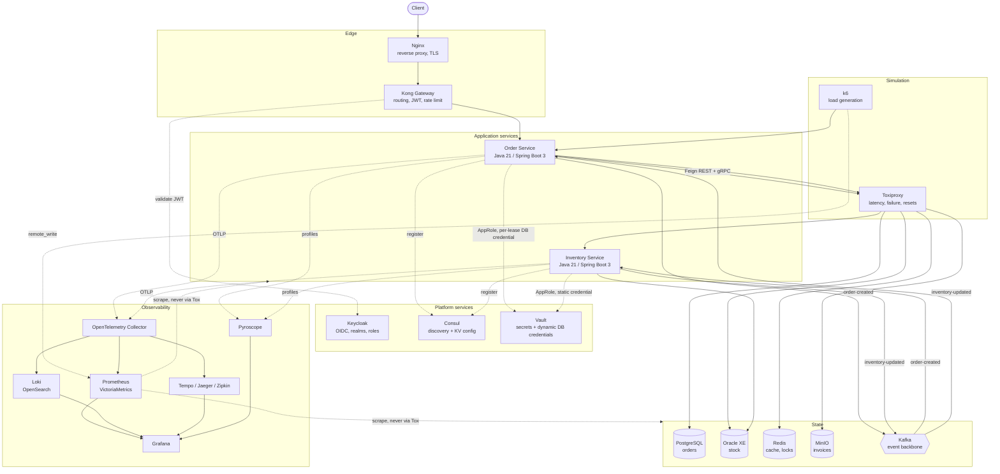

# Enterprise Microservice Observability Lab

A production-shaped microservice system built to be **observed**, not to be sold.

The business logic here is deliberately trivial — create an order, decrement stock. Everything around
it is not. The gateway, the identity provider, the service registry, the polyglot persistence, the
event backbone and the full logs/metrics/traces/profiles pipeline are wired the way a real production
system wires them, so that the interesting question stops being *"what does this code do?"* and
becomes *"how do I find out what this system is doing right now?"*

---

## What this is

- A learning platform for distributed systems, cloud-native architecture and production operations.
- A complete observability stack — logging, metrics, tracing and continuous profiling — with every
  pillar fed by real traffic from real services.
- A place where failure is a feature: endpoints that deliberately time out, leak memory, spike CPU,
  poison a Kafka topic or trip a circuit breaker, so the telemetry has something to show.

## What this is not

- Not a CRUD demo. The domain is small on purpose.
- Not a reference for business modelling. It is a reference for *operability*.
- Not a production deployment. It runs on one machine via Docker Compose, with resource limits sized
  for a laptop. The services' credentials live in Vault; the infrastructure containers' credentials
  still live in a git-ignored `.env`, and [docs/Vault.md §11](docs/Vault.md#11-what-this-step-did-not-do)
  says exactly which and why.

---

## Architecture at a glance

Everything below is a container on one Docker network, `lab-net`.



Two edges in that diagram carry most of the design.

Every **application** hop goes through Toxiproxy — including the service-to-service one, because the
Inventory Service registers itself in Consul as `toxiproxy`. With no toxics configured it is a
transparent TCP relay; the moment one is added, that hop is slow, lossy or dead, with no restart
involved.

Every **monitoring** hop does not. When a fault is injected, `postgres-exporter` keeps reporting a
healthy database while the service reports timeouts — and that disagreement is the diagnosis: the
fault is in the path, not the datastore.

A fuller treatment — runtime topology, data ownership, the observability pipelines and the decision
log — is in [docs/Architecture.md](docs/Architecture.md).

---

## Technology stack

| Concern | Technology |
| --- | --- |
| Language / runtime | Java 21 |
| Framework | Spring Boot 3.5.16, Spring Cloud 2025.0.3 |
| Build | Maven (multi-module), Maven Wrapper |
| Reverse proxy | Nginx |
| API gateway | Kong Gateway |
| Identity | Keycloak (OIDC / JWT) |
| Discovery & config | Consul, Consul KV |
| Secrets | HashiCorp Vault (KV v2, dynamic PostgreSQL credentials, AppRole) |
| Internal RPC | gRPC, Protocol Buffers |
| Messaging | Apache Kafka, Kafka UI |
| Cache | Redis |
| Object storage | MinIO |
| Databases | PostgreSQL (Order), Oracle XE (Inventory) |
| Metrics | Micrometer, Prometheus, VictoriaMetrics |
| Alerting | Prometheus rules, Alertmanager, Grafana unified alerting, Mailpit |
| Exporters | node, postgres, oracledb, redis, kafka |
| Logs | Logback JSON, Fluent Bit, Fluentd, Promtail, Loki, OpenSearch, Elasticsearch |
| Traces | OpenTelemetry SDK + Collector, Tempo, Jaeger, Zipkin |
| Profiles | Pyroscope agent + server |
| Dashboards | Grafana, Kibana, OpenSearch Dashboards |

Two databases and several overlapping backends per telemetry signal are intentional. Comparing Loki
against OpenSearch, or Tempo against Jaeger, on the *same* traffic is the point of the lab.

---

## Repository layout

```
.
├── pom.xml                      parent POM: toolchain contract, dependency governance
├── mvnw, mvnw.cmd, .mvn/        Maven wrapper, pins the build tool version
├── proto/                       the gRPC contract: inventory/v1, owned by the provider
├── services/
│   ├── shared-library/          cross-service platform code, no business rules
│   ├── order-service/           order lifecycle, PostgreSQL system of record
│   └── inventory-service/       stock levels, Oracle system of record
├── infrastructure/              configuration for every component, including k6 and Toxiproxy
├── docker/                      the service Dockerfile and the five Compose files
├── docs/                        architecture and operations documentation
└── scripts/                     build, operational and simulation scripts
```

`infrastructure/` holds *what a component is configured to do*; `docker/` holds *how it is built and
launched*. They are kept apart so either can be read without the other.

## Modules

| Module | Artifact | Port | Responsibility |
| --- | --- | --- | --- |
| `services/shared-library` | `shared-library` | — | API envelope, exception model, correlation/MDC utilities, tracing helpers, base entities. Depends on no service. |
| `services/order-service` | `order-service` | 8081 | Owns the order lifecycle. Origin of the distributed trace, producer of `order-created`, gRPC **client**. |
| `services/inventory-service` | `inventory-service` | 8082 (REST)<br/>9082 (gRPC) | Owns stock levels. Consumes `order-created`, produces `inventory-updated`, gRPC **server**. |

---

## Prerequisites

| Tool | Version | Needed for |
| --- | --- | --- |
| Docker + Compose | recent, with BuildKit | Running the entire system |
| JDK | 21 or newer | *Optional* — building outside Docker, or the IDE debug path |
| Maven | 3.9+ (or use `./mvnw`) | *Optional* — same |

Docker is the only hard requirement. The services are compiled inside their image, so a fresh clone
needs nothing but Docker to bring the whole system up.

The build compiles to Java 21 bytecode and enforces the toolchain floor, so an older JDK fails fast
with a message rather than a confusing compilation error.

Check your machine:

```bash
./scripts/verify-toolchain.sh
```

### Host requirements

Two configurations, far enough apart to be worth separating. **Default** is `./scripts/infra.sh up`:
35 services, 32 of them long-running. **Everything** adds the `search` and `load` profiles, for 41
services — the configuration to size for if you want every component up at once.

These are the resources that must reach *the containers*, which is not the same as the machine's specs:

| Resource | Default stack | Everything enabled |
| --- | --- | --- |
| RAM available to containers | **10 GB** (8 GB floor) | **14 GB** |
| CPU cores | 4 | 6–8 |
| Free disk | ~20 GB | ~35 GB |
| CPU architecture | x86-64 or arm64 | x86-64 or arm64 |

Below 8 GB, Oracle (capped at 2560M) does not start and the stack fails on its first run.

**How that maps to the machine depends on whether Docker runs inside a VM.**

| Host | Relationship | Physical RAM the machine needs |
| --- | --- | --- |
| **Linux**, Docker Engine | No VM. Containers draw on host RAM directly; there is nothing to allocate | requirement **+ ~2 GB** → 12 GB default, **16 GB** for everything |
| **macOS / Windows**, Docker Desktop | Docker runs in a VM whose memory is carved out of the host up front and unavailable to anything else | requirement **+ 6–8 GB** → 16 GB default, **22–24 GB** for everything |
| **macOS**, Colima / **Windows**, WSL2 | Same VM model, allocation set differently (see below) | as above |

The headroom is not padding. Once the host starts swapping, every latency number the lab produces is
measuring the swap file rather than the system — which defeats the point of running it. The right
allocation is the largest one that still leaves the host comfortable, not the largest Docker accepts.

**Architecture.** Every pinned image is multi-arch, including Oracle: `gvenzl/oracle-free:23` publishes
a native arm64 build, so Apple Silicon and arm64 Linux run the whole stack without emulation. The one
exception is the commented-out `ORACLE_IMAGE=gvenzl/oracle-xe:21-slim-faststart` alternative in
`.env` — 21c XE is x86-64 only, and on arm64 it runs under emulation: slower, and hungrier than the
2560M budget assumes.

**Disk.** The figures cover images, the 19 volumes and the Maven cache mount. Docker's build cache
grows on top of that; a default stack rebuilt a few times measured 25 GB of images, 5 GB of volumes
and a further 10 GB of build cache. `docker builder prune` reclaims the last of those without touching
anything the lab needs. On macOS and Windows the VM's virtual disk has its own ceiling — separate from
free space on the physical drive, and raised in the same settings pane as memory.

**Line endings** are handled by `.gitattributes`, so a Windows clone behaves like a macOS or Linux one
without configuring anything. The one remaining Windows runtime quirk is in
[GETTING_STARTED.md §6](GETTING_STARTED.md#on-windows-one-extra-thing).

### Where the memory goes

The `deploy.resources.limits.memory` values sum to **16.1 GB** for the default stack and **21.1 GB**
with `search` — both larger than the 10 GB and 14 GB recommended above. That is deliberate, and worth
understanding before choosing a number.

**A limit is a kill threshold, not a reservation.** `limits.memory: 768M` does not set 768 MB aside.
It writes one number into the container's cgroup: exceed this and the kernel kills you. The container
starts near zero and grows into it. So the sum of the limits answers *"what if all 32 containers hit
their ceiling at the same instant?"* — a question with no practical bearing on how much RAM to
allocate.

**The stack is overbooked on purpose**, the way an airline sells 160 seats on a 150-seat aircraft. It
works because the passengers do not all show up. Measured on an idle default stack, the 33
long-running containers together use about **5.1 GB against the 16.1 GB of ceilings — 32%.** The
spread across containers is what makes the average:

| Container | In use / ceiling | Ratio |
| --- | --- | --- |
| `redis` | 10 MiB / 384M | **3%** |
| `postgres` | 47 MiB / 768M | **6%** |
| `kafka-exporter` | 10 MiB / 128M | **8%** |
| `prometheus` | 154 MiB / 768M | 20% |
| `oracle` | 865 MiB / 2560M | 34% |
| `kafka` | 490 MiB / 1024M | 48% |
| `order-service` | 594 MiB / 768M | **77%** |

The containers at the top run no managed heap — the exporters are Go, `nginx` and `redis` are C — so
they allocate roughly what they use, and their ceilings exist to contain a leak rather than to describe
a working set. The ones at the bottom are JVMs, already holding a heap they have committed and will
not give back.

**Two ceilings, at two different levels**, and confusing them is the usual sizing mistake:

- **The per-container limit** protects you from *one* container consuming everything. Cross it and only
  that container is killed; the rest keep running. This is a targeted, diagnosable failure.
- **The Docker allocation** is the real total. If the combined resident usage of every container
  exceeds it, the kernel inside the VM starts OOM-killing to reclaim memory, and the victim is not
  necessarily the container responsible.

Per-container limits give no protection whatsoever against the second case. Insurance against that is
what the 10 GB figure actually buys.

**The `search` profile is where the overbooking assumption breaks**, and this is the part worth
knowing before enabling it:

| Component | Ceiling | Behaviour |
| --- | --- | --- |
| `opensearch`, `elasticsearch` | 1536M each | `-Xms768m -Xmx768m` — setting `-Xms` equal to `-Xmx` **commits the whole heap at startup** instead of growing into it, and unlike a Go process a JVM does not hand committed memory back. Over a gigabyte each once metaspace, thread stacks and off-heap buffers are counted |
| `opensearch-dashboards`, `kibana` | 768M each | Node.js front ends, several hundred MB each |
| `fluentd` | 512M | |

These are passengers who always show up. Where the default stack sits at 33% of its ceilings, `search`
starts near 75% of its own and stays there. The gap that makes the overbooking safe — the entire reason
10 GB covers 16.1 GB of limits — is absent from precisely these five containers.

Reading "+5 GB of ceilings" and reasoning "so about 1.7 GB in practice, like the other 33%" is the
specific mistake that ends in an OOM kill. Budget `search` at close to its stated limits.

The 33% for the default stack is measured. The 75% for `search` is derived from the configured heap
settings rather than observed, so treat it as a floor to budget against, not a prediction.

Add to that the growth under load — the two services climbing to their 768M ceiling, and Prometheus,
Loki, Tempo and VictoriaMetrics expanding as data accumulates over a long session. 14 GB covers the
projected peak with room left over; 10 GB does not.

### Configuring Docker

Where the memory setting lives depends on the runtime. Whichever applies, the change takes effect only
after the VM restarts, and the restart stops every container — bring the stack back with
`./scripts/infra.sh up` afterwards.

**Docker Desktop on macOS**, and **on Windows with the Hyper-V backend** — Settings → Resources →
Advanced. Set *Memory* to 14 GB and *CPUs* to 6 or more, then *Apply & Restart*. The virtual disk
size is on the same pane.

**Docker Desktop on Windows with the WSL 2 backend** — the Resources pane has **no memory slider**,
because WSL owns the VM. Create or edit `%UserProfile%\.wslconfig`:

```ini
[wsl2]
memory=14GB
processors=6
```

Then apply it by shutting WSL down (`wsl --shutdown` in PowerShell) and restarting Docker Desktop.
Editing Docker Desktop's settings instead has no effect on this backend, which is the usual reason a
Windows machine with plenty of RAM still OOM-kills Oracle.

**Colima (macOS / Linux)** — the allocation is fixed when the VM is created, so it must be recreated:

```bash
colima stop && colima start --memory 14 --cpu 6 --disk 100
```

**Docker Engine on Linux** — there is no VM and nothing to allocate. Containers draw on host RAM
directly, so the per-container `deploy.resources.limits` are the only ceilings, and the requirement is
simply that the machine has the RAM free.

Whatever the platform, confirm what the daemon actually received rather than what the settings pane
claims:

```bash
docker info --format 'Memory: {{.MemTotal}} bytes, CPUs: {{.NCPU}}'
```

### Enabling every component

The five `search` containers and the `load` generator are profile-gated, and stay down unless asked
for. Enable them for the whole project by setting the profiles in `docker/compose/.env`, which Compose
reads automatically:

```properties
COMPOSE_PROFILES=search
```

Setting it in `.env` rather than prefixing individual commands means every entry point agrees:
`infra.sh up`, `infra.sh health`, `infra.sh down` and any direct `docker compose` call all see the
same service list, with nothing to remember and nothing left running because one invocation knew
about a profile and the next did not.

**On a Linux host, `search` needs one kernel setting first.** OpenSearch and Elasticsearch both mmap
their indices and refuse to start when `vm.max_map_count` is below 262144, which is above the default
on most distributions. The compose files cannot set it — it is a host-wide kernel parameter:

```bash
sysctl vm.max_map_count                              # check; needs >= 262144
sudo sysctl -w vm.max_map_count=262144                # until the next reboot
echo 'vm.max_map_count=262144' | sudo tee /etc/sysctl.d/99-lab.conf   # permanently
```

This does not apply to Docker Desktop or Colima, whose VMs already ship a sufficient value — which is
why the default stack has never needed it and why this bites only when `search` is first enabled on
Linux. The symptom is an `opensearch` container that exits during startup with `max virtual memory
areas vm.max_map_count [65530] is too low`.

Then start the stack as usual, and generate load in a second terminal:

```bash
./scripts/infra.sh up
./scripts/load.sh load        # starts the k6 container from the `load` profile
```

Note what "everything at once" does and does not buy. The lab deliberately carries alternatives for
the same job — Loki against OpenSearch and Elasticsearch for logs, Prometheus against VictoriaMetrics
for metrics, Tempo against Jaeger against Zipkin for traces. Running them side by side is what makes
comparison on identical traffic possible, and it is the reason `search` exists. It is not a more
faithful production simulation; no production system runs three tracing backends. If realism is the
goal rather than comparison, pick one backend per signal and 10 GB is ample.

## Build

Building locally is **optional** — `./scripts/infra.sh up` compiles both services inside their image
and needs no JDK on the machine. Build here when you want the tests, or to iterate faster than an
image rebuild:

```bash
./scripts/build.sh          # resolves a JDK 21 toolchain, then runs clean verify
```

or drive Maven directly if your `JAVA_HOME` already points at JDK 21:

```bash
./mvnw clean verify
```

This compiles all modules, runs the tests and produces an executable jar per service.

## Run the system

**One command starts everything.** Both services, the gateway, identity, registry, two databases, the
broker, cache, object storage, the secret store, the whole observability stack and the fault proxy — 36 containers, all
on one Docker network, `lab-net`. Nothing runs outside it.

```bash
./scripts/infra.sh up        # build, start, wait until every container is healthy
./scripts/infra.sh health    # one line per container
./scripts/infra.sh urls      # where every UI lives
./scripts/infra.sh build     # rebuild just the two service images
./scripts/infra.sh down      # stop, keep the data
./scripts/infra.sh destroy   # stop and delete every volume (asks first)
```

First run pulls several GB, compiles both services and initialises Oracle from scratch, so expect
about ten minutes. Later runs are much faster — the Maven repository lives in a BuildKit cache mount.

Everything binds to `127.0.0.1`, and configuration lives in `docker/compose/.env`, created
automatically from the tracked `.env.example`.

Published ports exist **for a person** — a browser opening Grafana, a `curl` against an API. Nothing
in the stack talks to anything else through them: every component addresses every other by its
compose name on `lab-net`.

Operational detail — the single network and what it cost, init scripts, healthcheck timings,
troubleshooting — is in [docs/Infrastructure.md](docs/Infrastructure.md).

## Simulate load, failure and slow responses

The reason the whole system is inside one network. Neither of these is possible against a service
running on a laptop.

```bash
./scripts/load.sh smoke                   # 1 VU — is the system wired up?
./scripts/load.sh load                    # 10 orders/s for 5 minutes
./scripts/load.sh stress                  # climb to 100/s until something gives
./scripts/load.sh spike                   # idle, then 80/s in ten seconds
./scripts/load.sh soak                    # 5/s for two hours — finds what accumulates

./scripts/chaos.sh slow postgres 400      # +400ms on every database response
./scripts/chaos.sh slow inventory-grpc 800  # a slow dependency, past its deadline
./scripts/chaos.sh blackhole oracle       # accept connections, answer nothing
./scripts/chaos.sh down redis             # refuse connections outright
./scripts/chaos.sh vault seal             # secrets unreadable — and nothing breaks for an hour
./scripts/chaos.sh reset                  # undo everything, including the seal
```

k6 runs **inside** the network, so it experiences the same network the services do. Toxiproxy sits in
front of every dependency hop — including the service-to-service one — so latency and failure are
injectable at runtime with no restart. k6 remote-writes its metrics into the same Prometheus that
scrapes the platform, which puts a load test and its effect on one time axis.

Combine them; a fault under load behaves nothing like a fault on an idle system:

```bash
./scripts/load.sh load &
sleep 60 && ./scripts/chaos.sh slow postgres 400
```

Scenarios written out signal by signal — what each one *should* show in metrics, logs, traces and
profiles — are in **[docs/Simulation.md](docs/Simulation.md)**.

## The services

Both run as containers and are started by `infra.sh up`. The Order Service is on port 8081 with the
`dev` profile, applies its Flyway migrations, and connects to PostgreSQL, Redis and Kafka.

| Endpoint | Purpose |
| --- | --- |
| `POST /api/v1/orders` | Place an order. Returns 201 `PENDING` and enqueues `order-created` in the outbox. |
| `GET /api/v1/orders/{orderNumber}` | Read one order, served from Redis when warm. |
| `GET /api/v1/orders` | List orders, filterable by `customerId` and `status`, paginated. |
| `POST /api/v1/orders/availability` | Advisory stock check. `?transport=GRPC` (default) is one round trip for the whole basket; `?transport=REST` is one request per line. Reserves nothing. |
| `GET /api/v1/orders/{orderNumber}/invoice` | A short-lived signed URL to the invoice in MinIO. Rebuilds it if absent. |
| `POST /api/v1/orders/{orderNumber}/cancel` | Cancel. 422 if the status does not allow it. |
| `DELETE /api/v1/orders/{orderNumber}` | Remove a cancelled or rejected order. |
| `GET /actuator/health` | Health, with `liveness` and `readiness` groups. |
| `GET /swagger-ui.html` | API documentation (disabled under `prod`). |

### Inventory Service

Port 8082, against Oracle, consuming `order-created` from Kafka, and serving
`inventory.v1.InventoryService` over gRPC on 9082.

| Endpoint | Purpose |
| --- | --- |
| `POST /api/v1/stock` | Start tracking a product. |
| `GET /api/v1/stock/{productSku}` | Read one stock level, served from Redis when warm. |
| `GET /api/v1/stock` | List tracked products, paginated. |
| `POST /api/v1/stock/{productSku}/receive` | Units arrived. |
| `POST /api/v1/stock/{productSku}/release` | Undo a reservation. |
| `POST /api/v1/stock/{productSku}/adjust` | Operator correction. |
| `DELETE /api/v1/stock/{productSku}` | Stop tracking. Refused while units are reserved. |

### Through the gateway

Since step 06 the intended entry point is the edge on port 80, not the service ports:

```
client ──► Nginx :80 ──► Kong :8000 ──► order-service :8081
                                    └─► inventory-service :8082
```

Nginx owns request identity and security headers; Kong owns routing, rate limiting, upstream health
checking and — since step 07 — JWT verification. The service ports stay bound to `127.0.0.1` and are
for operators — calling them directly skips the gateway, but not authentication: the services
validate the token themselves too (see [docs/Keycloak.md](docs/Keycloak.md)).

```bash
./scripts/gateway.sh status      # routes, plugins, upstream health
```

Since step 07 every `/api/**` call needs a Keycloak bearer token. `/actuator/health` and
`/swagger-ui.html` stay open, and `DELETE` requires the `ADMIN` role.

### Seeing both services work together

With the stack and both services running, everything goes through the edge, and every call carries a
token (`./scripts/token.sh` mints one — `alice` is a `USER`, `manager` is an `ADMIN`):

```bash
TOKEN=$(./scripts/token.sh alice)

# Track a product
curl -X POST http://localhost/api/v1/stock \
  -H "Authorization: Bearer $TOKEN" \
  -H 'Content-Type: application/json' \
  -d '{"productSku":"SKU-1","initialQuantity":100}'

# Place an order for it
curl -X POST http://localhost/api/v1/orders \
  -H "Authorization: Bearer $TOKEN" \
  -H 'Content-Type: application/json' \
  -d '{"customerId":"C-1","currency":"EUR",
       "items":[{"productSku":"SKU-1","quantity":2,"unitPrice":10.50}]}'

# The Inventory Service consumed order-created and reserved the units
curl http://localhost/api/v1/stock/SKU-1 -H "Authorization: Bearer $TOKEN"

# ...and answered on inventory-updated, so the order is no longer PENDING
curl http://localhost/api/v1/orders/ORD-... -H "Authorization: Bearer $TOKEN"

# The invoice was uploaded to MinIO; this hands back a signed, expiring link to it
curl http://localhost/api/v1/orders/ORD-.../invoice -H "Authorization: Bearer $TOKEN"
```

The `201` means **accepted**, not fulfilled: the order is `PENDING` until the Inventory Service
decides, which is what lets orders be taken while Inventory is down. It becomes `CONFIRMED` or
`REJECTED` a moment later. [docs/Kafka.md](docs/Kafka.md) traces the whole round trip.

Without the header the edge answers `401`; `DELETE` with `alice`'s token answers `403`, with
`manager`'s it succeeds. The full auth model is in [docs/Keycloak.md](docs/Keycloak.md).

`/actuator` is deliberately not routed through the gateway — health detail and metrics describe
internal topology, so they stay on the service port.

Every response carries `meta.requestId`, `meta.correlationId` and `meta.traceId`.

**The loop is deliberately not closed yet.** The Inventory Service records its decision in Oracle but
does not yet tell the Order Service, so orders remain `PENDING` even when stock was reserved. The
reply leg — publishing `inventory-updated` so an order becomes `CONFIRMED` or `REJECTED`, along with
retries, the dead-letter topic and the transactional outbox — is the integration step.

## Configuration profiles

Configuration is split so that environment-specific values never leak into the base file, and
secrets never enter the repository at all.

| Profile | Intent |
| --- | --- |
| `local` (default) | Developer workstation. Verbose application logging, stack traces available on request. |
| `dev` | Shared integration environment. Verbose application logs, framework noise suppressed, no stack traces to callers. |
| `prod` | Conservative. Nothing that leaks internals to a caller, nothing that floods the log pipeline. |

```bash
java -jar services/order-service/target/order-service-1.0.0-SNAPSHOT.jar --spring.profiles.active=dev
```

Every service also carries three identity values — `app.name`, `app.version`, `app.environment` —
that later steps stamp onto every log line, metric tag and span attribute so telemetry can be sliced
by service and environment.

---

## Documentation

Two layers, and the difference is the reading mode.

**Guides** are organised by **task** and read in order, at a keyboard — *"an order is stuck PENDING,
where do I look?"*. **Reference** is organised by **subsystem** and read by lookup — *"what is Loki
configured to do?"*. A reader who wants one is badly served by the other.

### Start here

**New to this lab? → [GETTING_STARTED.md](GETTING_STARTED.md)** — empty clone to a confirmed order in
about ten minutes.

| If you want to | Read |
| --- | --- |
| Get it running for the first time | [GETTING_STARTED.md](GETTING_STARTED.md) |
| Run it day to day | [docs/Operations.md](docs/Operations.md) |
| Know which knob does what | [docs/Configuration.md](docs/Configuration.md) |
| **Find the cause of something** | **[docs/Debugging.md](docs/Debugging.md)** |
| Practise, with checkable answers | [docs/Exercises.md](docs/Exercises.md) |
| Understand the system | [docs/Architecture.md](docs/Architecture.md) → [SYSTEM_ARCHITECTURE.md](SYSTEM_ARCHITECTURE.md) |
| See what happens on one request | [docs/SequenceDiagrams.md](docs/SequenceDiagrams.md) |
| See what runs where | [docs/InfrastructureDiagram.md](docs/InfrastructureDiagram.md) |
| Deploy or roll back | [docs/Deployment.md](docs/Deployment.md) |
| Act on an alert | [docs/Runbook.md](docs/Runbook.md), [docs/Alerting.md](docs/Alerting.md) |
| Fix something broken | [docs/Troubleshooting.md](docs/Troubleshooting.md) |
| Measure it | [docs/Performance.md](docs/Performance.md) |
| Know what protects what | [docs/Security.md](docs/Security.md) |
| Break it on purpose | [docs/Simulation.md](docs/Simulation.md), [docs/FailureSimulation.md](docs/FailureSimulation.md) |

### Learning guides — read in order, at a keyboard

| Document | Contents |
| --- | --- |
| [GETTING_STARTED.md](GETTING_STARTED.md) | Empty clone to a working stack; what each prerequisite is for; what "it worked" looks like at every stage; the first order end to end and where to watch it in Grafana; the three things most likely to go wrong |
| [docs/Operations.md](docs/Operations.md) | The lifecycle, restarting and rebuilding one service, reading health correctly, where the logs are per component, scaling and what breaks when you do, disk and volume cleanup, and the gotchas that only show up once |
| [docs/Configuration.md](docs/Configuration.md) | Every knob that matters and what moves when it does; published port versus in-network address; the load-bearing values; retention, TTLs and sampling with their real measured values; what must change together |
| [docs/Debugging.md](docs/Debugging.md) | **The centrepiece.** Symptom → signal → tool → query; four investigations worked start to finish from real measurements, each naming the wrong turn as well as the right one; how to pivot metric → trace → log → profile; what each tool is bad at |
| [docs/Exercises.md](docs/Exercises.md) | Six graded levels, each posing a question with a checkable answer — a number, a query or a diagnosis. Solutions in a separate section |

### Operations

| Document | Contents |
| --- | --- |
| [docs/Deployment.md](docs/Deployment.md) | What a deployment is, prerequisites, the configuration surface, startup ordering, verification, redeploy and rollback, and what this deployment is deliberately not |
| [docs/Runbook.md](docs/Runbook.md) | Procedures: service lifecycle, per-component operations, incident procedures, data procedures, running an experiment, change procedures, and how to prove the system is healthy again |
| [docs/Troubleshooting.md](docs/Troubleshooting.md) | Symptom → cause → check → fix, across startup, auth, addressing, the data layer, messaging, the telemetry pipelines and the simulation stack — plus the signals that mislead |
| [docs/Performance.md](docs/Performance.md) | The measured ceiling, the latency budget, what runs out first, how to measure honestly, the tuning playbook, the cost of observing, and what not to conclude |
| [docs/Security.md](docs/Security.md) | The layered controls, identity, double token verification, the authorization matrix, the header trust model, credentials, container hardening — and what is deliberately not secured |

### Design and diagrams

| Document | Contents |
| --- | --- |
| [docs/SequenceDiagrams.md](docs/SequenceDiagrams.md) | Fifteen worked flows: the order lifecycle with its transaction phases, the express reservation race, retry and dead letter, startup, one request across four signals, fault injection, and alert delivery |
| [docs/InfrastructureDiagram.md](docs/InfrastructureDiagram.md) | The static map: the whole system on one network, compose-file ownership, published ports versus in-network addresses, the fault-injection topology, the startup graph, the four telemetry pipelines, volumes and the resource budget |

### Reference, by subsystem

| Document | Contents |
| --- | --- |
| [docs/Architecture.md](docs/Architecture.md) | Design principles, system context, runtime topology, communication patterns, observability architecture, decision log |
| [docs/SystemDesign.md](docs/SystemDesign.md) | Module and package design, configuration strategy, port allocation, API and error conventions, resilience and testing strategy |
| [docs/Infrastructure.md](docs/Infrastructure.md) | What runs in Docker, network topology, init scripts, healthchecks, data lifecycle, troubleshooting |
| [docs/Keycloak.md](docs/Keycloak.md) | Authentication: the realm, clients, roles and users, the JWT flow, and how the gateway and services verify a token |
| [docs/Consul.md](docs/Consul.md) | Service discovery and configuration: registration, health checks, and reading configuration from Consul KV |
| [docs/Vault.md](docs/Vault.md) | Secret management: AppRole authentication, policy scoping, static and dynamic credentials, the audit log, and an honest account of what the bootstrap still costs |
| [docs/Kafka.md](docs/Kafka.md) | Event-driven integration: topics, consumer groups, the transactional outbox, idempotency, retry, backoff and the dead-letter topic |
| [docs/Redis.md](docs/Redis.md) | Caching: what is cached and what deliberately is not, key layout, TTL, eviction and after-commit invalidation |
| [docs/MinIO.md](docs/MinIO.md) | Object storage: the invoice bucket, least-privilege credentials, upload timing, object naming and signed URLs |
| [docs/Logging.md](docs/Logging.md) | Structured JSON logs, the MDC lifecycle, the three shipping pipelines, Loki vs OpenSearch, label cardinality and the Grafana dashboard |
| [docs/Metrics.md](docs/Metrics.md) | Micrometer instrument types, common tags and cardinality, histograms vs pre-computed percentiles, Prometheus and VictoriaMetrics, rules and dashboards |
| [docs/Tracing.md](docs/Tracing.md) | The OpenTelemetry agent, the collector fan-out to Tempo/Jaeger/Zipkin, span attributes, events, status and links, and cross-signal correlation |
| [docs/Profiling.md](docs/Profiling.md) | Continuous profiling with async-profiler and Pyroscope: CPU, allocation, live heap and lock contention, and the trace-to-profile link |
| [docs/Alerting.md](docs/Alerting.md) | Alerting: severities and what each means, the full alert matrix, Alertmanager routing, grouping and inhibition, delivery to email and webhook, and the first response to every alert |
| [docs/Grpc.md](docs/Grpc.md) | The internal gRPC hop: the contract and codegen, the interceptor chain, discovery and client-side load balancing, deadlines, status taxonomy, retries, circuit breaking, and what all of it emits |
| [docs/Observability.md](docs/Observability.md) | **The map.** What each of the four signals is for, how they link, the eleven dashboards, and where to look by symptom |
| [docs/Simulation.md](docs/Simulation.md) | **Load, failure and latency on demand.** The k6 scenarios, the Toxiproxy faults, and seven worked scenarios stating what every signal should show |
| [docs/FailureSimulation.md](docs/FailureSimulation.md) | **The in-process faults.** Thirteen production failures — leaks, CPU spikes, deadlocks, poison messages — each one command, each with its expected signals written down first |

### gRPC — the design behind step 15

| Document | Contents |
| --- | --- |
| [SYSTEM_ARCHITECTURE.md](SYSTEM_ARCHITECTURE.md) | **The cross-protocol view.** Full architecture, communication matrix, the complete request flow across REST, gRPC and Kafka |
| [LEARNING_ROADMAP.md](LEARNING_ROADMAP.md) | Every step, what it teaches, and the reading order by goal |
| [GRPC_ENHANCEMENT_ANALYSIS.md](GRPC_ENHANCEMENT_ANALYSIS.md) | Why gRPC, justified from a measurable N+1 defect in the current REST path |
| [GRPC_ARCHITECTURE.md](GRPC_ARCHITECTURE.md) | Communication matrix, channel design, metadata propagation, the four RPC flows |
| [GRPC_PROTO_DESIGN.md](GRPC_PROTO_DESIGN.md) | The contract: versioning, field numbering, enum evolution, breaking-change prevention |
| [GRPC_OBSERVABILITY.md](GRPC_OBSERVABILITY.md) | gRPC logging, RED and USE metrics, trace propagation, streaming spans, the dashboard |
| [GRPC_ERROR_HANDLING.md](GRPC_ERROR_HANDLING.md) | Status-code taxonomy, deadlines, retries, circuit breaking, load balancing |
| [GRPC_FAILURE_SIMULATION.md](GRPC_FAILURE_SIMULATION.md) | Seven chaos scenarios, with the expected signal-by-signal response for each |

Both layers are complete as of step 19. The alert guide, alert matrix and per-alert first response are
in [docs/Alerting.md](docs/Alerting.md); the runbook deliberately does not repeat them, and the
learning guides route to [docs/Simulation.md](docs/Simulation.md) and
[docs/FailureSimulation.md](docs/FailureSimulation.md) rather than restating their scenarios.

---

## Implementation roadmap

The lab is built in sequenced steps. Each step is self-contained, leaves the build green, and is
documented before the next one starts.

| Step | Scope | Status |
| --- | --- | --- |
| 01 | Repository foundation: parent POM, modules, docs skeleton | **Complete** |
| 02 | Infrastructure: Docker Compose, networks, volumes, healthchecks | **Complete** |
| 03 | Shared library: DTOs, exceptions, correlation, MDC, base entities | **Complete** |
| 04 | Order Service: CRUD, validation, actuator, OpenAPI, Kafka producer, Redis | **Complete** |
| 05 | Inventory Service: CRUD, validation, actuator, Kafka consumer, Redis | **Complete** |
| 06 | API gateway: Kong routing, rate limiting, JWT plugin; Nginx | **Complete** |
| 07 | Authentication: Keycloak realm, clients, roles, users, JWT flow | **Complete** |
| 08 | Service discovery: Consul registration, health, KV configuration | **Complete** |
| 09 | Integration: end-to-end order flow, Kafka events, MinIO upload, retry, DLQ | **Complete** |
| 10 | Logging: JSON logs, MDC, Fluent Bit, Fluentd, Promtail, Loki, OpenSearch | **Complete** |
| 11 | Metrics: Micrometer, Prometheus, VictoriaMetrics, business metrics | **Complete** |
| 12 | Tracing: OpenTelemetry agent and Collector, Tempo, Jaeger, Zipkin | **Complete** |
| 13 | Profiling: Pyroscope agent and server, CPU/heap/alloc/lock profiles | **Complete** |
| 14 | Dashboards: production-quality Grafana dashboards per signal | **Complete** |
| 15 | Enterprise gRPC: proto contract, streaming, deadlines, retries, circuit breaker, gRPC observability | **Complete** |
| 16 | Alerting: 33 rules in three severities (38 after step 20), Alertmanager routing to email and webhook, five exporters, alert guide and matrix | **Complete** |
| — | Containerisation: both services in Docker, four networks collapsed into `lab-net`, k6 load generation and Toxiproxy fault injection | **Complete** |
| 17 | Failure simulation: 14 chaos endpoints guarded three ways, a scenario runner, and 13 documented scenarios. Found and fixed a dead-letter path that could never publish | **Complete** |
| 18 | Reference documentation: deployment, runbook, troubleshooting, performance and security guides, sequence diagrams, infrastructure diagram, final README | **Complete** |
| 19 | Learning guides: getting started, operations, configuration, debugging walkthroughs, graded exercises — every command verified against a running stack | **Complete** |
| 20 | Secret management: Vault running a real sealed server, AppRole per service, KV v2, dynamic PostgreSQL credentials with lease renewal, audit log into Loki, 5 alerts, 2 failure scenarios | **Complete** |

Specifications live in `PROMPT_MICROSERVICE_OBSERVABILITY_LAB.md` (what to build) and
`PROMPT_MICROSERVICE_OBSERVABILITY_STEPS.md` (the order to build it in).

---

## Conventions

- **Group id** `com.observability.lab`; base package matches, then the service name.
- **Version** is `1.0.0-SNAPSHOT` for every module, managed once in the parent POM.
- **The shared library depends on no service.** Every service depends on it. That direction is not
  negotiable — it is what keeps cross-cutting behaviour identical across services.
- **Dependency versions are never declared in a module.** They come from the Spring Boot BOM, the
  Spring Cloud BOM, or `dependencyManagement` in the parent.
- **Configuration is layered**: base file, then profile file, then environment. Secrets only ever
  come from the environment.
