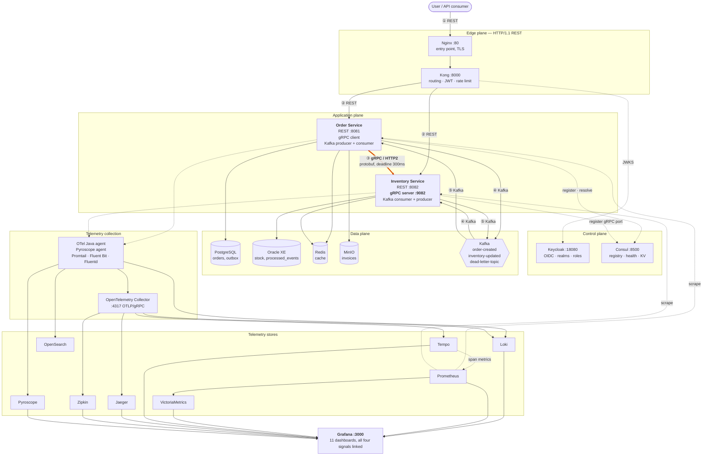
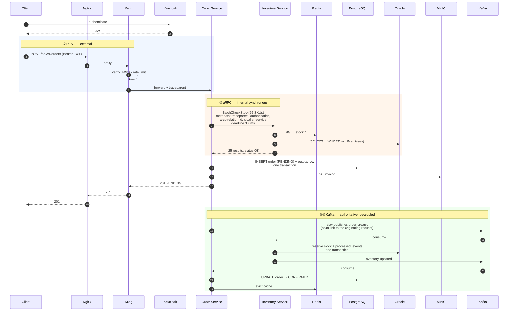
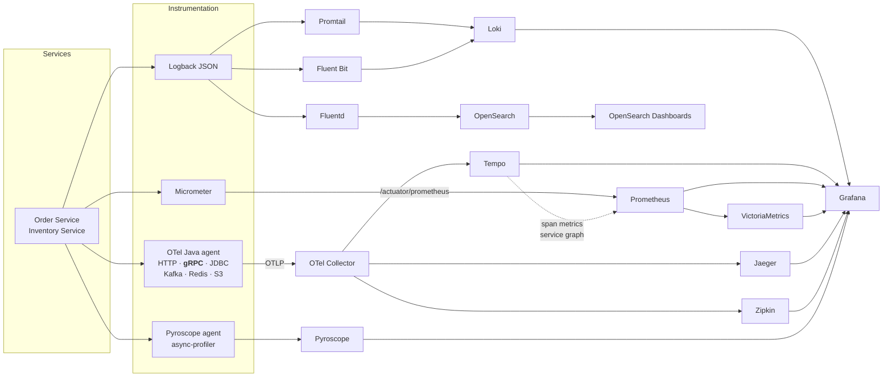

# System Architecture

The consolidated architecture of the Enterprise Microservice Observability Lab, with all three
communication protocols and the full four-signal observability stack.

This is the **cross-protocol view**. Component-level architecture is in
[docs/Architecture.md](docs/Architecture.md); implementation conventions are in
[docs/SystemDesign.md](docs/SystemDesign.md); the gRPC design is in
[GRPC_ARCHITECTURE.md](GRPC_ARCHITECTURE.md).

---

## 1. Complete architecture



**① REST** external · **② REST** gateway→service · **③ gRPC** service→service ·
**④⑤ Kafka** asynchronous events

---

## 2. Communication matrix

| # | Hop | Protocol | Sync | Coupling | Purpose |
| --- | --- | --- | :---: | --- | --- |
| 1 | Client → Nginx → Kong | HTTP/1.1 REST | ✓ | External | Public API |
| 2 | Kong → Service | HTTP/1.1 REST + JSON | ✓ | Availability | Request routing after policy |
| 3 | **Order → Inventory** | **gRPC / HTTP2 + protobuf** | ✓ | **Availability** | **Stock queries, express reservation** |
| 4 | Order → Kafka → Inventory | Kafka + JSON | ✗ | **Decoupled** | `order-created` — authoritative reservation |
| 5 | Inventory → Kafka → Order | Kafka + JSON | ✗ | **Decoupled** | `inventory-updated` — settlement |
| 6 | Kong → Keycloak | HTTPS | ✓ | Availability | JWKS |
| 7 | Service → Consul | HTTP | ✓ | Startup | Registration, health, KV config |
| 8 | Service → PostgreSQL / Oracle | JDBC | ✓ | Availability | System of record |
| 9 | Service → Redis | RESP | ✓ | Degradable | Cache |
| 10 | Service → MinIO | HTTP (S3) | ✗ | Degradable | Invoice objects |
| 11 | Service → OTel Collector | gRPC / OTLP | ✗ | Degradable | Telemetry egress |
| 12 | Prometheus → Service | HTTP | ✓ | — | Metric scrape (pull) |

### The selection rule

> **REST at the edge. gRPC between services when the caller must wait. Kafka when it must not.**

| Property | REST | gRPC | Kafka |
| --- | :---: | :---: | :---: |
| External clients | ✅ | ❌ needs proxy | ❌ |
| Human-debuggable (`curl`) | ✅ | ⚠️ `grpcurl` | ⚠️ console consumer |
| Gateway policy applies | ✅ | ❌ | ❌ |
| Enforced schema | ⚠️ OpenAPI | ✅ protobuf | ❌ |
| Binary encoding | ❌ | ✅ | ❌ |
| Streaming | ❌ | ✅ | ⚠️ log semantics |
| Caller survives callee outage | ❌ | ❌ | ✅ |
| Fan-out to N consumers | ❌ | ❌ | ✅ |
| Replay | ❌ | ❌ | ✅ |

No protocol wins every row. **That is why all three are here.**

---

## 3. Complete request flow

One order, exercising all three protocols, both databases, cache, object storage and every telemetry
signal.



**The client is answered before the asynchronous half completes.** The order is accepted as `PENDING`
and settled shortly after. This is what lets order intake survive an Inventory outage — and it is why
step 3 (gRPC) is an optimisation, not the critical path.

---

## 4. Observability architecture



| Signal | Instrumentation | Stores | gRPC coverage |
| --- | --- | --- | --- |
| **Logs** | Logback JSON + MDC | Loki, OpenSearch | `protocol`, `grpc_method`, `grpc_status`, `caller_service` added to the existing 8-field schema |
| **Metrics** | Micrometer | Prometheus, VictoriaMetrics | `grpc_server_*` / `grpc_client_*`, RED + USE |
| **Traces** | **OTel Java agent** | Tempo, Jaeger, Zipkin | **Automatic** — the agent instruments `grpc-java` on both sides |
| **Profiles** | Pyroscope agent | Pyroscope | Automatic — JVM-level, protocol-agnostic |

### Cross-signal correlation

```
logs ──trace_id──► traces ──span_id──► profiles
  ▲                  │
  └───trace_id───────┴──service──► metrics
```

**This works across the protocol boundary unchanged**, because gRPC metadata *is* HTTP/2 headers: the
`traceparent` key is identical, so the W3C propagator already in use needs no translation layer. One
trace covers Kong → Order (HTTP) → Inventory (gRPC) → Oracle (JDBC), and the outbox's stored
`trace_id`/`span_id` carry it across the Kafka hop as a span **link**.

---

## 5. Data ownership

| Service | Bounded context | System of record | Owns |
| --- | --- | --- | --- |
| Order Service | Ordering | PostgreSQL | `orders`, `order_items`, `outbox_events` |
| Inventory Service | Stock | Oracle XE | `stock_levels`, `stock_movements`, `processed_events` |

No service reads another's database. Integration is via gRPC, REST or events — never a join.

**The gRPC contract does not change this.** `BatchCheckStock` is an API call to the owner, not a
shortcut into its schema. A proto that exposed table columns would be a shared database with extra
steps.

---

## 6. Resilience across protocols

| Mechanism | REST (Feign) | gRPC | Kafka |
| --- | --- | --- | --- |
| Timeout | 2 s connect / 5 s read | **Deadline** 200–300 ms, propagated | `max.poll.interval.ms` |
| Retry | None at Feign layer | 3 attempts, retryable statuses only | 3 attempts, 1 s backoff |
| Backoff | — | Exponential + jitter | Fixed |
| Circuit breaker | Not applied | 50% errors **or** 80% slow calls, business statuses excluded | n/a |
| Dead letter | n/a | n/a | `dead-letter-topic` |
| Idempotency | Read-only | `event_id` | `processed_events` |
| Fallback | Degraded answer | Degraded answer, or **fall through to Kafka** | Retry topic |

The bottom-right of that table is the design's keystone: **gRPC's fallback is Kafka.** Because the
asynchronous path is the invariant rather than a bolt-on, the circuit breaker has somewhere safe to
fail to. A breaker with no fallback is only a faster failure.

---

## 7. Port allocation

| Component | Port | Component | Port |
| --- | --- | --- | --- |
| Nginx | 80 | Grafana | 3000 |
| Kong proxy / admin / manager | 8000 / 8001 / 8002 | Loki | 3100 |
| Keycloak | 18080 | Tempo | 3200 |
| **Order Service** REST | **8081** | Pyroscope | 4040 |
| **Order Service** gRPC | **9081** *(reserved)* | OTLP gRPC / HTTP | 4317 / 4318 |
| **Inventory Service** REST | **8082** | Prometheus | 9090 |
| **Inventory Service** gRPC | **9082** | VictoriaMetrics | 8428 |
| Kafka (external) | 29092 | Jaeger UI | 16686 |
| Kafka UI | 8090 | Zipkin | 9411 |
| Consul | 8500 | OpenSearch / Dashboards | 9200 / 5601 |
| PostgreSQL | 15432 | Elasticsearch / Kibana | 9201 / 5602 |
| Oracle | 1521 | MinIO API / console | 9000 / 9001 |
| Redis | 16379 | | |

`90xx` mirrors `80xx` so the REST/gRPC pairing is obvious. Neither gRPC port is exposed through
Kong — **gRPC is internal only**, which is a security boundary, not an omission. Every port binds to
`127.0.0.1`.

---

## 8. Decision log

Decisions ADR-01 to ADR-10 are in [docs/Architecture.md](docs/Architecture.md#11-decision-log).
The gRPC decisions:

| ID | Decision | Rationale | Consequence |
| --- | --- | --- | --- |
| ADR-11 | gRPC for Order → Inventory synchronous calls | A measurable N+1 on the checkout path, a class of silent contract bug, three access patterns REST expresses poorly | A second transport to operate; the comparison is the teaching material |
| ADR-12 | Separate gRPC port, not the servlet container | Preserves HTTP/2 flow control and the Netty transport | One more listener to health-check |
| ADR-13 | Client-side load balancing via Consul | A gRPC channel is long-lived; an L4 proxy pins every RPC to one instance | The client owns balancing |
| ADR-14 | Kafka remains authoritative for reservation | Availability decoupling is the one property gRPC cannot provide | Two paths, one effect; idempotency makes it safe |
| ADR-15 | Inventory's REST API is retained | Public, gateway-routed, used by clients that will never speak gRPC | Two transports over one application service |
| ADR-16 | Proto owned by the provider, additive-only | A shared or consumer-owned schema becomes a distributed monolith | Breaking changes require a new versioned package |
| ADR-17 | `buf breaking` in CI | Contract violations are invisible to all four telemetry signals (see [failure scenario 5](GRPC_FAILURE_SIMULATION.md#scenario-5--contract-violation)) | The pipeline fails on a wire-incompatible change |

---

## 9. Why this is enterprise-shaped

| Property | How it shows up here |
| --- | --- |
| **Protocol chosen by coupling, not fashion** | REST external, gRPC internal-synchronous, Kafka decoupled — each justified by what the caller can tolerate |
| **Contract-first internal APIs** | Proto owned by the provider, versioned, additive-only, enforced in CI |
| **Deadlines everywhere, propagated** | A budget that travels with the call and shrinks inward |
| **Failure is designed, not discovered** | Retry, breaker, fallback — each with a defined behaviour and a chaos scenario proving it |
| **One telemetry vocabulary across protocols** | `service`/`environment`/`version` on all four signals, both transports |
| **Observability covers its own blind spots** | Gauges where traces cannot see; business metrics where nothing else can |
| **Synchronous optimisation over an asynchronous invariant** | The express path can fail entirely without losing an order |

---

## 10. Learning path

The order in which this system is best understood is in
[LEARNING_ROADMAP.md](LEARNING_ROADMAP.md). The gRPC material assumes steps 01–14: it builds on
Consul discovery, the OpenTelemetry agent, the metric conventions and the correlation schema, rather
than restating them.
