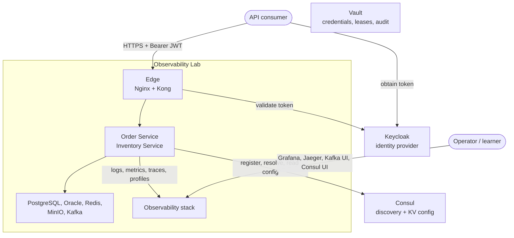
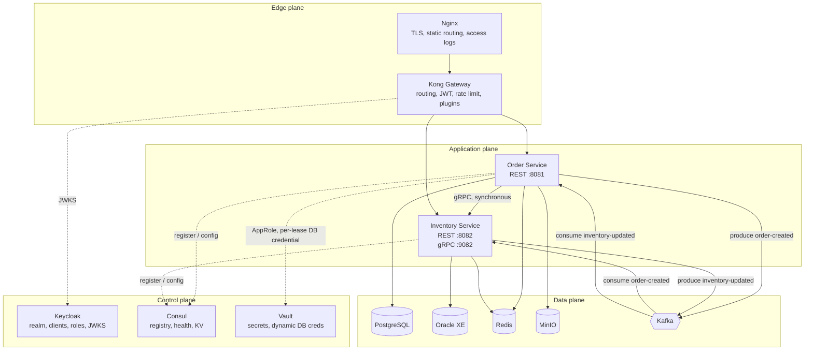
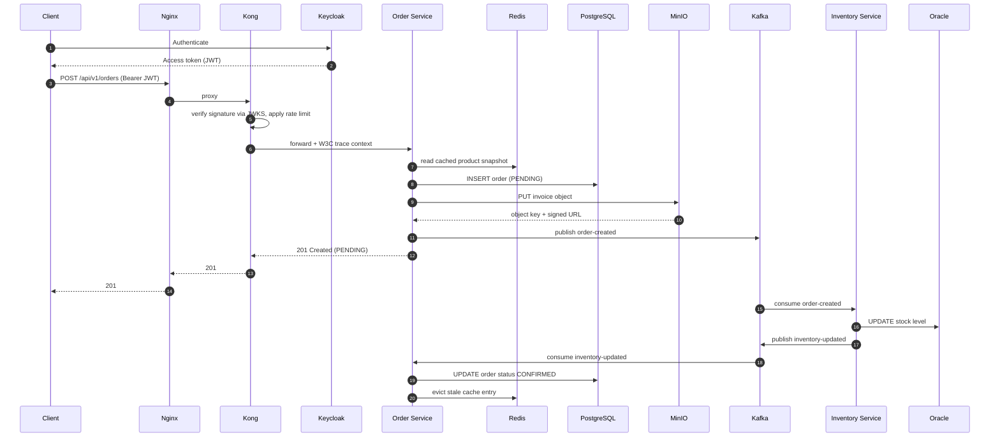
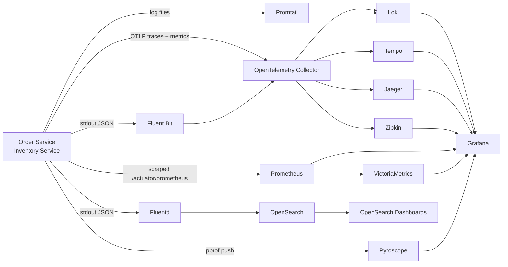

# Architecture

This document describes the target architecture of the Enterprise Microservice Observability Lab:
the components, how they communicate, who owns what state, and how telemetry leaves the system.

For implementation-level conventions — package layout, configuration strategy, port allocation, API
and error contracts — see [SystemDesign.md](SystemDesign.md).

---

## 1. Purpose and scope

The system exists to make distributed-system behaviour **visible**. Two services exchange a trivial
order/stock workflow across a realistic production topology: a reverse proxy, an API gateway, an
identity provider, a service registry, two different relational databases, a cache, an object store
and an event backbone. Every hop emits logs, metrics, traces and profiling samples.

The architecture is therefore optimised for a property that most demo systems ignore: **every
interesting failure mode must be reachable and observable**. Slow dependencies, poisoned messages,
exhausted connection pools, memory pressure and tripped circuit breakers are all first-class
scenarios, not accidents.

## 2. Design principles

| Principle | What it means here |
| --- | --- |
| **Every technology earns its place** | Nothing is included for the logo. Each component answers a question the others cannot — Kong does edge policy, Consul does discovery, Kafka does decoupling. |
| **No component is bypassed** | Traffic goes through the full chain, edge to service. Shortcuts would hide exactly the latency and failure the lab exists to show. |
| **Telemetry is not optional** | A code path that cannot be observed is considered incomplete. Instrumentation is part of the definition of done, not a follow-up. |
| **One trace, end to end** | Context propagates across HTTP, Feign and Kafka. A trace that stops at a queue boundary is a broken trace. |
| **State has exactly one owner** | A service owns its database. No other service reads it. Integration happens through APIs and events. |
| **Configuration is external, secrets more so** | 12-Factor: config from Consul KV, credentials from Vault, and never either in the repository. The dividing line is stated once and applied everywhere — a value that could appear in a screenshot is configuration; anything else is a secret. See [Vault.md](Vault.md). |
| **Fail visibly, degrade gracefully** | Timeouts, retries with backoff, circuit breakers and dead-letter queues everywhere a remote call is made. |

## 3. System context

## 4. Runtime topology

Components are grouped into four planes. The grouping matters operationally: each plane fails
differently and is scaled, secured and monitored differently.

**Why Nginx *and* Kong.** They solve different problems. Nginx terminates TLS and is the single
network entry point; Kong owns API policy — route matching, JWT verification, rate limits, request
transformation. Collapsing them would work, but keeping them separate mirrors how most organisations
actually deploy, and it gives two distinct sets of access logs and latency measurements to correlate.

## 5. Service decomposition and data ownership

| Service | Bounded context | System of record | Owns |
| --- | --- | --- | --- |
| Order Service | Ordering | PostgreSQL | Orders, order lines, order status transitions, invoice objects |
| Inventory Service | Stock | Oracle XE | Stock levels per product, stock movements |

Neither service reads the other's database. The Order Service learns about stock through a Feign call
or an event, never through a join.

**Why two different databases.** Polyglot persistence is common in real estates, usually for
historical reasons rather than technical ones. Running PostgreSQL and Oracle side by side means the
lab produces two genuinely different sets of connection-pool metrics, driver behaviours, SQL dialects
and failure signatures — which is precisely what makes database observability worth practising.

## 6. Communication patterns

The same pair of services talks both synchronously and asynchronously, on purpose.

| Pattern | Used for | Failure behaviour |
| --- | --- | --- |
| **REST (external)** | The public API: client → Nginx → Kong → service | Standard HTTP semantics; gateway applies rate limits and JWT policy |
| **REST via Feign (internal)** | Retained, and still the honest one-request-per-SKU implementation, so the protocol comparison has two real sides | Timeout, no Feign-level retry, caller degrades to an "unknown" answer |
| **gRPC** | Internal synchronous calls the caller must wait for: batch stock checks, express reservation, streaming | Deadline (200–300 ms), retry on retryable statuses only, circuit breaker on errors *and* slow calls, fallback to a degraded answer or to the Kafka path |
| **Kafka events** | State changes other services react to: `order-created`, `inventory-updated` | Consumer retry topic with backoff, then a dead-letter topic; producer is unaffected by consumer failure |

The selection rule, stated once: **REST at the edge; gRPC between services when the caller must wait;
Kafka when it must not.** The full matrix is in [SYSTEM_ARCHITECTURE.md](../SYSTEM_ARCHITECTURE.md#2-communication-matrix),
and the design rationale in [GRPC_ARCHITECTURE.md](../GRPC_ARCHITECTURE.md).

The contrast is the lesson. The synchronous path couples availability — if Inventory is slow, Order is
slow — and shows up as latency and circuit-breaker metrics. The asynchronous path decouples
availability but introduces lag and eventual consistency, and shows up as consumer lag and DLQ depth.

**Topics**

| Topic | Producer | Consumer | Purpose |
| --- | --- | --- | --- |
| `order-created` | Order Service | Inventory Service | An order was accepted and needs stock reserved |
| `inventory-updated` | Inventory Service | Order Service | Stock was adjusted; the order can be confirmed or rejected |
| `retry-topic` | Consumers | Consumers | Delayed redelivery with backoff |
| `dead-letter-topic` | Consumers | Operators | Messages that exhausted their retries |

## 7. End-to-end business flow

One request exercises REST, both databases, the cache, object storage, the event backbone and every
telemetry pillar. Note that the client is answered before the asynchronous half completes — the order
is accepted as `PENDING` and confirmed later.

Every numbered interaction above becomes a span in one trace, a set of structured log lines carrying
the same trace id, and at least one metric.

## 8. Observability architecture

Four signals, several backends per signal. The duplication is deliberate: comparing two backends on
identical traffic is far more instructive than reading either one's marketing page.

### 8.1 Logs

Applications write structured JSON to stdout. Three shipping paths run in parallel so their
trade-offs can be compared directly:

1. **Fluent Bit → OpenTelemetry Collector → Loki** — the modern OTLP-native path; logs, metrics and
   traces share one pipeline and one set of resource attributes.
2. **Fluentd → OpenSearch** — the document-store path, with rich indexing and full-text search.
3. **Promtail → Loki** — the direct path, label-based rather than index-based.

Every log line carries `trace_id`, `span_id`, `request_id`, `correlation_id`, `user_id`,
`service`, `environment` and `version`, so a log can be pivoted to its trace and back.

### 8.2 Metrics

Micrometer exposes `/actuator/prometheus`. Prometheus scrapes it and remote-writes to
VictoriaMetrics for longer retention. Beyond JVM, HTTP, GC, thread, connection-pool, Kafka, Redis and
Feign metrics, the services publish **business** metrics — orders created, stock rejections, invoice
uploads — using counters, timers, gauges, distribution summaries and long-task timers.

### 8.3 Traces

The OpenTelemetry SDK instruments the services; the Collector is the single egress point and fans out
to Tempo, Jaeger and Zipkin simultaneously. Context propagates across HTTP, Feign and Kafka headers,
so one trace spans gateway, both services, both databases, Redis, MinIO and the broker. Spans carry
attributes, events, status and recorded exceptions.

### 8.4 Profiles

The Pyroscope agent runs in-process and pushes CPU, allocation, heap and lock-contention profiles
continuously. Grafana renders them beside metrics and traces, so a latency spike can be taken from
"which endpoint" to "which line of code" without redeploying anything.

**Why the Collector sits in the middle.** Services speak OTLP to exactly one endpoint and know
nothing about Tempo, Jaeger or Zipkin. Backends can be added, removed or swapped by editing collector
configuration — no application change, no redeploy. That indirection is the single most valuable
piece of the telemetry design.

## 9. Cross-cutting concerns

| Concern | Approach |
| --- | --- |
| **Identity** | Keycloak issues JWTs. Kong verifies signatures at the edge; services re-validate and read roles for authorisation. |
| **Authorisation** | `ADMIN` and `USER` roles carried in the token, enforced with method-level security. |
| **Discovery** | Services register with Consul on startup and deregister on shutdown; Feign resolves targets through the registry, never through a hostname. |
| **Configuration** | Base file, then profile file, then Consul KV, then environment. Later layers win. |
| **Correlation** | A correlation id is accepted from the caller or generated at the edge, placed in the MDC, propagated over HTTP and Kafka headers, and echoed in the response. |
| **Resilience** | Timeouts on every remote call; bounded retries with exponential backoff and jitter; circuit breakers around Feign clients; dead-letter topics for poisoned messages. |
| **Idempotency** | Consumers deduplicate by event key so redelivery is safe. |
| **Lifecycle** | Healthchecks gate startup order; graceful shutdown drains in-flight requests and finishes the current consumer batch. |

## 10. Deployment view

The whole system runs on one host via Docker Compose, **entirely inside one Docker network,
`lab-net`.** Nothing runs outside it: not the two services, not the load generator, not the fault
proxy. Containers use named volumes for durable state, declare healthchecks, and express startup
order with `depends_on` + `condition: service_healthy` rather than sleeps. Resource limits and
restart policies are set so memory pressure and restarts are *observable* rather than silently
absorbed by the host.

That single network replaced four tier networks, and the trade is recorded honestly in
[Infrastructure.md](Infrastructure.md#2-network-topology): real isolation was given up, in exchange
for a system whose every hop can be instrumented, delayed or broken from inside. The isolation was
already fictional while the services were host processes reached through `host.docker.internal`.

Three addressing rules follow, and every wiring decision in the stack obeys them:

| Rule | Why |
| --- | --- |
| Components address each other by **compose name** | A published port can change without breaking anything but a bookmark |
| Applications reach dependencies **through Toxiproxy** | Faults become injectable at runtime; with no toxics it is a transparent relay |
| Monitoring reaches its targets **directly** | An exporter sharing the application's broken path could not tell you the path is what is broken |

Compose files are split by concern — core data, platform, observability, services, simulation — for
readability, not so they can be run separately. See [`docker/README.md`](../docker/README.md).

## 11. Decision log

| ID | Decision | Rationale | Consequence |
| --- | --- | --- | --- |
| ADR-01 | Maven multi-module monorepo | The shared library and its consumers change together; a monorepo keeps them consistent without publishing snapshots between repositories. | One build, one version. Module boundaries must be policed by review, since nothing physically prevents a bad dependency. |
| ADR-02 | Java 21 bytecode, JDK 21+ build floor | Java 21 is the current LTS with virtual threads and pattern matching available. Allowing newer JDKs to *build* keeps contributors unblocked. | Enforced by `maven-enforcer-plugin`; a JDK 17 build fails immediately with an actionable message. |
| ADR-03 | Spring Boot 3.5.x with Spring Cloud 2025.0.x | Aligned release trains. Mixing lines produces subtle autoconfiguration failures. | Both BOMs are upgraded together, never independently. |
| ADR-04 | PostgreSQL for Order, Oracle for Inventory | Produces two genuinely different sets of driver, pool and SQL failure signatures to observe. | Oracle XE is heavy; it is the slowest container to start and is gated by a healthcheck. |
| ADR-05 | Both Feign and Kafka between the same services | Lets the coupling trade-off be observed directly on identical traffic. | Two code paths to maintain; the difference is the teaching material. |
| ADR-06 | OpenTelemetry Collector as sole telemetry egress | Backends become configuration, not code. | The Collector is a single point of failure for telemetry; it gets its own healthcheck and metrics. |
| ADR-07 | Multiple backends per signal | Comparing Loki with OpenSearch, or Tempo with Jaeger, on identical traffic is the fastest way to understand either. | Higher resource usage than a real deployment would accept. Acceptable: this is a lab. |
| ADR-08 | Shared library for cross-cutting code | Correlation, error envelope and MDC handling must be *identical* across services; copies drift. | The library must stay business-free, or it becomes a distributed monolith. |
| ADR-09 | Nginx in front of Kong | Separates network entry and TLS from API policy, as most real deployments do. | An extra hop; it also yields a second, independent latency measurement. |
| ADR-10 | Failure-simulation endpoints ship with the services | Observability cannot be learned on a system that never misbehaves. | They must be disabled outside `local`/`dev`. Guarded by profile and role. |
| ADR-11 | gRPC for Order → Inventory synchronous calls | A measurable N+1 on the checkout path, a class of silent contract bug, and three access patterns REST expresses poorly. | A second transport to operate and observe; the comparison is the teaching material. |
| ADR-12 | Separate gRPC port rather than the servlet container | Preserves HTTP/2 flow control and the Netty transport gRPC is tuned for. | One more listener to health-check. |
| ADR-13 | Client-side load balancing via Consul, no L4 proxy | A gRPC channel is long-lived, so a layer-4 proxy pins every RPC to one instance. | The client owns balancing; instance changes must reach the resolver. |
| ADR-14 | Kafka remains authoritative for reservation | Availability decoupling is the one property gRPC cannot provide. | Two paths to one effect; idempotency on `event_id` makes it safe. |
| ADR-15 | Inventory's REST API is retained alongside gRPC | It is public, gateway-routed, and used by clients that will never speak gRPC. | Two transports over one application service — deliberate, behaviour shared. |
| ADR-16 | Proto owned by the provider, additive-only | A consumer-owned or committee-owned schema becomes a distributed monolith. | Breaking changes require a new versioned package, never an edit. |
| ADR-17 | `buf breaking` enforced in CI | A wire-incompatible change is invisible to all four telemetry signals. | The pipeline fails rather than a consumer silently decoding garbage. |

## 12. Current state

This document describes the target. What is actually built and running:

| Working | Notes |
| --- | --- |
| Both services, end to end | Order on PostgreSQL, Inventory on Oracle, with CRUD, validation, caching and actuator |
| The full order flow | Transactional outbox → `order-created` → idempotent reservation → `inventory-updated` → settlement. Retry and dead-letter topic included |
| The edge | Client → Nginx → Kong → service, with routing, rate limiting and upstream health checks |
| Authentication | Keycloak realm, clients, roles and users; JWT verified at the gateway and re-validated in each service |
| Service discovery | Both services register with Consul; Feign resolves `inventory-service` through the registry, filtered to passing instances |
| Configuration | Consul KV, watched, overriding the bundled `application.yml` |
| Object storage | Invoices in MinIO, handed out as short-lived signed URLs |
| **Logging** | JSON with 8 correlation fields; Promtail and Fluent Bit → Loki, Fluentd → OpenSearch |
| **Metrics** | Micrometer → Prometheus → VictoriaMetrics; JVM, HTTP, pool, Kafka, Redis and business metrics; recording and alert rules |
| **Tracing** | OpenTelemetry Java agent → Collector → Tempo, Jaeger and Zipkin; span links across the outbox |
| **Profiling** | Pyroscope: CPU, allocation, live heap and lock contention, linked from traces |
| **Dashboards** | Eleven Grafana dashboards, ten of them generated from one source, every query verified against live data |
| **Alerting** | 33 Prometheus rules across three severities and five categories, routed by Alertmanager with grouping and inhibition, delivered to email and webhook; two Grafana rules for the log-based signals; five exporters for host, both databases, Redis and Kafka |
| **gRPC** | `inventory.v1.InventoryService` on port 9082: unary, server-streaming and client-streaming RPCs, generated from one `.proto` into both sides. Deadlines, status mapping, retries with a budget, a circuit breaker, and client-side balancing through Consul |
| **Circuit breakers** | Around the gRPC hop, tripping on slow calls as well as errors, with a defined fallback per call |
| **Failure simulation** | Network faults through Toxiproxy on every dependency hop, 14 in-process chaos endpoints guarded three ways, a scenario runner, and 13 scenarios with expectations written before the run |
| **Reference documentation** | Deployment, runbook, troubleshooting, performance and security guides, plus [SequenceDiagrams.md](SequenceDiagrams.md) and [InfrastructureDiagram.md](InfrastructureDiagram.md) |

Described above but not yet built:

| Not yet | Status |
| --- | --- |
| **TLS at the edge.** Nginx serves plain HTTP. Every port binds to `127.0.0.1`, so TLS would encrypt a loopback hop while adding certificate handling that obscures gateway behaviour. A deployment reachable from elsewhere terminates TLS at Nginx. | Deliberate for a single-host lab |
| **mTLS between services.** The gRPC hop is plaintext, like every other hop here. A real deployment authenticates both ends, which is where a service mesh would take over. | Deliberate for a single-host lab |
| **`buf lint` and `buf breaking` in CI.** ADR-17. The contract rules are enforced by review today; a wire-incompatible change is invisible to all four signals, so it needs a machine. | **Still owed.** No step claims it — there is no CI pipeline in this repository at all, which is the honest reason rather than the scheduled one |
| **Backups and a tested restore.** No volume is backed up and no restore has been performed. | Deliberate for a lab, and the first gap to close anywhere else — [Deployment.md §12](Deployment.md#12-what-this-deployment-is-not) |
| **Down-migrations.** Flyway runs forward only, so the rollback for a bad migration is `destroy`. | Deliberate for a lab |

See [LEARNING_ROADMAP.md](../LEARNING_ROADMAP.md) for the full step table.
