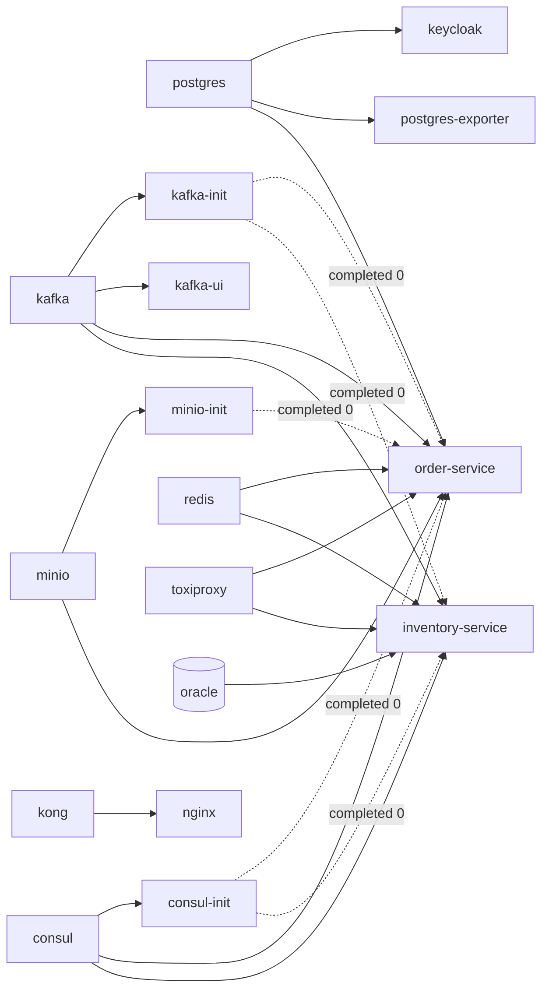

# Deployment

How this system is deployed, what a deployment consists of, and what it deliberately is not.

> **Scope.** This is the reference for *deploying the stack as it exists*: one host, Docker Compose,
> 35 containers on one network. It documents the deployment surface — files, variables, ordering,
> verification, rollback — rather than narrating a first run. The narrated first run belongs to
> `GETTING_STARTED.md` (step 19); the component-by-component detail lives in
> [Infrastructure.md](Infrastructure.md).
>
> Section 12 states plainly what this deployment is not, and what a real one would have to add.

---

## 1. What a deployment is here

| Property | Value |
| --- | --- |
| Unit of deployment | A Docker Compose project named `observability-lab` |
| Host count | One |
| Network | One bridge network, `lab-net`. Nothing runs outside it |
| Containers on a default `up` | 35 — of which 3 are one-shots that run and exit |
| Containers declared in total | 41 — 5 gated behind the `search` profile, 1 behind `load` |
| Locally built images | 2: `lab-order-service`, `lab-inventory-service` |
| Everything else | Pinned upstream images, listed in `docker/compose/.env.example` |
| Published ports | Bound to `${BIND_HOST}`, `127.0.0.1` by default |
| Persistent state | 19 named volumes — 6 hold the system's own data ([Infrastructure.md §7](Infrastructure.md#7-data-lifecycle)), 12 hold telemetry, 1 holds the log files |

There is no orchestrator, no service mesh, no rolling update and no health-gated traffic shift beyond
what Kong's upstream health checks do inside a single node. Deployment is `docker compose up`, wrapped
by a script that also waits for the stack to converge.

---

## 2. Prerequisites

| Requirement | Value | Why |
| --- | --- | --- |
| Docker Engine + Compose v2 | Recent, with BuildKit | BuildKit cache mounts are how a rebuild stays fast; the Dockerfile depends on them |
| Memory allocated to Docker | **10 GB** recommended, 8 GB workable | Oracle alone is capped at 2560M and needs most of it |
| Free disk | ~20 GB | Images, the Maven cache mount, and 19 volumes |
| CPU | 4 cores or better | The two services are capped at 1.5 CPU each; below 4 cores the load scenarios measure the host |
| JDK 21 + Maven | **Optional** | Only for building outside Docker, or the IDE debug path |

```bash
./scripts/verify-toolchain.sh    # reports whether this machine can build and run the lab
```

Docker is the only hard requirement: both services compile inside their image, so a fresh clone with
no JDK installed can still bring the whole system up.

### The memory figure, honestly

The `deploy.resources.limits.memory` values across the default 35 containers sum to **15.6 GB**, and
the `search` profile adds 5 GB more. That number is a *ceiling*, not a reservation — Docker does not
pre-allocate it, and most containers idle far below their limit. 10 GB is enough because the stack is
never simultaneously at every ceiling.

It stops being enough when it is: a stress run plus the `search` profile plus a memory-leak chaos
toggle will find the wall. See [Performance.md §4](Performance.md#4-the-limits-and-what-each-one-bounds).

The largest single claims:

| Container | Limit |
| --- | --- |
| `oracle` | 2560M |
| `opensearch`, `elasticsearch` | 1536M each — `search` profile only |
| `kafka`, `keycloak` | 1024M each |
| `order-service`, `inventory-service` | 768M each (`ORDER_SERVICE_MEMORY`, `INVENTORY_SERVICE_MEMORY`) |
| `prometheus` | 768M |

---

## 3. The artefacts of a deployment

```
docker/compose/
  docker-compose.yml                core data plane    postgres, oracle, kafka, redis, minio + inits
  docker-compose.platform.yml       edge & control     consul, keycloak, kong, nginx
  docker-compose.observability.yml  telemetry          24 containers, 5 of them profile-gated
  docker-compose.services.yml       the two applications
  docker-compose.simulation.yml     toxiproxy, k6
  .env                              the entire configuration surface — git-ignored
  .env.example                      the tracked template, and the list of every variable
docker/service/Dockerfile           builds either service
infrastructure/<component>/         what each component is configured to do
scripts/infra.sh                    the deployment driver
```

**The five files are always used together.** They are split by concern so each stays readable, not so
they can be run separately: Keycloak depends on the `postgres` service in the core file, both services
depend on `toxiproxy` in the simulation file, and the network every one of them joins is declared in
the core file. Heaviness is handled with compose *profiles*, not by omitting a file.

`infrastructure/` holds *what a component does*; `docker/` holds *how it is built and launched*. Either
can be read without the other.

### Why `infra.sh` names the files explicitly

`.env` sets `COMPOSE_FILE` to a colon-separated list, and Compose splits it on `COMPOSE_PATH_SEPARATOR`
— whose default is `:` on macOS and Linux but `;` on Windows. Left to the default, that list becomes
one nonexistent filename on Windows and nothing starts. `.env.example` pins the separator, *and*
`infra.sh` passes `-f` five times so the question never arises. Both, because either alone leaves a
path where a Windows user gets a confusing failure.

---

## 4. Configuration

Everything configurable in a deployment is a variable in `docker/compose/.env`. There is no second
place, and no compose file should be edited to change a value.

`infra.sh` creates `.env` from `.env.example` on first run and never overwrites it afterwards — it holds
local edits and, in a real setup, credentials.

### The staleness check

An existing `.env` is preserved, which means it goes stale: every step that adds a component adds keys
to `.env.example`, and a `.env` written three steps ago is missing all of them.

`infra.sh` therefore diffs the two on every command and warns:

```
WARNING: docker/compose/.env is missing 27 key(s) that .env.example defines:
    INVENTORY_ADVERTISE_HOST INVENTORY_GRPC_PORT INVENTORY_SERVICE_CPUS ...
```

**A missing key produces one of two outcomes, and which one depends on where it is used.**

| The key feeds | Compose does | Symptom |
| --- | --- | --- |
| An environment variable, a published port, an image tag | Substitutes an **empty string** and carries on | The stack starts and *misbehaves*: an exporter that cannot authenticate, a port published on `:0`, an image tag of `""` |
| `deploy.resources.limits.cpus` or `.memory` | **Fails to decode the file. Nothing starts at all** | `'services[order-service].deploy.resources.limits.cpus' strconv.ParseFloat: parsing "": invalid syntax` |

The second is the better failure and the one to hope for. The first is the one the warning exists for.

### Staleness the check cannot catch

The diff compares key *names*. A key that is still present but whose **meaning changed** passes
silently, and that is the worse case. Two have changed in this repository's history:

| Key | Used to mean | Now means |
| --- | --- | --- |
| `REDIS_PORT` | The published host port | The **in-network Toxiproxy listener** (`16379`). The published port moved to `REDIS_HOST_PORT` |
| `KEYCLOAK_ISSUER` | `http://localhost:8080/…` — correct while the services ran on the host | `http://keycloak:8080/…`, which is what Kong's pinned consumer key matches. The old value makes every token 401 |

A `.env` predating the containerisation change carries both, is not flagged by the staleness check, and
produces a stack that starts and then rejects every request. **When in doubt, regenerate**: back the
file up, copy `.env.example` over it, and re-apply only the overrides you know you made.

```bash
cd docker/compose
cp .env ".env.stale-$(date +%Y%m%d-%H%M%S)" && cp .env.example .env
# then re-apply local overrides — a remapped published port is the usual one
```

### Layers, in precedence order

1. `application.yml` in the service jar — the defaults, describing a standard local stack
2. `application-{local,dev,prod}.yml` — profile overrides
3. Consul KV, `config/application/data` — seeded by `consul-init`, watched at runtime
4. Environment variables from the compose file, sourced from `.env`

The visible proof that layer 3 is read: `/actuator/info` reports `platform.config-source`, which
defaults to the string `"application.yml default (Consul KV not applied)"` and is overwritten by the
value in KV.

### The values that must change together

| Change this | And this, or it breaks |
| --- | --- |
| `KEYCLOAK_REALM` or `KEYCLOAK_ISSUER` | The consumer `key` in `infrastructure/kong/kong.yml` — every token is otherwise rejected as an unknown issuer |
| The realm's RSA signing key | The `rsa_public_key` in `kong.yml`, which is the pinned public half |
| `TOXIPROXY_KAFKA_PORT` | The `PROXY` advertised listener in `docker-compose.yml` **and** the `kafka` proxy in `infrastructure/toxiproxy/toxiproxy.json` — a mismatch silently routes clients past the proxy |
| `ORDER_SERVICE_CPUS` / `_MEMORY` | The k6 defaults are calibrated against these; raising a limit invalidates the measured ceiling ([Performance.md §2](Performance.md#2-the-measured-ceiling)) |
| `KAFKA_CLUSTER_ID` | Requires destroying `lab-kafka-data`; a KRaft log directory is stamped with the id that formatted it |
| Any datastore credential | Only takes effect on an **empty** volume — init scripts run once ([§9](#9-changing-configuration-that-only-applies-once)) |

### Published port versus in-network address

The single most common source of confusion in this stack, so it is stated here as a rule:

> **Published ports exist for a person.** A browser opening Grafana, a `curl` against an API, `psql`
> from the host. Nothing in the stack talks to anything else through them — every component addresses
> every other by its compose name on `lab-net`.

The consequence is that changing a published port can inconvenience a human and **cannot** break the
system. `ORDER_DB_PORT=15432` is not PostgreSQL's port; it is Toxiproxy's listener for PostgreSQL, on
`lab-net`. `POSTGRES_PORT=5432` is the host-side publication and nothing in the stack reads it.

The full port allocation is in [SystemDesign.md §5](SystemDesign.md#5-port-allocation) and drawn in
[InfrastructureDiagram.md §3](InfrastructureDiagram.md#3-published-ports-versus-in-network-addresses).

---

## 5. Deploying

```bash
./scripts/infra.sh up          # build images, start everything, wait until healthy
```

That is the deployment. It performs, in order:

1. `docker compose up -d --build --remove-orphans` across all five files.
   `--build` on every `up` is deliberate: a stale service image is a debugging session that starts with
   entirely correct-looking code. The layer cache makes it nearly free when nothing changed.
2. Polls every container every 5 s until the stack converges, up to `WAIT_TIMEOUT_SECONDS` (900).
3. Prints the health table and the URL list.

**Convergence** means: every long-running container is `healthy`, or `running` with no healthcheck
declared; and every one-shot has exited with code **0**. Accepting any exit code from a one-shot would
let a failed bucket or topic setup pass for a healthy stack, and that failure would only surface much
later, somewhere else.

### The other commands

| Command | Does |
| --- | --- |
| `./scripts/infra.sh build` | Rebuilds only `order-service` and `inventory-service` |
| `./scripts/infra.sh health` | One line per container: name, state, health (or `exit N`) |
| `./scripts/infra.sh urls` | Every UI and endpoint, reading the effective `.env` rather than defaults |
| `./scripts/infra.sh ps` | `docker compose ps` |
| `./scripts/infra.sh logs [svc]` | Follows, last 200 lines |
| `./scripts/infra.sh down` | Stops containers, keeps every volume |
| `./scripts/infra.sh destroy` | Stops and deletes every volume. Prompts for the literal word `destroy` |
| `./scripts/infra.sh restart` | `down` then `up` |
| `./scripts/infra.sh <anything>` | Passed through to `docker compose` with all five `-f` flags |

### Timings to expect

| Phase | First run | Later runs |
| --- | --- | --- |
| Image pull | Several GB | Cached |
| Service compile | 3–6 min (full reactor; both images share the dependency layer) | Seconds to ~1 min |
| Oracle first initialisation | 3–8 min | ~1 min to healthy |
| Keycloak first boot | ~90 s (it performs a build step) | ~30 s |
| **Total** | **~10 min** | **2–4 min** |

Oracle dominates. Its healthcheck has `start_period: 180s` and 40 retries at 15 s — roughly ten minutes
of grace — and it is generous on purpose. Do not shorten it because it looks stuck.

### Optional profiles

```bash
cd docker/compose
docker compose --profile search up -d     # + OpenSearch, Dashboards, Elasticsearch, Kibana, Fluentd
```

`search` costs roughly 4–5 GB and exists so Loki and OpenSearch can be compared on identical traffic.
`load` holds only k6 and is started on demand by `scripts/load.sh` — a load generator running during a
normal `up` would poison every other measurement the lab takes.

---

## 6. Startup ordering

Compose `depends_on` encodes the real dependency graph; nothing sleeps and hopes.



Solid arrows are `condition: service_healthy`; dotted arrows are
`condition: service_completed_successfully`.

Waiting for the one-shots to *complete* rather than merely start is what stops a service from booting
against a broker with no topics or an object store with no bucket. Both of those fail at the first
request rather than at startup, which is far harder to attribute.

**Two dependencies are deliberately absent.** Neither service waits for Keycloak, and neither waits for
the observability stack:

- The `JwtDecoder` is built with `withJwkSetUri`, which fetches keys lazily on the first token. Issuer
  and expiry are still validated on every token, so the laziness costs no security and buys a service
  that starts when the identity provider is down.
- `spring.cloud.consul.config.fail-fast: false` and `import: "optional:consul:"` mean a missing registry
  degrades to the bundled `application.yml` rather than a failed boot.

### What each service does on startup

1. Reads Consul KV (optional) and merges it over `application.yml`
2. Runs Flyway migrations — `baseline-on-migrate: false`, so an existing schema with no Flyway history
   stops the boot for a human rather than guessing
3. Hibernate validates the entity model against the migrated schema (`ddl-auto: validate`)
4. Registers in Consul as `hostname: ${SERVICE_HOSTNAME}` with a 10 s HTTP health check
5. Opens the gRPC server (Inventory only) on `0.0.0.0:9082`
6. Reports `readiness` UP once `db` and `redis` are reachable — which is when the container becomes
   healthy, and when Kong starts routing to it

---

## 7. Verifying a deployment

Run these in order. Each fails differently, and failing at a known point is most of the diagnosis.

```bash
# 1. Every container converged
./scripts/infra.sh health

# 2. The edge answers
curl -fsS http://localhost/healthz

# 3. Identity works, and the issuer matches what Kong holds
TOKEN=$(./scripts/token.sh alice)

# 4. The gateway routes, and enforces
curl -s -o /dev/null -w '%{http_code}\n' http://localhost/api/v1/orders                      # 401
curl -s -o /dev/null -w '%{http_code}\n' -H "Authorization: Bearer $TOKEN" \
     http://localhost/api/v1/orders                                                          # 200

# 5. Kong sees its upstreams as healthy
./scripts/gateway.sh status

# 6. Both services registered
curl -s http://localhost:8500/v1/catalog/services

# 7. Prometheus is scraping what it should — every target UP
curl -s 'http://localhost:9090/api/v1/query?query=up==0'

# 8. No fault is left over from an earlier experiment
./scripts/chaos.sh list

# 9. The whole path, end to end
./scripts/load.sh smoke
```

Step 9 is the real acceptance test: `smoke.js` mints a token, seeds stock, places an order and reads it
back, against a `p(95) < 300 ms` threshold. A green smoke run exercises Nginx, Kong, Keycloak, the Order
Service, PostgreSQL, Redis, MinIO, Kafka, the Inventory Service and Oracle in one pass.

**Step 8 is not optional before any measurement.** A load test against a stack still carrying a toxic
from an earlier experiment produces numbers that look like a regression and are an artefact.

### What "healthy" does and does not mean

| Probe | Answers | Includes |
| --- | --- | --- |
| `/actuator/health/liveness` | "Should this container be restarted?" | `livenessState` only — a failing dependency is not a restart reason |
| `/actuator/health/readiness` | "Should traffic be routed here?" | `readinessState`, `db`, `redis` |
| Container healthcheck | Compose ordering, Kong routing | **Readiness**, not liveness |
| Consul HTTP check | Whether discovery hands this instance out | `/actuator/health`, at `SERVICE_HOSTNAME` |

Consul's health check is deliberately aimed at the *advertised* address, which for the Inventory Service
is `toxiproxy`. That is correct: if the path to a service is broken then the service is unreachable,
whatever the process itself thinks.

`management.health.consul.enabled: false` breaks the other direction of that loop — the registry's own
reachability must not drag down the health of the service it is checking.

---

## 8. Building the images

Both services are built from one `docker/service/Dockerfile`, selected by `--build-arg SERVICE`.

```bash
./scripts/infra.sh build                                   # both
cd docker/compose && docker compose build order-service    # one
```

| Stage | Base | Contains |
| --- | --- | --- |
| `builder` | `eclipse-temurin:21-jdk-jammy` | Full reactor build, plus the three Java agents |
| `runtime` | `eclipse-temurin:21-jre-jammy` | `curl`, a non-root `lab` user (uid/gid **10001**), `/opt/agents`, `/app/app.jar` |

Points that matter for a deployment:

- **The build context is the repository root**, not `docker/service/`. The reactor is multi-module and
  each service compiles against `shared-library` and against stubs generated from `proto/`.
  `.dockerignore` keeps that context small.
- **Debian, not Alpine.** `protobuf-maven-plugin` downloads a glibc-linked `protoc`; on musl it fails
  with an error naming neither `protoc` nor the libc.
- **The Maven repository is a BuildKit cache mount**, so it stays out of the image and survives across
  builds. That is why the second service image builds almost free.
- **Tests are skipped in the image build.** Packaging is not the place to run a suite twice.
  `./scripts/build.sh` is where tests run.
- **The agents are fetched at build time and versioned from `pom.xml`**, read out with `sed`. The parent
  POM is the single place an agent version changes, and `scripts/agents.sh` resolves the same
  coordinates for the host-run path — so the container and the IDE cannot silently profile with
  different agents.
- **No agent flags in the `ENTRYPOINT`.** They are set through `JAVA_TOOL_OPTIONS` in
  `docker-compose.services.yml`, so dropping an agent is a line edit rather than an image rebuild.
- **`-XX:MaxRAMPercentage=70`, never `-Xmx`.** The heap is sized from the container limit, so changing
  `ORDER_SERVICE_MEMORY` changes the heap and the two cannot drift apart.
- **`LAB_SERVICE_TAG`** names the built image (`lab-order-service:local`). Bump it to keep an older build
  around for comparison; `infra.sh build` overwrites whatever it names.

---

## 9. Changing configuration that only applies once

Several things are provisioned by an init script that runs **only on an empty volume**. Changing the
variable on a stack that already has data does nothing, silently.

| Provisioned by | Runs when | Creates |
| --- | --- | --- |
| `infrastructure/postgres/init` | `lab-postgres-data` is empty | `orderdb`, `keycloakdb`, their owners, and the read-only `MONITOR_DB_USER` |
| `infrastructure/oracle/init` | `lab-oracle-data` is empty | The app user in the PDB and the read-only `ORACLE_MONITOR_USER` |
| `minio-init` | Every start | Bucket and least-privilege user — idempotent, so unaffected |
| `kafka-init` | Every start | Four topics — idempotent |
| `consul-init` | Every start | `config/application/data` — idempotent, overwrites |
| Keycloak `--import-realm` | The realm does not exist | The realm, clients, roles, users, pinned RSA key |

So: **Kafka, MinIO and Consul configuration changes take effect on the next `up`. Database credentials
and the Keycloak realm do not.**

Two ways out, in order of preference:

```bash
# Preferred where the data is expendable
./scripts/infra.sh destroy && ./scripts/infra.sh up

# Where it is not — create the objects by hand; docs/Alerting.md §7 has the exact SQL
docker exec -i lab-postgres psql -U postgres -d orderdb
```

The Keycloak realm is a middle case: the import is idempotent and skipped once the realm exists, so
re-importing a changed realm needs `lab-postgres-data` dropped — which also drops `orderdb`.

---

## 10. Changing configuration without a restart

Not everything needs a redeploy. These take effect live, and knowing which is which is most of the
difference between a five-second change and a ten-minute one.

| Component | Change | How |
| --- | --- | --- |
| Kong | Routes, plugins, rate limits, the consumer key | `./scripts/gateway.sh validate && ./scripts/gateway.sh reload` |
| Nginx | Headers, timeouts, proxy behaviour | Same command — `gateway.sh reload` reloads both |
| Consul KV | Anything under `config/application/data` | `consul kv put`; the services watch and re-bind |
| Prometheus | Rules in `infrastructure/prometheus/rules/` | `curl -X POST http://localhost:9090/-/reload` |
| Alertmanager | Routing, receivers, inhibition | `curl -X POST http://localhost:9093/-/reload` |
| Grafana | Provisioned dashboards, datasources, alert rules | Picked up from the mounted directories on an interval |
| Toxiproxy | Every network fault | `./scripts/chaos.sh …` — HTTP API, no restart at all |
| Services | Chaos toggles; log level via KV | `./scripts/chaos.sh app …`, or Consul KV |
| **Anything else** | | Rebuild and recreate the container |

**Every gateway configuration change is asynchronous.** `kong reload` returns once the master process has
been signalled; workers respawn behind it and the gateway serves the previous configuration for a short
window. `gateway.sh reload` waits for Kong's `configuration_hash` to change before returning, precisely
so a test run straight afterwards does not exercise the old config and conclude the change did not work.

---

## 11. Redeploy, rollback and teardown

### Redeploying one service

```bash
cd docker/compose
docker compose build order-service
docker compose up -d order-service
```

`up -d <service>` recreates only that container. What happens around it:

- Kong's active health check marks the target unhealthy after 3 consecutive failures at 5 s intervals and
  stops routing to it; it returns after 2 successes at 10 s intervals.
- Consul deregisters on graceful shutdown (`deregister: true`) and re-registers on boot.
- In-flight requests get `spring.lifecycle.timeout-per-shutdown-phase: 30s` to drain
  (`server.shutdown: graceful`).
- Kafka rebalances the consumer group. With `concurrency: 3` matching the 3 partitions there is a brief
  pause, not a loss: offsets are committed per record with `enable-auto-commit: false`.
- Undelivered outbox rows stay in PostgreSQL and are published by the relay on the next poll.

**There is no zero-downtime path.** One instance per service, so a redeploy is an outage of that service
for its duration, and Kong returns 503 while the upstream has no healthy target. That is a property of
the topology, not an oversight — see §12.

### Rolling back

```bash
# Keep the previous image around before the change
LAB_SERVICE_TAG=known-good ./scripts/infra.sh build

# Roll back by pointing .env at it and recreating
#   LAB_SERVICE_TAG=known-good  in docker/compose/.env
./scripts/infra.sh up
```

Rolling back *configuration* is `git checkout` of the file plus the reload from §10. Rolling back a
**Flyway migration** is not supported: there are no down-migrations, so the rollback for a bad migration
is `destroy` and a fresh start. In a lab that is acceptable, and it is the single loudest difference
between this and a production deployment.

### Teardown

| Command | Containers | Volumes | Images |
| --- | --- | --- | --- |
| `infra.sh down` | Removed | **Kept** | Kept |
| `infra.sh destroy` | Removed | **Deleted** (prompts) | Kept |
| `docker system prune -a` | — | — | Removed, including the build cache |

`destroy` is also the way to make init scripts run again ([§9](#9-changing-configuration-that-only-applies-once)).

---

## 12. What this deployment is not

Read this section before quoting anything above as a pattern.

| This lab | A production deployment |
| --- | --- |
| One host, Docker Compose | An orchestrator with scheduling, restart policy and node-failure handling |
| One replica per service | Several, behind a load balancer, so a redeploy is not an outage |
| No TLS anywhere — plain HTTP end to end | TLS at the edge, and mTLS or a mesh between services |
| Credentials in a git-ignored `.env` | A secret manager, with rotation and audit |
| One PostgreSQL engine hosting two databases | Separate engines, or at least separate hosts |
| Single-node Kafka, replication factor 1 | Three or more brokers, RF ≥ 3, `min.insync.replicas` ≥ 2 |
| Single-node Consul (`bootstrap_expect: 1`) | Three or five servers |
| Kong rate limiting with `policy: local` | `policy: redis`, so nodes share a counter instead of each allowing the full quota |
| `restart: unless-stopped` as the entire availability story | Health-gated rollout, disruption budgets, drain and cordon |
| No backups of any volume | Scheduled backups, tested restores, a documented RPO and RTO |
| No down-migrations | A reversible migration strategy, or expand/contract |
| 100% trace sampling, continuous profiling always on | Sampled, and budgeted |
| Toxiproxy in the path of every dependency | Nothing of the sort in the request path |
| Chaos endpoints compiled into the services | Not present in the artefact at all |

**The single network is also a deliberate loss.** Four tier networks (`lab-data`, `lab-app`, `lab-edge`,
`lab-observability`) were collapsed into one. That separation was a genuine control — Nginx could not
reach a database however badly it was misconfigured — and it is gone. The reasoning is recorded in the
`networks:` block of `docker-compose.yml` and in
[Infrastructure.md §2](Infrastructure.md#2-network-topology): the segmentation was already fictional once
the services ran on the host and the main traffic path left the bridge network entirely. Network
segmentation as a security control is not thereby dismissed; it is simply not what this lab demonstrates.

### If this were deployed for real, in order

1. TLS at Nginx, HTTP→HTTPS redirect, and `sslRequired` raised from `external` in the realm.
2. Every credential in `.env` rotated and moved to a secret store. They are obvious placeholders and are
   safe only because every port binds to `127.0.0.1`.
3. `BIND_HOST` left at `127.0.0.1`, or the whole simulation file removed — the Toxiproxy control API on
   `:8474` is unauthenticated and can break every dependency in the stack.
4. `SERVICE_PROFILE=prod`, which disables the chaos endpoints, Swagger UI and caller-visible stack traces.
5. The `search` profile decided one way or the other. Running Loki *and* OpenSearch is a teaching device,
   not a design.
6. Backups, and a restore actually performed at least once.

The security posture is stated in full, control by control, in [Security.md](Security.md).

---

## 13. Where to go next

| Question | Document |
| --- | --- |
| What is running, and how is the network laid out? | [Infrastructure.md](Infrastructure.md), [InfrastructureDiagram.md](InfrastructureDiagram.md) |
| It deployed — how do I operate it? | [Runbook.md](Runbook.md) |
| It did not deploy | [Troubleshooting.md](Troubleshooting.md) |
| How fast is it, and what limits it? | [Performance.md](Performance.md) |
| What protects what? | [Security.md](Security.md) |
| What happens on one request? | [SequenceDiagrams.md](SequenceDiagrams.md) |
