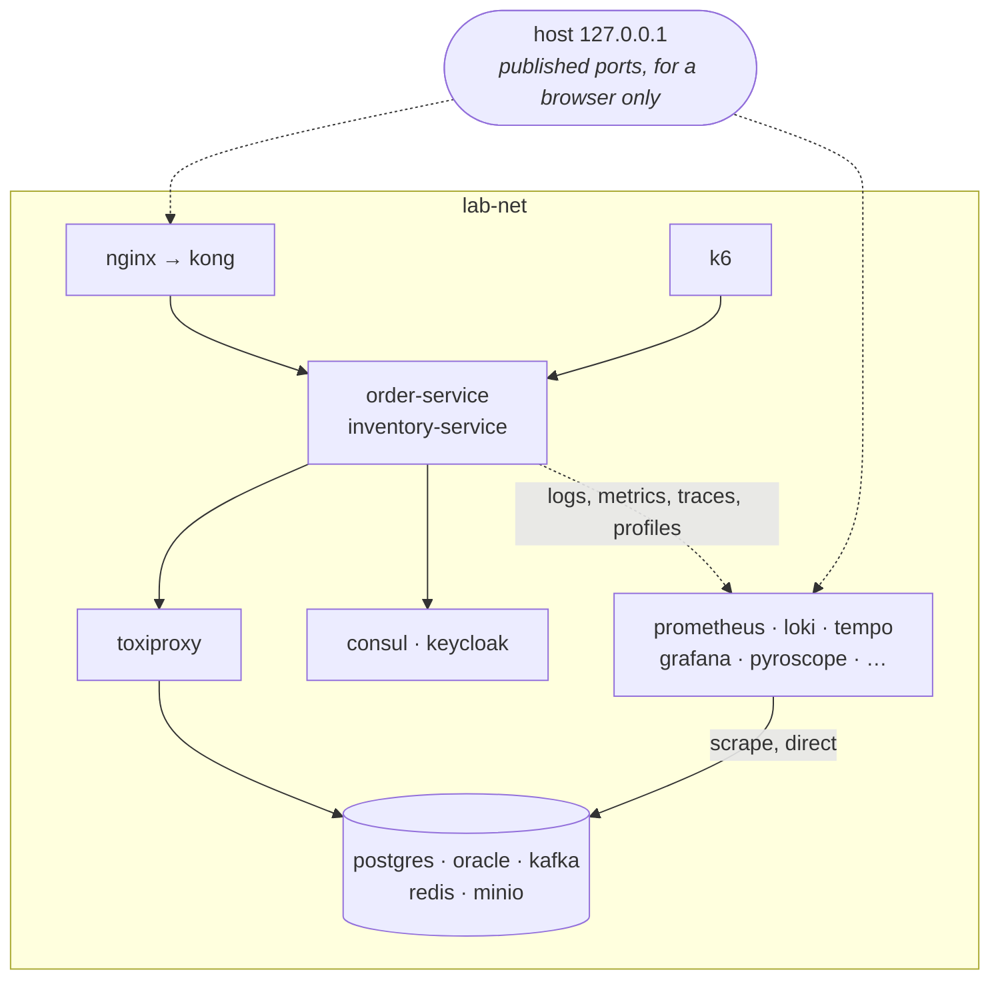

# Infrastructure

How the stack is composed, started and operated.

**Everything runs in Docker, on one network.** The two Spring Boot services, the ten backing
components, the observability stack, the load generator and the fault proxy are all containers on
`lab-net`. No component runs outside it.

That was not always true. Until this step the services were processes on the developer's machine and
every container that needed to reach them did so through `host.docker.internal`. Section 2 explains
what changed and what it cost.

---

## 1. What runs

| Component | Image | Host port | Role |
| --- | --- | --- | --- |
| **Order Service** | `lab-order-service:local` (built here) | 8081 | Orders, PostgreSQL, Kafka producer, gRPC client |
| **Inventory Service** | `lab-inventory-service:local` (built here) | 8082 / 9082 | Stock, Oracle, Kafka consumer, gRPC server |
| **Toxiproxy** | `ghcr.io/shopify/toxiproxy:2.10.0` | 8474 | Fault injection on every dependency hop |
| **k6** | `grafana/k6:1.8.0` | — | Load generation, profile `load` |
| Nginx | `nginx:1.30-alpine` | 80 | Single network entry point |
| Kong | `kong:3.9.3` | 8000 / 8001 / 8002 | API gateway, DB-less |
| Keycloak | `quay.io/keycloak/keycloak:26.7.0` | 8080 | OIDC identity provider |
| Consul | `hashicorp/consul:1.22.7` | 8500 | Service registry and KV store |
| PostgreSQL | `postgres:17-alpine` | 5432 | Order Service database + Keycloak database |
| Oracle | `gvenzl/oracle-free:23-slim-faststart` | 1521 | Inventory Service database |
| Kafka | `apache/kafka:4.2.1` | 29092 | Event backbone, KRaft mode |
| Kafka UI | `kafbat/kafka-ui:v1.5.0` | 8090 | Topic, consumer-group and lag inspection |
| Redis | `redis:7.4-alpine` | 6379 | Cache, locks, rate-limit counters |
| MinIO | `minio/minio:RELEASE.2025-09-07T16-13-09Z` | 9000 / 9001 | S3-compatible object storage |
| Loki | `grafana/loki:3.5.7` | 3100 | Log store for the always-on pipelines |
| Promtail | `grafana/promtail:3.5.7` | — | Log shipper, pipeline 1 |
| Fluent Bit | `fluent/fluent-bit:4.2.7` | — | Log shipper, pipeline 2 |
| Prometheus | `prom/prometheus:v3.7.3` | 9090 | Scrapes metrics, evaluates rules, remote-writes to VictoriaMetrics |
| VictoriaMetrics | `victoriametrics/victoria-metrics:v1.111.0` | 8428 | Long-term metric store, answers the same PromQL |
| OTel Collector | `otel/opentelemetry-collector-contrib:0.140.1` | 4317 / 4318 | Receives OTLP, fans out to all three trace stores |
| Tempo | `grafana/tempo:2.9.1` | 3200 | Trace store Grafana links to; derives service-graph metrics |
| Jaeger | `jaegertracing/all-in-one:1.66.0` | 16686 | Trace UI, in-memory storage |
| Zipkin | `openzipkin/zipkin:3.6.1` | 9411 | Trace UI, its own wire format |
| Pyroscope | `grafana/pyroscope:1.16.0` | 4040 | Continuous profile store |
| Grafana | `grafana/grafana:12.2.10` | 3000 | Dashboards; datasources provisioned from files |

Three further containers run once and exit: `kafka-init` declares the topics, `minio-init` creates
the invoice bucket and its least-privilege user, and `consul-init` seeds the KV configuration.

### The `search` profile

Four more components are declared but **not started by default**, because OpenSearch and
Elasticsearch need roughly 2 GB each — more than a machine already running Oracle and Kafka has
spare. Start them explicitly when comparing the two log stores:

```bash
docker compose --profile search up -d
```

| Component | Image | Host port | Role |
| --- | --- | --- | --- |
| Fluentd | built from `docker/fluentd` | — | Log shipper, pipeline 3, to OpenSearch |
| OpenSearch | `opensearchproject/opensearch:2.19.6` | 9200 | Log store that indexes every field |
| OpenSearch Dashboards | `opensearchproject/opensearch-dashboards:2.19.6` | 5601 | OpenSearch UI |
| Elasticsearch | `docker.elastic.co/elasticsearch/elasticsearch:8.19.7` | 9201 | The other side of the fork, to point at |
| Kibana | `docker.elastic.co/kibana/kibana:8.19.7` | 5602 | Elasticsearch UI |

OpenSearch and Elasticsearch both listen on 9200 inside their containers, so they are published on
different host ports; the same applies to their two dashboards. See [Logging.md](Logging.md).

Every image is pinned to an exact tag rather than `latest`, so a rebuild months from now produces the
same stack. All of them publish a native `arm64` build, so nothing runs under emulation on Apple
Silicon.

### Why Oracle Free 23ai rather than Oracle XE 21c

The specification names Oracle XE. Oracle renamed the product: **Oracle Database Free 23ai is the
current release of what was Oracle XE**, same free licence, same product line. It matters here for a
practical reason — the 21c XE images publish `amd64` only, so on Apple Silicon they run under
emulation, which for Oracle means minutes of extra startup and noticeably worse behaviour under load.
The 23ai images publish a native `arm64` build.

To pin 21c XE instead, change one line in `.env`:

```properties
ORACLE_IMAGE=gvenzl/oracle-xe:21-slim-faststart
```

On Apple Silicon that also needs `platform: linux/amd64` on the `oracle` service.

---

## 2. Network topology

**One bridge network, `lab-net`.** Every component joins it and nothing runs outside it.



### Why one network, and what it cost

This replaced four tier networks — `lab-edge`, `lab-app`, `lab-data`, `lab-observability` — whose
separation was a real control. Nginx sat on the edge alone and could not reach a database however
badly it was misconfigured. **That property is gone, and the trade was deliberate.**

The reason is that the segmentation was already fictional. The two services ran on the host and were
reached through `host.docker.internal`, so the system's main traffic path left the bridge network,
crossed the host's stack and came back — passing no tier boundary at all. A boundary the primary
traffic path routes around is a diagram, not a control.

What was bought instead:

- **A fault proxy can sit in front of any hop.** Toxiproxy is on the same network as both the services
  and their dependencies, which is what makes latency and failure injectable at all. See
  [Simulation.md](Simulation.md).
- **A load generator experiences the same network the services do**, rather than the host's loopback
  stack — which has different latency characteristics and no notion of the gateway.
- **A failing component is a failure of the lab, not of the laptop.** Resource limits, OOM kills and
  restarts are now observable events rather than things that happen to a JVM in a terminal.
- **One address space.** Kong, Prometheus and Consul all reach a service by its compose name. Three
  `host.docker.internal` indirections and their platform caveats are gone.

Network segmentation as a security control is not thereby dismissed — it is simply not what this lab
demonstrates, and an honest single network is worth more than a decorative set of four. If you want
the segmentation back, it is a `networks:` block per compose file and no other change; the addressing
is already by name.

### Addressing rules

Three rules, and every wiring decision in the stack follows from them.

| Rule | Why |
| --- | --- |
| Components address each other **by compose name**, never through the host | A published port can then change without breaking anything but a bookmark |
| Applications reach their dependencies **through `toxiproxy`** | Faults become injectable at runtime; with no toxics it is a transparent relay |
| Monitoring reaches its targets **directly** | An exporter that shared the application's broken path could not tell you the path is what is broken |

### Port binding

Every published port binds to `${BIND_HOST}`, which defaults to `127.0.0.1`. The stack is therefore
not reachable from the local network. The placeholder credentials in `.env.example` are only
defensible because of this — change `BIND_HOST` and you must change the passwords too.

Published ports exist **for a person**: a browser opening Grafana, a `curl` against an API, `psql`
against PostgreSQL. Nothing in the stack talks to anything else through them.

### The one exception

`./scripts/run-service.sh` still runs a single service on the host, for attaching an IDE debugger. It
is the documented exception and it is not how the lab runs — the container has to be stopped first,
the instance is outside `lab-net`, Toxiproxy is not in its path, and its logs are not shipped. The
script's header lists what you give up.

---

## 3. Prerequisites

| Requirement | Value |
| --- | --- |
| Docker Engine | recent, with the Compose v2 plugin and BuildKit |
| Memory available to Docker | **10 GB recommended**, 8 GB minimum |
| Disk | ~10 GB for images plus volume data |

Oracle alone is capped at 2.5 GB, and the two services take 768 MB each — together they are most of
the memory figure. On Docker Desktop the limit is under Settings → Resources.

The service memory limits are deliberately modest and are set in `.env`
(`ORDER_SERVICE_MEMORY`, `INVENTORY_SERVICE_MEMORY`). A service with room to spare never exhibits GC
pressure, heap alerts or an OOM kill, and those are things this lab exists to make visible.

BuildKit is needed because `docker/service/Dockerfile` uses cache mounts for the Maven repository. It
is the default in every currently supported Docker version.

Check the machine first:

```bash
./scripts/verify-toolchain.sh
```

---

## 4. Running the stack

```bash
./scripts/infra.sh up        # build, start everything, wait until healthy, print endpoints
./scripts/infra.sh build     # rebuild just the two service images
./scripts/infra.sh health    # one line per container
./scripts/infra.sh ps        # compose status
./scripts/infra.sh logs order-service
./scripts/infra.sh urls      # where every UI lives
./scripts/infra.sh down      # stop containers, keep data
./scripts/infra.sh destroy   # stop containers and delete all volumes (asks first)
```

`up` starts the **whole system** — infrastructure, both services, the observability stack and the
fault proxy. There is no second command to run afterwards. Load and faults are driven separately:

```bash
./scripts/load.sh  load                  # sustained high load, from inside the network
./scripts/chaos.sh slow postgres 400     # +400ms on the database hop
./scripts/chaos.sh reset                 # undo every fault
```

Anything the script does not recognise is passed straight to `docker compose`, so
`./scripts/infra.sh top` or `./scripts/infra.sh exec redis sh` work as expected.

**First run takes around ten minutes.** Images are pulled, both services are compiled from source in
a builder stage, Oracle initialises a database from scratch and Keycloak performs a build step. `up`
waits for health rather than returning early, and reports what is still pending if it times out.

Subsequent runs are far faster: the Maven repository lives in a BuildKit cache mount, so a rebuild
after a code change recompiles without re-resolving dependencies.

### Configuration

`docker/compose/.env` holds every value. It is git-ignored; `infra.sh` creates it from the tracked
`.env.example` on first run. `.env.example` documents every variable and carries obvious local-only
placeholders (`localdev_*`) so a fresh clone starts without editing anything.

`COMPOSE_FILE` in `.env` combines the five compose files, which is why plain `docker compose up`
works from `docker/compose/`:

| File | Contents |
| --- | --- |
| `docker-compose.yml` | Core data plane: PostgreSQL, Oracle, Kafka, Kafka UI, Redis, MinIO. Declares `lab-net` |
| `docker-compose.platform.yml` | Edge and control plane: Consul, Keycloak, Kong, Nginx |
| `docker-compose.observability.yml` | Logs, metrics, traces, profiles, alerting, exporters |
| `docker-compose.services.yml` | The two Spring Boot services. Declares the `lab-logs` volume |
| `docker-compose.simulation.yml` | Toxiproxy and k6 |

They are split by concern so each stays readable, not so they can be run separately. They are always
used together: Keycloak depends on the PostgreSQL service from the core file, the services depend on
Toxiproxy from the simulation file, and `lab-net` itself is declared in the core file.

Two compose profiles keep the heaviest components opt-in:

| Profile | Starts | Why it is opt-in |
| --- | --- | --- |
| `search` | OpenSearch, Elasticsearch and their dashboards, Fluentd | ~4 GB that a machine already running Oracle does not have spare |
| `load` | k6 | A load generator running during `up` would poison every other measurement |

---

## 5. Initialisation

Init scripts run **once**, when a volume is empty. They do not re-run on restart. Making them run
again means deleting the volume, which is what `infra.sh destroy` does.

| Script | What it does |
| --- | --- |
| `infrastructure/postgres/init/01-init-databases.sh` | Creates `orderdb` and `keycloakdb`, each with its own owning role, and restores `public` schema rights that PostgreSQL 15 revoked. |
| `infrastructure/oracle/init/01-inventory-grants.sh` | Grants the app user a tablespace quota and DDL privileges inside `FREEPDB1`. |
| `infrastructure/kafka/init/create-topics.sh` | Declares the four topics with explicit partitions, replication and retention. |
| `infrastructure/minio/init/create-buckets.sh` | Creates the invoice bucket with versioning, plus a user scoped to that bucket alone. |

Three details worth knowing, because each one produces an error that looks like an application bug:

- **PostgreSQL 15+** revoked `CREATE` on the `public` schema from `PUBLIC`. Without the explicit grant
  the owning role can connect but cannot create a table.
- **Oracle's `RESOURCE` role has not implied `UNLIMITED TABLESPACE` since 11g.** Without an explicit
  quota the first `INSERT` fails with `ORA-01950`.
- **Kafka topic auto-creation is disabled.** A topic is infrastructure with a retention and partition
  policy; producing to an undeclared topic fails rather than silently creating a one-partition topic
  with default retention.

### Topics

| Topic | Partitions | Retention | Purpose |
| --- | --- | --- | --- |
| `order-created` | 3 | 7 days | An order was accepted and needs stock reserved |
| `inventory-updated` | 3 | 7 days | Stock was adjusted; the order can be settled |
| `retry-topic` | 3 | 7 days | Delayed redelivery with backoff |
| `dead-letter-topic` | 3 | 30 days | Messages that exhausted their retries |

Dead letters are kept far longer than successes: a parked message is only useful if it is still there
when somebody finally looks at the alert.

---

## 6. Health and startup ordering

Every long-running container declares a healthcheck, and dependencies are expressed as
`depends_on` with `condition: service_healthy` — never a sleep. Keycloak does not start until
PostgreSQL answers queries; the topic bootstrap does not run until the broker serves API requests.

| Container | Probe | Typical time to healthy |
| --- | --- | --- |
| postgres | `pg_isready` | ~10 s |
| oracle | `healthcheck.sh` (shipped in the image) | **2–5 min on first run** |
| kafka | `kafka-broker-api-versions.sh` | ~20 s |
| kafka-ui | `/actuator/health` via wget | ~45 s |
| redis | `redis-cli ping` | ~5 s |
| minio | `mc ready local` | ~10 s |
| consul | `consul members` | ~10 s |
| keycloak | bash socket redirect to `/health/ready` on port 9000 | ~60–90 s first run |
| kong | `kong health` | ~15 s |
| nginx | wget on `/healthz` | ~5 s |

Keycloak's image ships neither curl nor wget, so its probe uses the bash `/dev/tcp` redirection form
that the Keycloak documentation recommends. Health endpoints are on the management port 9000, enabled
by `KC_HEALTH_ENABLED`.

---

## 7. Data lifecycle

| Volume | Holds | Lost on `destroy` |
| --- | --- | --- |
| `lab-postgres-data` | Order database and Keycloak's realm data | yes |
| `lab-oracle-data` | Inventory database | yes |
| `lab-kafka-data` | Broker log, consumer offsets | yes |
| `lab-redis-data` | AOF and RDB snapshots | yes |
| `lab-minio-data` | Invoice objects and versions | yes |
| `lab-consul-data` | Registry state and KV | yes |

`down` keeps all of it; `destroy` deletes all of it and prompts for confirmation first. Deleting the
volumes is also how init scripts are made to run again.

The Kafka cluster id is fixed in `.env` (`KAFKA_CLUSTER_ID`). It has to be: a KRaft log directory is
stamped with the cluster id that formatted it, and a broker started with a different one refuses to
mount its own data.

---

## 8. Troubleshooting

**Oracle never becomes healthy.** First initialisation genuinely takes minutes. Watch it with
`./scripts/infra.sh logs oracle` and look for `DATABASE IS READY TO USE`. If it fails repeatedly,
Docker almost certainly has too little memory — Oracle is capped at 2.5 GB and needs most of it.

**Keycloak restarts in a loop.** Nearly always PostgreSQL: check that `01-init-databases.sh` actually
created `keycloakdb`. If PostgreSQL initialised before the script existed, the volume is stale —
`./scripts/infra.sh destroy` and start again.

**A service connects to Kafka and immediately drops.** Advertised listeners. Containers must use
`kafka:9092`; anything on the host uses `localhost:29092`. Using the wrong one produces a connection
that establishes and then fails, because the broker hands back an address the client cannot reach.

**Port already in use.** Every port is a variable in `.env` — change it there, not in the compose
file, so the override stays machine-local and out of version control. The defaults most likely to
clash are **5432** and **6379** (a PostgreSQL or Redis installed natively, typically through
Homebrew) and **8080** (another Keycloak, or any JVM application). On Windows, **80** is the usual
casualty: IIS or the kernel HTTP stack normally holds it, so `NGINX_HTTP_PORT` is the first thing to
change there. Moving the lab is almost always better than stopping whatever already owns the port.
`./scripts/infra.sh urls` prints the effective addresses, so it is the fastest way to see what a
remapped stack actually listens on.

**An init script fails with `bad interpreter` or `^M`.** The file was checked out with Windows line
endings and the container cannot run it. [`.gitattributes`](../.gitattributes) exists to prevent
exactly this; if it is missing or was added after the clone, run `git add --renormalize . && git
checkout .` to rewrite the working tree. The symptom is a database that comes up with no schema, or
Kafka with no topics, and one line about it deep in a container log.

**`docker exec` reports a path that does not exist, prefixed with `C:/Program Files/Git/`.** Git Bash
rewrites arguments that look like absolute POSIX paths. The scripts here already set
`MSYS_NO_PATHCONV=1`; a one-off command needs the same, or a leading double slash
(`//opt/kong/kong.yml`).

**`up` times out.** It prints the state of every container. Read the health column first, then
`./scripts/infra.sh logs <service>` for whichever is not healthy.

---

## 9. What is deliberately not here yet

This step brings the components up. It does not configure what they do:

| Deferred to | What arrives |
| --- | --- |
| Step 07 | Keycloak realm, clients, roles, users; the JWT plugin starts enforcing |
| Step 08 | Consul service registration and KV configuration |
| Step 10–13 | The entire observability stack |
| — | Nothing. Step 17 completed the failure-simulation surface: network faults in [Simulation.md](Simulation.md), in-process faults in [FailureSimulation.md](FailureSimulation.md). Step 18 consolidates the documentation |

---

## 10. The edge

Since step 06 the gateway is configured and carrying traffic:

```
client ──► Nginx :80 ──► Kong :8000 ──► order-service :8081
                                    └─► inventory-service :8082
```

Those upstream targets are compose names on `lab-net`; they were `host.docker.internal` until the
services were containerised. Note that the gateway reaches the Inventory Service **directly**, while
the Order Service reaches it **through Toxiproxy** — so a fault on the `inventory-http` proxy breaks
service-to-service calls while the public API keeps answering. That asymmetry is deliberate: it is a
real and confusing production shape, and worth having seen once.

| Component | Owns |
| --- | --- |
| **Nginx** | Network entry, request and correlation identity, security headers, body size ceiling, removal of spoofable identity headers |
| **Kong** | Routing, rate limiting, upstream health checking, token verification |

The split is deliberate: identity and transport belong to the outermost hop, API policy belongs one
hop in. Configuration lives in [`infrastructure/nginx/`](../infrastructure/nginx) and
[`infrastructure/kong/kong.yml`](../infrastructure/kong/kong.yml).

```bash
./scripts/gateway.sh status      # routes, plugins and upstream health
./scripts/gateway.sh validate    # parse kong.yml without applying it
./scripts/gateway.sh reload      # apply it, waiting until it is actually serving
```

### Things worth knowing

**Every gateway configuration change is asynchronous.** Both `kong reload` and `POST /config` return
once the master process has been signalled; the workers are respawned behind them, and for a short
window the gateway is still serving the previous configuration. `gateway.sh reload` waits for Kong's
`configuration_hash` to change before returning, precisely so that a test run straight afterwards
does not silently exercise the old config and conclude the change did not work. The same applies to
`nginx -s reload`, where existing keepalive connections continue to be served by old workers.

**`/actuator` is not routed.** Health detail, environment properties and metrics describe internal
topology. Operators reach them on the service port, which is bound to loopback.

**Upstream targets are static.** Kong addresses `order-service:8081` and `inventory-service:8082` —
compose names on `lab-net`. They were `host.docker.internal` until the services were containerised.
A registry lookup would be the next step; the services already register in Consul, and Kong reading
that catalog rather than a static list is the change that makes instances scalable at the edge.

**Rate limit counters are per Kong node.** `policy: local` is correct for a single-node gateway; a
cluster would need the `redis` policy, or each node would independently allow the whole quota.

**Nothing protects the service ports.** Bypassing the gateway and calling `:8081` directly skips rate
limiting and header stripping entirely — a spoofed `X-User-Id` sent straight to a service *is*
honoured. That is exactly why those ports bind to `127.0.0.1` and why only Nginx is meant to be
reachable.
