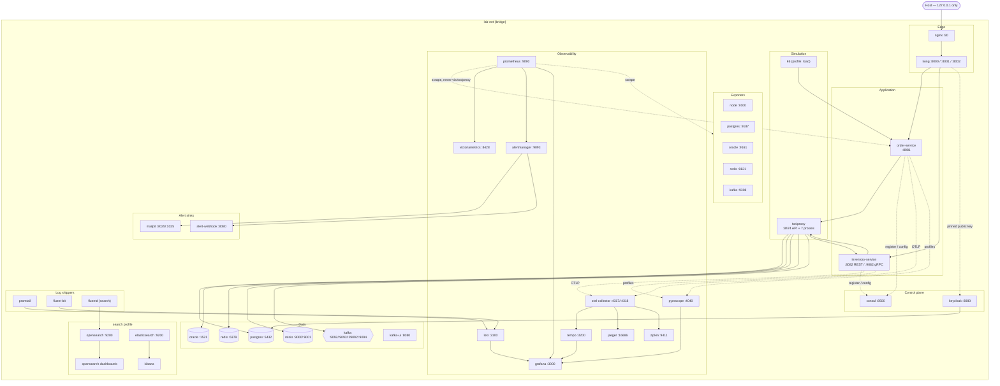
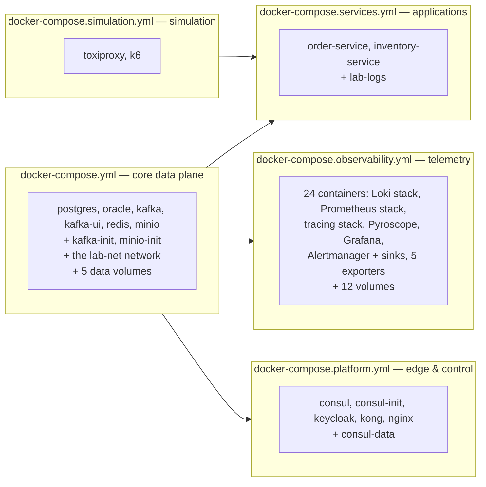
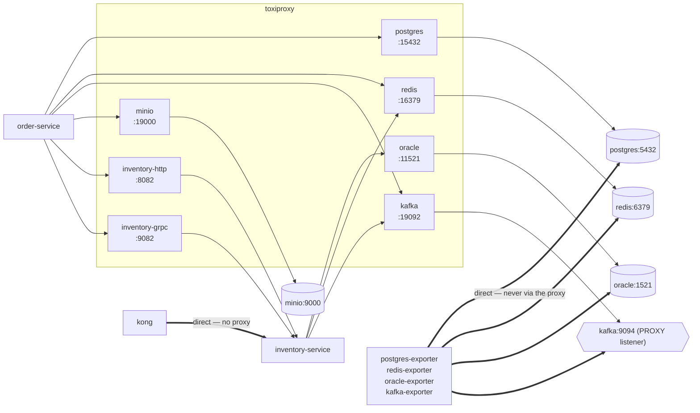
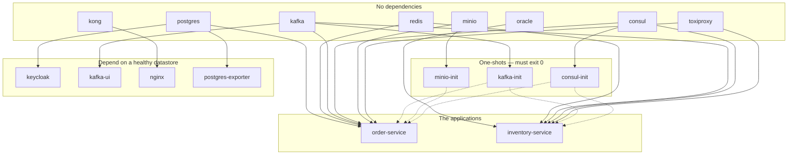
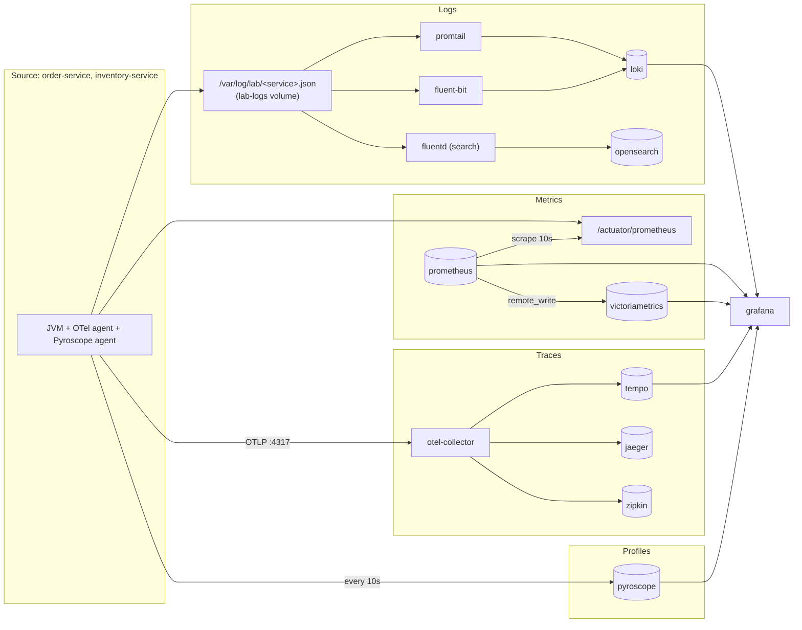
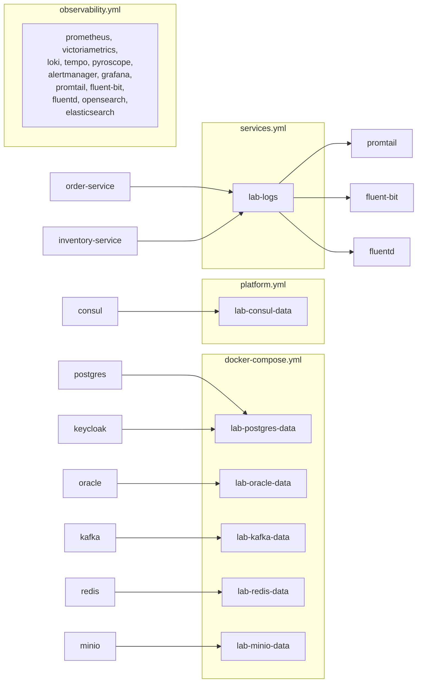
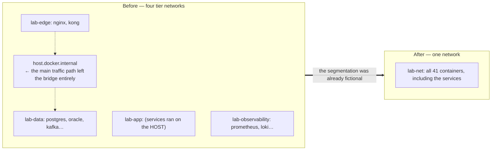

# Infrastructure Diagram

The static picture. What runs, where it runs, what addresses it by which name, and which files own it.

> **Companion documents.** [Infrastructure.md](Infrastructure.md) is the prose — what each component is
> and how it is configured. [SequenceDiagrams.md](SequenceDiagrams.md) is the motion. This is the map.
>
> Every diagram below is generated from the compose files and configuration in this repository. Where a
> diagram and a file disagree, the file is right and this document is a bug.

---

## 1. The whole system

41 containers are declared; 35 start on a default `up`. Every one of them is on **one** bridge network,
`lab-net`. Nothing runs outside it — not the services, not the load generator, not the fault proxy.

**Two edges carry most of the design.**

Every **application** hop goes through Toxiproxy — including the service-to-service one, because the
Inventory Service registers itself in Consul as `toxiproxy`. With no toxics configured it is a
transparent TCP relay; the moment one is added, that hop is slow, lossy or dead, with no restart.

Every **monitoring** hop does not. When a fault is injected, `postgres-exporter` keeps reporting a
healthy database while the service reports timeouts — and that disagreement is the diagnosis.

---

## 2. Which file owns what

**All five are always used together.** They are split by concern so each stays readable, not so they can
be run separately: Keycloak needs `postgres` from the core file, both services need `toxiproxy` from the
simulation file, and the network they all join is declared in the core file.

Heaviness is handled with compose **profiles**, not by omitting a file:

| Profile | Containers | Cost | Started by |
| --- | --- | --- | --- |
| *(none)* | 35 | ~10 GB working set | `./scripts/infra.sh up` |
| `search` | + fluentd, opensearch, opensearch-dashboards, elasticsearch, kibana | ~5 GB more | `docker compose --profile search up -d` |
| `load` | + k6 | 512M, transient | `./scripts/load.sh <scenario>` |

Configuration is separated the same way: `infrastructure/<component>/` holds *what a component is
configured to do*; `docker/` holds *how it is built and launched*. Either can be read without the other.

---

## 3. Published ports versus in-network addresses

This is the table that resolves most confusion in this stack.

> **A published port is for a person.** A browser opening Grafana, a `curl` against an API, `psql` from
> the host. **Nothing in the stack talks to anything else through one** — every component addresses every
> other by its compose name on `lab-net`.
>
> The consequence: changing a published port can inconvenience a human and **cannot** break the system.

| Component | Published on `127.0.0.1` | Addressed in-network as | `.env` variable |
| --- | --- | --- | --- |
| Nginx | 80 | `nginx:80` | `NGINX_HTTP_PORT` |
| Kong proxy / admin / manager | 8000 / 8001 / 8002 | `kong:8000` | `KONG_*_PORT` |
| Keycloak | 8080 | `keycloak:8080` | `KEYCLOAK_PORT` |
| Consul | 8500 | `consul:8500` | `CONSUL_PORT` |
| Order Service | 8081 | `order-service:8081` | `ORDER_SERVICE_PORT` |
| Inventory Service | 8082 / 9082 | `inventory-service:8082` / `:9082` | `INVENTORY_SERVICE_PORT`, `INVENTORY_GRPC_PORT` |
| PostgreSQL | 5432 | `postgres:5432` | `POSTGRES_PORT` |
| Oracle | 1521 | `oracle:1521` | `ORACLE_PORT` |
| Redis | 6379 | `redis:6379` | `REDIS_HOST_PORT` |
| MinIO API / console | 9000 / 9001 | `minio:9000` | `MINIO_*_PORT` |
| Kafka (host listener) | 29092 | `kafka:9092` (internal) | `KAFKA_EXTERNAL_PORT` |
| Kafka UI | 8090 | `kafka-ui:8080` | `KAFKA_UI_PORT` |
| Prometheus | 9090 | `prometheus:9090` | `PROMETHEUS_PORT` |
| VictoriaMetrics | 8428 | `victoriametrics:8428` | `VICTORIAMETRICS_PORT` |
| Loki | 3100 | `loki:3100` | `LOKI_PORT` |
| OTLP gRPC / HTTP / zPages | 4317 / 4318 / 55679 | `otel-collector:4317` | `OTLP_*_PORT` |
| Tempo / Jaeger / Zipkin | 3200 / 16686 / 9411 | `tempo:3200`, `jaeger:…`, `zipkin:9411` | — |
| Pyroscope | 4040 | `pyroscope:4040` | `PYROSCOPE_PORT` |
| Grafana | 3000 | `grafana:3000` | `GRAFANA_PORT` |
| Alertmanager | 9093 | `alertmanager:9093` | `ALERTMANAGER_PORT` |
| Mailpit UI / SMTP | 8025 / 1025 | `mailpit:1025` | `MAILPIT_*_PORT` |
| Alert webhook sink | 8099 | `alert-webhook:8080` | `ALERT_WEBHOOK_PORT` |
| Toxiproxy API | 8474 | `toxiproxy:8474` | `TOXIPROXY_API_PORT` |
| OpenSearch / Dashboards | 9200 / 5601 | `opensearch:9200` | `OPENSEARCH_*_PORT` |
| Elasticsearch / Kibana | 9201 / 5602 | `elasticsearch:9200` | `ELASTICSEARCH_PORT`, `KIBANA_PORT` |
| Exporters (node, pg, oracle, redis, kafka) | 9100 / 9187 / 9161 / 9121 / 9308 | same names on `lab-net` | `*_EXPORTER_PORT` |

**OpenSearch and Elasticsearch both listen on 9200 inside their containers**, which is why they are
published on different host ports — 9200 and 9201. The same applies to their two dashboards.

---

## 4. The fault-injection topology

Seven proxies, and one asymmetry that matters.

| Proxy | Listens | Forwards to |
| --- | --- | --- |
| `postgres` | `0.0.0.0:15432` | `postgres:5432` |
| `oracle` | `0.0.0.0:11521` | `oracle:1521` |
| `redis` | `0.0.0.0:16379` | `redis:6379` |
| `kafka` | `0.0.0.0:19092` | `kafka:9094` — the **PROXY** listener |
| `minio` | `0.0.0.0:19000` | `minio:9000` |
| `inventory-http` | `0.0.0.0:8082` | `inventory-service:8082` |
| `inventory-grpc` | `0.0.0.0:9082` | `inventory-service:9082` |

**Three things to notice.**

1. **Kafka needs its own listener.** A Kafka client bootstraps against one address and is then told by
   the broker which address to actually use. Proxying `:9092` would hand the client `kafka:9092` on that
   second connection and the proxy would be bypassed — **silently**, so injected Kafka faults would
   appear to do nothing at all. A client arriving on the `PROXY` listener is told to keep using the
   proxy.
2. **Kong reaches the Inventory Service directly; the Order Service reaches it through the proxy.** So a
   toxic on `inventory-http` breaks service-to-service calls while the public API keeps answering. That
   asymmetry is deliberate — it is a real and confusing production shape.
3. **The exporters are never in the path.** During a fault the exporter reports a healthy database while
   the service reports timeouts, and reading that disagreement is the diagnosis.

Taking the proxy out of any one path is a one-line `.env` edit: point `ORDER_DB_HOST` at `postgres`,
`REDIS_HOST` at `redis`, `INVENTORY_ADVERTISE_HOST` at `inventory-service`.

---

## 5. Startup dependency graph

Solid: `condition: service_healthy`. Dotted: `condition: service_completed_successfully`.

**Waiting for one-shots to *complete* rather than start** is what stops a service booting against a
broker with no topics or an object store with no bucket — both of which fail at the first request rather
than at startup, which is far harder to attribute.

**Neither service depends on Keycloak or on the observability stack.** JWKS is fetched lazily on the
first token; Consul config is `optional:` with `fail-fast: false`. Both are deliberate: a service that
starts when a neighbour is down is a service whose failures are attributable.

### Healthcheck budgets

| Container | Interval | Retries | Start period | Worst case |
| --- | --- | --- | --- | --- |
| `oracle` | 15 s | 40 | **180 s** | ~13 min |
| `inventory-service` | 10 s | 12 | 120 s | ~4 min |
| `order-service` | 10 s | 12 | 90 s | ~3.5 min |
| `keycloak` | 15 s | 20 | 90 s | ~6.5 min |
| `kafka` | 10 s | 20 | 30 s | ~3.8 min |
| `postgres`, `redis`, `minio`, `consul`, `kong` | 10 s | 5–10 | 10–20 s | < 2 min |

`infra.sh up` allows `WAIT_TIMEOUT_SECONDS=900` overall. Oracle dominates that budget, and its
generosity is deliberate — do not shorten it because a first boot looks stuck.

---

## 6. The four telemetry pipelines

**Several backends per signal is the point**, not redundancy. Comparing Loki against OpenSearch, or
Tempo against Jaeger, on *identical* traffic is far more instructive than reading either one's
marketing page.

| Signal | Transport | Why that transport |
| --- | --- | --- |
| Logs | File on a shared volume, tailed | Decouples the service from the shipper. The async appender drops rather than blocks — a log pipeline that back-pressures request threads has turned an observability component into an availability one |
| Metrics | Pull (scrape) | The scraper decides the cadence; a target that dies stops being scraped rather than flooding a queue |
| Traces | Push (OTLP gRPC) | Spans are events with no meaningful "current value" to poll |
| Profiles | Push, every 10 s | Same |

`OTEL_METRICS_EXPORTER=none` and `OTEL_LOGS_EXPORTER=none` are set deliberately: Prometheus scrapes the
metrics and the file pipeline carries the logs, so exporting either over OTLP would double-count them.

### Prometheus scrape targets

| Job | Target | Interval |
| --- | --- | --- |
| `observability-lab-services` | `order-service:8081`, `inventory-service:8082` at `/actuator/prometheus` | 10 s |
| `node` | `node-exporter:9100` | 15 s |
| `postgres` | `postgres-exporter:9187` | 15 s |
| `oracle` | `oracle-exporter:9161` | **30 s** — Oracle's views are expensive |
| `redis` | `redis-exporter:9121` | 15 s |
| `kafka` | `kafka-exporter:9308` | 15 s |
| `prometheus`, `alertmanager`, `victoriametrics`, `loki`, `grafana` | themselves | 15 s |
| `fluent-bit` | `fluent-bit:2020` at `/api/v1/metrics/prometheus` | 15 s |
| `promtail` | `promtail:9080` | 15 s |
| `toxiproxy` | `toxiproxy:8474` | 15 s — needs `-proxy-metrics -runtime-metrics`, or `/metrics` 404s |

k6 does not appear here: it **remote-writes** into the same Prometheus, which runs with
`--web.enable-remote-write-receiver` for that reason. That is what puts a load test and its effect on
one time axis.

---

## 7. State — volumes and what is in them

| Volume | Holds | Lost on `destroy` |
| --- | --- | --- |
| `lab-postgres-data` | `orderdb` **and** Keycloak's realm data | yes |
| `lab-oracle-data` | Inventory database | yes |
| `lab-kafka-data` | Broker log, consumer offsets | yes |
| `lab-redis-data` | AOF and RDB snapshots | yes |
| `lab-minio-data` | Invoice objects | yes |
| `lab-consul-data` | Registry state and KV | yes |
| `lab-logs` | JSON log files, written by the services and read by three shippers | yes |
| 12 observability volumes | Metrics, logs, traces, profiles, dashboards | yes |

**`lab-logs` is a named volume rather than a bind mount to `<repo>/logs`, deliberately.** The files are
produced inside the network and consumed inside it, so routing them through the host filesystem would
put a component of the pipeline outside the network for no benefit — and on Docker Desktop it would put
every write through a filesystem translation layer, which is slow enough to distort exactly the latency
measurements this lab takes.

**Keycloak shares the PostgreSQL volume**, which is why re-importing a changed realm requires dropping
`lab-postgres-data` — and that also drops `orderdb`.

**The Kafka cluster id is fixed in `.env`.** A KRaft log directory is stamped with the cluster id that
formatted it, and a broker started with a different one refuses to mount its own data.

---

## 8. The resource budget

Limits, not reservations. Docker does not pre-allocate these; most containers idle far below their
ceiling, which is why 10 GB is enough for a stack whose limits sum to 15.6 GB.

| Tier | Containers | Sum of limits |
| --- | --- | --- |
| Data plane | postgres 768M, **oracle 2560M**, kafka 1024M, kafka-ui 512M, redis 384M, minio 512M | 5760M |
| Edge & control | consul 384M, keycloak 1024M, kong 512M, nginx 192M | 2112M |
| Applications | order-service 768M, inventory-service 768M | 1536M |
| Observability | prometheus 768M, pyroscope 640M, loki/tempo/jaeger/grafana/victoriametrics 512M each, otel-collector 384M, zipkin 384M, alertmanager 256M, promtail 256M, oracle-exporter 256M, 6 × 128M | 6400M |
| Simulation | toxiproxy 128M | 128M |
| **Default total** | **35 containers** | **≈ 15.6 GB** |
| `search` profile | opensearch 1536M, elasticsearch 1536M, opensearch-dashboards 768M, kibana 768M, fluentd 512M | + 5.0 GB |

**The two service limits are deliberately modest.** A service with room to spare never exhibits GC
pressure, a heap alert, thread-pool saturation or an OOM kill — and those are four of the things this lab
exists to make visible. `ORDER_SERVICE_CPUS=1.5` and `ORDER_SERVICE_MEMORY=768M` are what put the
saturation point within reach of a ninety-second run.

Raising them to watch a symptom disappear is a legitimate experiment; raising them because a run went
red is deleting the result. The measured ceiling those numbers produce is in
[Performance.md §2](Performance.md#2-the-measured-ceiling).

The JVM heap follows the container limit through `-XX:MaxRAMPercentage=70` rather than `-Xmx`, so the
two cannot drift apart.

---

## 9. The one network, and what it cost

**What was given up.** Nginx on `lab-edge` could not reach a database however badly it was
misconfigured. That was a genuine control, and it is gone.

**Why the trade was made.** The segmentation was already fictional: the two services ran on the
developer's machine and were reached through `host.docker.internal`, so traffic that was supposed to stay
inside a bridge network left it, crossed the host's stack and came back — which no tier boundary was
inspecting. A boundary that the main traffic path routes around is a diagram, not a control.

**What was bought.** The whole system is one addressable network: a fault proxy can sit in front of any
hop, a load generator experiences the same network the services do, and a failing container is a failure
of the lab rather than a failure of the laptop. For a system whose purpose is reproducing load, latency
and failure, that is the better trade.

Network segmentation as a security control is not thereby dismissed — it is simply not what this lab is
demonstrating, and the honest version of a thing is better than a decorative one.
[Security.md §12](Security.md#12-what-is-deliberately-not-secured) records it as a gap.

---

## 10. Related documents

| Document | For |
| --- | --- |
| [Infrastructure.md](Infrastructure.md) | What each component is, and how it is configured |
| [Deployment.md](Deployment.md) | Bringing this up, and the configuration surface |
| [SequenceDiagrams.md](SequenceDiagrams.md) | What moves through this |
| [SystemDesign.md §5](SystemDesign.md#5-port-allocation) | The port allocation rationale |
| [Security.md](Security.md) | What each boundary does and does not protect |
| [Performance.md](Performance.md) | What the resource limits produce |
