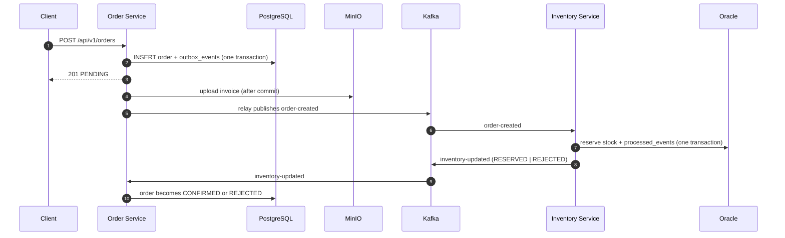

# Event-driven integration — Kafka

Step 09 turns the two services into a working event-driven pair. An order is accepted without
knowing whether its stock exists; the Inventory Service decides and answers; the Order Service
settles. Nothing in that chain is a distributed transaction, and every piece of machinery below
exists because of something that can go wrong when it isn't.

---

## 1. Topics

Declared by [`create-topics.sh`](../infrastructure/kafka/init/create-topics.sh), never
auto-created — a topic has a partition count and a retention policy, and neither should be decided
by whichever producer connects first.

| Topic | Produced by | Consumed by | Retention |
| --- | --- | --- | --- |
| `order-created` | Order Service (outbox relay) | Inventory Service | 7d |
| `inventory-updated` | Inventory Service | Order Service | 7d |
| `dead-letter-topic` | both, on exhausted retries | nobody | 30d |
| `retry-topic` | reserved for step 16 | — | 7d |

Dead letters are kept far longer than successes: a dead letter is only useful if it is still there
when somebody finally looks at the alert.

Every message is **keyed by order number**, so all events for one order land on the same partition
and are delivered in the order they happened. Keyed by anything else, a settlement could overtake
the creation it refers to.

## 2. Consumer groups

Convention `<service>-<topic>-group`:

- `inventory-order-created-group`
- `order-inventory-updated-group`

The group id is the unit of offset tracking. Changing it silently replays the topic from
`auto-offset-reset`, which is `earliest` on both sides — missing an `order-created` means stock is
never reserved, and missing an `inventory-updated` leaves an order `PENDING` forever. Neither has
anything to reconcile against, so both prefer replay to loss.

Auto-commit is off and the ack mode is `record`: the container commits after a record is handled, so
a crash replays at most one message rather than acknowledging a batch it never processed.

---

## 3. The order flow



The client's `201` says **accepted**, not fulfilled. That is the whole reason for the design: the
Order Service keeps taking orders while the Inventory Service is down.

---

## 4. The two hard parts

### Dual write, on the producing side

Committing the order to PostgreSQL and sending to Kafka are two systems with no shared transaction.
Commit then send, and a broker outage loses the event for an order that exists. Send then commit,
and a rollback leaves consumers acting on an order that never did.

The **transactional outbox** removes the choice. The event is written as a row in `outbox_events` in
the *same transaction* as the order ([`V2__create_outbox.sql`](../services/order-service/src/main/resources/db/migration/V2__create_outbox.sql)),
by a `BEFORE_COMMIT` listener. Either both are durable or neither is.
[`OutboxRelay`](../services/order-service/src/main/java/com/observability/lab/order/infrastructure/messaging/OutboxRelay.java)
then moves rows to Kafka on a fixed delay and marks them published. A failure there is never data
loss — the row survives and the next run retries it.

The relay claims its batch with `FOR UPDATE SKIP LOCKED`, which is what makes it safe to run in more
than one instance: two relays take different rows instead of publishing everything twice or blocking
on each other.

### Dual write, on the replying side

The Inventory Service has the mirror problem: it commits a reservation to Oracle, then has to tell
the Order Service. It solves it *without* a second outbox, using the consumer offset as the durable
marker.

[`InventoryUpdatedPublisher`](../services/inventory-service/src/main/java/com/observability/lab/inventory/infrastructure/messaging/InventoryUpdatedPublisher.java)
sends **synchronously** and the listener only returns once the broker has acknowledged. If it cannot,
the listener throws, the offset is not committed, and `order-created` is redelivered.

That only works because a redelivery can reproduce the same answer, which is why
`processed_events` records the **decision** and not merely the fact of handling
([`V2__record_event_outcome.sql`](../services/inventory-service/src/main/resources/db/migration/V2__record_event_outcome.sql)).
Without the stored outcome a redelivery would find "already processed", have nothing to announce, and
strand the order in `PENDING` with its stock reserved.

---

## 5. Idempotency

Delivery is **at-least-once** in both directions. Duplicates are normal operation, not a fault.

| Side | Mechanism | Why that one |
| --- | --- | --- |
| Inventory | `processed_events` keyed by `eventId`, written in the reservation's transaction | Reserving twice genuinely subtracts twice. The marker and the effect must commit together. |
| Order | none needed | Settling is naturally idempotent — moving an order to a state it already occupies is a no-op costing one query. |

Exactly-once across a database and a broker is not available at any price worth paying here.

---

## 6. Retry, backoff and the DLQ

Both consumers use `DefaultErrorHandler` with a `FixedBackOff` of **3 attempts, 1 second apart**,
then a `DeadLetterPublishingRecoverer`.

**Not everything is retried.** `BusinessException` and `ValidationException` are registered as
non-retryable and go to the dead-letter topic on the first failure. A rule that refused once refuses
identically every time; retrying it wastes the budget and holds up every later record on the
partition.

**Deserialisation failures never reach the poll loop.** An unparseable record throws inside the
consumer before any listener runs, and without `ErrorHandlingDeserializer` that exception is raised
on every poll of the same offset forever — the consumer never advances, lag grows without limit, and
no application code is involved to notice.

The recoverer republishes the original record with its key, value and headers intact, plus headers
naming the source:

```
kafka_dlt-original-topic      order-created
kafka_dlt-original-offset     ...
kafka_dlt-exception-fqcn      org.springframework.kafka.listener.ListenerExecutionFailedException
kafka_dlt-exception-message   ...
```

That is the difference between a message that can be diagnosed and replayed and one that was merely
logged.

**Nothing consumes `dead-letter-topic`.** A queue that automatically feeds poison messages back into
the consumer that already choked on them is a loop, not a recovery.

---

## 7. Serialisation

Both services configure serialisers **as instances** rather than by class name in `application.yml`.
Naming the class lets Kafka build it with a private `ObjectMapper` that leaves
`WRITE_DATES_AS_TIMESTAMPS` on, so an `Instant` goes onto the wire as `1784537424.040746` while the
same field in an HTTP response renders as `"2026-07-20T08:50:24.040746Z"`. One service, two
representations of the same instant, is a bug waiting for whoever writes the consumer.

Type headers are switched off (`setAddTypeInfo(false)`) and the consumer ignores them. The topic and
its documented schema are the contract — not a fully-qualified Java class name that every consumer
would then have to own, and that a producer could otherwise use to choose which class the consumer
instantiates.

Each side declares its **own** copy of the message record. Sharing one class would make the schema a
compile-time coupling, which is exactly what publishing events was meant to remove.

---

## 8. Verify it

```bash
# Watch a settlement arrive
docker exec lab-kafka /opt/kafka/bin/kafka-console-consumer.sh \
  --bootstrap-server kafka:9092 --topic inventory-updated --from-beginning --timeout-ms 8000

# Outbox state: unpublished rows are the backlog
docker exec lab-postgres psql -U order_user -d orderdb \
  -c "select event_type, message_key, published_at is not null as published, attempts from outbox_events order by occurred_at desc limit 5;"

# Consumer group lag
docker exec lab-kafka /opt/kafka/bin/kafka-consumer-groups.sh \
  --bootstrap-server kafka:9092 --describe --group inventory-order-created-group

# Send a poison message and watch it land in the DLQ rather than block the partition
echo '{"eventId":"poison-1","orderNumber":"","items":[]}' | docker exec -i lab-kafka \
  /opt/kafka/bin/kafka-console-producer.sh --bootstrap-server kafka:9092 --topic order-created
docker exec lab-kafka /opt/kafka/bin/kafka-console-consumer.sh \
  --bootstrap-server kafka:9092 --topic dead-letter-topic --from-beginning --timeout-ms 8000
```

Kafka UI at <http://localhost:8090> shows topics, groups and lag without the CLI.
