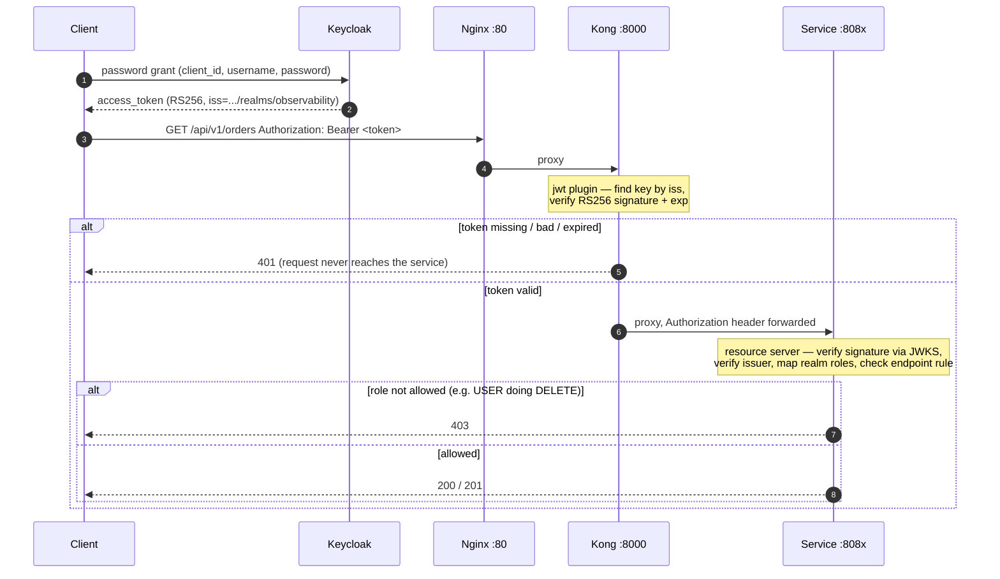

# Authentication — Keycloak, Kong and the resource servers

Step 07 turns the lab from open to authenticated. It adds a Keycloak realm that issues JSON Web
Tokens, switches on the Kong JWT plugin that step 06 left staged, and makes both services OAuth2
resource servers that validate those tokens and enforce roles.

Nothing in the business flow changed. What changed is that every `/api/**` call now has to prove who
is making it, and every destructive call has to prove it is allowed to.

---

## 1. Where the pieces live

| Concern | Location |
| --- | --- |
| Realm definition (clients, roles, users, signing key) | [`infrastructure/keycloak/realm/observability-realm.json`](../infrastructure/keycloak/realm/observability-realm.json) |
| Keycloak container + realm import | [`docker/compose/docker-compose.platform.yml`](../docker/compose/docker-compose.platform.yml) |
| Edge JWT verification | [`infrastructure/kong/kong.yml`](../infrastructure/kong/kong.yml) — `jwt` plugin + realm consumer |
| Service-side verification and authorization | `shared-library` → `ResourceServerAutoConfiguration` |
| Realm/issuer configuration | [`docker/compose/.env.example`](../docker/compose/.env.example) → `KEYCLOAK_*` |
| Token helper | [`scripts/token.sh`](../scripts/token.sh) |

---

## 2. The realm

A single realm, **`observability`**. Its issuer — the value every token carries in its `iss` claim
and the string both the gateway and the services check — is:

```
http://localhost:8080/realms/observability
```

The issuer is the realm URL as seen by whoever requested the token. Because tokens in this lab are
always minted through `http://localhost:8080` (the published Keycloak port), the issuer is stable and
both verifiers can be configured with it literally. Change `KEYCLOAK_PORT` or `KEYCLOAK_REALM` in
`.env` and the issuer changes with them — see [§8](#8-changing-ports-or-realm-name).

### 2.1 A pinned signing key

Keycloak normally generates a fresh RSA key the first time a realm starts. That is fine when
verifiers fetch keys dynamically, but Kong's community JWT plugin verifies against a **static** key
held in its configuration — a generated key would be different on every clean start and would not
match what is committed in `kong.yml`.

So the realm import pins its own RSA keypair (`components → org.keycloak.keys.KeyProvider`, provider
`rsa`, priority `101`). The public half of that exact key is what `kong.yml` carries. Because both
sides derive from one keypair, the gateway keeps verifying across rebuilds with no coordination.

> The private key in the realm file is **lab material only**. It exists so the stack is reproducible
> on any machine; it must never be reused for anything real. This is the same posture as the
> local-dev passwords already in `.env.example`.

The services do not use the static key — they fetch the public key from the realm's JWKS endpoint at
runtime, so key rotation would be transparent to them.

### 2.2 Clients

| Client | Type | Flows | Purpose |
| --- | --- | --- | --- |
| `gateway` | confidential (secret) | authorization code, client credentials, direct access | The edge / backend-for-frontend. Demonstrates a confidential client and service-account tokens. |
| `swagger-ui` | public | authorization code (PKCE), direct access | The per-service Swagger UIs sign in through this. Direct access grants are enabled so `token.sh` and `curl` can obtain a token without a secret. |
| `frontend` | public | authorization code (PKCE) | Placeholder SPA. No direct access grants — a browser app uses the code flow. |

### 2.3 Roles and users

Two realm roles, `USER` and `ADMIN`, and two seeded users (local-dev credentials):

| Username | Password | Realm roles |
| --- | --- | --- |
| `alice` | `alice` | `USER` |
| `manager` | `manager` | `ADMIN`, `USER` |

`USER` may read and write the APIs; `ADMIN` may additionally issue `DELETE`. The Keycloak bootstrap
administrator (`admin` / `KEYCLOAK_ADMIN_PASSWORD`, at <http://localhost:8080>) is a separate account
for managing Keycloak itself, not a realm user.

---

## 3. Getting a token (the JWT flow)

```bash
# USER token
TOKEN=$(./scripts/token.sh alice)

# ADMIN token
ADMIN_TOKEN=$(./scripts/token.sh manager)
```

Under the hood that is the password grant against the realm's token endpoint:

```bash
curl -s -X POST \
  http://localhost:8080/realms/observability/protocol/openid-connect/token \
  -d client_id=swagger-ui \
  -d username=alice -d password=alice \
  -d grant_type=password
```

In Swagger UI (`http://localhost:8081/swagger-ui.html`) the **Authorize** button takes the same
access token — paste the value from `token.sh`.

---

## 4. How a request is verified — twice



**Why verify twice.** The gateway answers one question — *is this caller authenticated?* — and
answers it for the whole edge. Authorization is finer: it is per endpoint and per role, and only the
service knows its own rules. The service also cannot assume every caller arrived through the gateway,
because in this lab its port is reachable on the host. Each layer therefore fails closed on its own:
the edge rejects anonymous traffic early, the service enforces who-may-do-what.

### 4.1 At the edge (Kong)

The `jwt` plugin (`enabled: true`) selects the verifying key by the token's `iss` claim
(`key_claim_name: iss`), checks the RS256 signature against the realm's public key held on the
`keycloak-observability` consumer, and verifies `exp`. The token is **forwarded** upstream so the
service can re-validate and authorize. Kong also strips any client-supplied `X-User-Id` so identity
cannot be spoofed in a header.

### 4.2 At the service (Spring resource server)

`ResourceServerAutoConfiguration` in the shared library installs one identical policy in every
service:

- **Open:** `/actuator/**` (probes and, later, scraping), `/v3/api-docs/**`, `/swagger-ui/**`,
  `/error`.
- **`DELETE /api/**`:** requires `ADMIN`.
- **Every other `/api/**`:** requires `USER` or `ADMIN`.

Realm roles from `realm_access.roles` become `ROLE_*` authorities
(`KeycloakRealmRoleConverter`). The token's `preferred_username` becomes the principal name and is
stamped onto the correlation MDC (`SecurityUserMdcFilter`), so from authentication onward every log
line carries the real user. The JWT decoder is built from the JWKS endpoint and fetches keys lazily,
so a service starts even when Keycloak is not up yet; the issuer is still checked on every token.

---

## 5. Try it

With the stack and both services running:

```bash
TOKEN=$(./scripts/token.sh alice)        # USER
ADMIN=$(./scripts/token.sh manager)      # ADMIN

# No token → refused at the edge
curl -i http://localhost/api/v1/orders                      # 401

# USER may read and write
curl -s http://localhost/api/v1/stock -H "Authorization: Bearer $TOKEN"

# USER may not delete
curl -i -X DELETE http://localhost/api/v1/stock/SKU-1 \
  -H "Authorization: Bearer $TOKEN"                          # 403

# ADMIN may
curl -i -X DELETE http://localhost/api/v1/stock/SKU-1 \
  -H "Authorization: Bearer $ADMIN"                          # 200 / 422
```

---

## 6. Operations

- **Import is idempotent.** Keycloak imports the realm on boot and skips it if it already exists.
  To re-import after editing the realm file, drop Keycloak's store:
  `./scripts/infra.sh destroy` (removes all volumes) or remove the `postgres-data` volume, then
  `up` again.
- **Admin console:** <http://localhost:8080>, sign in as `admin`. Realm → `observability`.
- **Reload Kong after editing `kong.yml`:** `./scripts/gateway.sh reload` (validate first with
  `./scripts/gateway.sh validate`).

---

## 7. Rotating the pinned key

Regenerate a keypair and update both sides from the one key:

```bash
openssl genrsa -out priv.pem 2048
openssl pkcs8 -topk8 -nocrypt -in priv.pem              # → realm privateKey (strip PEM header/footer)
openssl req -new -x509 -key priv.pem -days 36500 \
  -subj /CN=observability-lab                           # → realm certificate (strip header/footer)
openssl rsa -in priv.pem -pubout                        # → kong.yml rsa_public_key (keep PEM)
```

Put the PKCS#8 body and certificate body into the realm's `rsa` KeyProvider, the public PEM into the
Kong consumer, re-import the realm and reload Kong.

---

## 8. Changing ports or realm name

The issuer is `http://localhost:${KEYCLOAK_PORT}/realms/${KEYCLOAK_REALM}`. If either changes:

1. `.env` — `KEYCLOAK_ISSUER` / `KEYCLOAK_JWKS_URI` follow automatically.
2. `infrastructure/kong/kong.yml` — the consumer's `key` is the issuer; update it to match, or Kong
   rejects every token as coming from an unknown issuer.

The services need no change: they read the issuer and JWKS URL from the environment.
