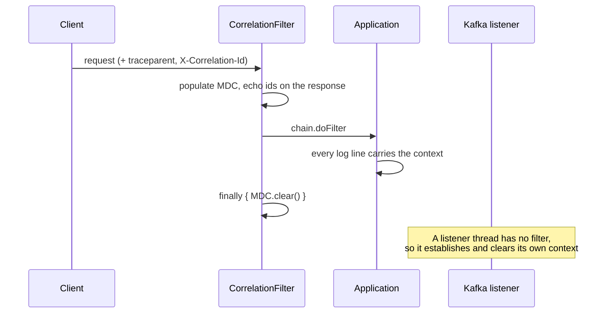

# Logging

Step 10 turns log lines into data. The services already carried a correlation context (step 03);
this step gives it a machine-readable shape, ships it three different ways, and puts a dashboard on
the other end.

---

## 1. The log record

Every line is one JSON object. The field names are a **contract**: they are what dashboards, saved
queries and alerts are built on, so they live next to the code that produces them —
[`CorrelationFields`](../services/shared-library/src/main/java/com/observability/lab/shared/correlation/CorrelationFields.java)
defines the MDC keys and [`logback-common.xml`](../services/shared-library/src/main/resources/logback-common.xml)
renders them.

```json
{
  "@timestamp": "2026-07-21T06:51:09.885Z",
  "level": "INFO",
  "logger": "c.o.lab.order.application.OrderApplicationService",
  "thread": "http-nio-8081-exec-3",
  "message": "Order accepted with 1 line(s), total 9.99 EUR",
  "trace_id": "4bf92f3577b34da6a3ce929d0e0e4736",
  "span_id": "00f067aa0ba902b7",
  "request_id": "24b76acffdcb4afdbc89eadf36f8905e",
  "correlation_id": "4bf92f3577b34da6a3ce929d0e0e4736",
  "user_id": "manager",
  "service": "order-service",
  "environment": "local",
  "version": "1.0.0-SNAPSHOT"
}
```

| Field | Meaning |
| --- | --- |
| `trace_id` / `span_id` | The distributed operation and one unit of work inside it. Present when the caller sent a W3C `traceparent`; step 12's SDK will mint them unconditionally. |
| `request_id` | One inbound HTTP request. Generated at the edge if absent. |
| `correlation_id` | One *business* transaction, which may span several requests. Caller-supplied, and it survives across service boundaries. |
| `user_id` | Subject of the authenticated principal. |
| `service` / `environment` / `version` | Which deployment produced the line. |

On an exception the record also carries `exception_class` and `stack_trace`. The trace is **one
string field**, not raw multi-line text: written across many lines it becomes many log records, and
the parser attributes all but the first to nothing.

### Two shapes, chosen by profile

| Profile | Console | File |
| --- | --- | --- |
| `local` | colourised single line, for a human | JSON |
| `dev`, `prod` | JSON | JSON |

A pipeline cannot parse the pretty form and a person should not have to read the JSON one, so neither
is a compromise. The JSON file is written in every profile, which is what lets the whole pipeline be
exercised on a workstation without giving up a readable console.

### Where levels are set

**`application.yml`, not logback.** Spring Boot applies `logging.level.*` *after* `logback-spring.xml`
is parsed, so a `<logger level="...">` there is silently overridden and the two disagree in a way
nobody can see. `logback-spring.xml` owns *where logs go and what shape they take*; the YAML owns
*which ones are emitted*.

Also note the file must be `logback-spring.xml` and not `logback.xml`: only the former is read after
Spring resolves the environment, which is what makes `<springProfile>` work at all.

### Dropping rather than blocking

Both JSON appenders are wrapped in an `AsyncAppender` with `neverBlock=true`. Under sustained
pressure, log events are **discarded** rather than allowed to apply back-pressure to the threads
doing the work. Losing log lines during a flood is bad; stalling every request thread because a disk
is slow is worse — it turns a logging problem into an outage.

`discardingThreshold` is `0`, not the default 20%. The default silently drops TRACE, DEBUG and INFO
once the queue is a fifth full, which removes exactly the context that makes the surviving WARN and
ERROR lines legible.

---

## 2. The MDC lifecycle



The `finally` block is the part that must never be removed. Request threads are pooled: without the
clear, the next request inherits the previous request's identity and the logs confidently attribute
one user's activity to another. The Kafka listeners do the same thing for the same reason.

### Crossing the outbox

The transactional outbox (step 09) breaks the chain if nothing is done about it: the row is written
inside the request, but the relay publishes it later on a **scheduler thread that has no MDC and no
way to recover one**. The Inventory Service then received no correlation header, invented its own
from the order number, and one business transaction appeared under two different identifiers either
side of the broker.

The fix is to stop treating correlation as ambient thread state and store it as part of the event:
`outbox_events` carries `correlation_id` and `trace_id`
([V3](../services/order-service/src/main/resources/db/migration/V3__outbox_correlation.sql)),
captured at write time and replayed by the relay onto both the outbound Kafka header and its own log
context. The same applies to service identity — a scheduler or listener thread has no filter to
establish it, and a line without a `service` field is invisible to every query that filters by
service.

The result is that one id spans the whole round trip:

```
order-service      Order accepted with 1 line(s), total 9.99 EUR
order-service      Invoice archived for order 'ORD-…'
order-service      Enqueued order-created for order 'ORD-…'
order-service      Relayed order-created to order-created-2@5
inventory-service  Handled order-created for order 'ORD-…'
inventory-service  Reserved 1 line(s) for order 'ORD-…'
inventory-service  Published inventory-updated (RESERVED) for order 'ORD-…'
order-service      Handled inventory-updated for order 'ORD-…'
order-service      Order settled as CONFIRMED
```

Caller-supplied identifiers are **sanitised** before they reach the MDC — bounded in length and
restricted to `[A-Za-z0-9._-]`. That is not cosmetic: a newline in a header lets a caller forge log
entries, and an unbounded value is an amplification primitive that turns one request into megabytes
of log volume across three pipelines.

---

## 3. Three pipelines

```
services ──> lab-logs volume ──┬──> Promtail   ──> Loki        ──> Grafana
             /var/log/lab/*.json ├──> Fluent Bit ──> Loki        ──> Grafana
                               └──> Fluentd    ──> OpenSearch  ──> OpenSearch Dashboards
```

All three read the **same files**, on a named Docker volume the services write and the agents mount
read-only. That duplication is the point — the lab exists to make the differences concrete — so each
agent stamps the record with the pipeline that carried it. Without that they would be
indistinguishable in Loki and look like every log had been ingested twice.

The volume replaced a bind mount to `<repo>/logs`, which was how it had to work while the services
were processes on the host. Two reasons it was worth changing: it put a hop of the log pipeline
outside the Docker network, and on Docker Desktop every write went through a filesystem translation
layer slow enough to distort the very latency being measured.

Under the `dev` profile the services **also** log JSON to stdout, so `docker logs lab-order-service`
shows the same records in the same shape the agents ship. Switching the agents to the container log
driver would therefore be a configuration change and nothing else; the file pipeline is kept because
tailing a file is what these three agents are actually deployed to do.

| Agent | Written in | Why you would pick it |
| --- | --- | --- |
| [Promtail](../infrastructure/promtail/promtail.yml) | Go | Grafana's own agent. Speaks Loki natively, so there is no format translation in the path. |
| [Fluent Bit](../infrastructure/fluent-bit/fluent-bit.conf) | C | A few megabytes of memory. The usual choice for a DaemonSet on every node, where a Go runtime is multiplied by the node count. |
| [Fluentd](../infrastructure/fluentd/fluent.conf) | Ruby | The mature plugin ecosystem. Heavier, but it can reach destinations the other two cannot. |

### Loki versus OpenSearch

The reason two stores are worth running:

|  | Loki | OpenSearch |
| --- | --- | --- |
| Indexes | labels only | every field |
| Ingestion cost | low | high |
| Storage cost | low (compressed chunks) | high (inverted index) |
| Query model | label lookup, then grep | any field, aggregations, relevance |

Neither is "right". Running both and querying the same records through each is how the trade stops
being abstract.

### Label cardinality — the thing to get right

Only low-cardinality fields become Loki labels: `service`, `level`, `environment`, `pipeline`, `job`.

Every distinct combination of label values is a separate **stream**. Promoting `correlation_id` or
`request_id` to a label would create a stream per request and bring the ingester down. Those fields
stay inside the line, where LogQL still finds them:

```logql
{service="order-service"} |= "loki-demo-42"
{service=~".+"} | json | correlation_id = "loki-demo-42"
```

That is the single most common way to make Loki unusable, and it is why the agents' configs list
labels explicitly rather than promoting everything the JSON contains.

### Timestamps

Every agent is configured to use the application's `@timestamp`, not the moment it read the line.
Otherwise a backlog read after a restart arrives with every record stamped at the same instant, and
the ordering of the incident you are investigating is destroyed.

---

## 4. Running it

Loki, both agents and Grafana start with the normal bring-up:

```bash
./scripts/infra.sh up          # or: docker compose up -d
./scripts/infra.sh up      # services write /var/log/lab/*.json on the lab-logs volume,
                           # which all three shipping agents mount read-only
```

| UI | Address |
| --- | --- |
| Grafana | <http://localhost:3000> (anonymous viewing; `admin` to edit) |
| Loki API | <http://localhost:3100> |

The search stack is **opt-in**, because OpenSearch and Elasticsearch need roughly 2 GB each that a
machine already running Oracle and Kafka does not have spare:

```bash
docker compose --profile search up -d
```

| UI | Address |
| --- | --- |
| OpenSearch Dashboards | <http://localhost:5601> |
| Kibana | <http://localhost:5602> |

Nothing ships to Elasticsearch by default; it is there to be pointed at when comparing the two.

### The dashboard

**Logs — Overview** (`Observability Lab / logs`) has headline counts, log rate by level, error rate
by service, and a live tail. Its variables are the useful part:

- **Pipeline** — look at Promtail's copy or Fluent Bit's. Both carry everything, so this is how you
  compare them rather than double-count.
- **Contains** — paste a `correlation_id` here to follow one business transaction across both
  services: the order being accepted, the stock reserved, the settlement coming back.

Levels use reserved status colours (ERROR red, WARN orange) rather than an arbitrary series palette,
so red means the same thing here as everywhere else.

Dashboards are provisioned from [files](../infrastructure/grafana/dashboards) and read-only in the
UI. A dashboard that exists only in someone's browser is not part of the system: it cannot be
reviewed and it is lost when the volume is recreated.

---

## 5. Verify it

```bash
# A line with the full correlation context
TOKEN=$(./scripts/token.sh manager | tail -1)
curl -s -X POST http://localhost:8081/api/v1/orders \
  -H "Authorization: Bearer $TOKEN" -H 'Content-Type: application/json' \
  -H 'X-Correlation-Id: demo-1' \
  -H 'traceparent: 00-4bf92f3577b34da6a3ce929d0e0e4736-00f067aa0ba902b7-01' \
  -d '{"customerId":"C-1","currency":"EUR","items":[{"productSku":"SKU-1","quantity":1,"unitPrice":"9.99"}]}'

docker exec lab-order-service grep demo-1 /var/log/lab/order-service.json \
  | head -1 | python3 -m json.tool

# The same record through each pipeline
for p in promtail fluent-bit; do
  curl -s -G http://localhost:3100/loki/api/v1/query_range \
    --data-urlencode "query={job=\"$p\"} |= \"demo-1\"" --data-urlencode 'limit=1'
done

# What Loki is indexing — if this list grows unexpectedly, a high-cardinality
# field has been promoted to a label
curl -s http://localhost:3100/loki/api/v1/labels
```

---

## 6. What this step deliberately leaves out

- **`trace_id` and `span_id` are only populated when a caller sends a `traceparent`.** Nothing mints
  them yet. The OpenTelemetry SDK does that in step 12, and the Loki datasource already has the
  derived-field wiring ready to turn a `trace_id` in a log line into a link to the trace.
- **The OpenTelemetry Collector is not in the log path.** The lab specification routes Fluent Bit
  through it; the collector is introduced with tracing, and adding a half-configured one here would
  mean touching it twice.
- **No log-based alerts.** Loki's ruler is configured but has no rules; alerting belongs with the
  metrics step, where there is something to compare a log rate against — and its routing with
  step 16, where alerts acquire categories and somewhere to be delivered.
