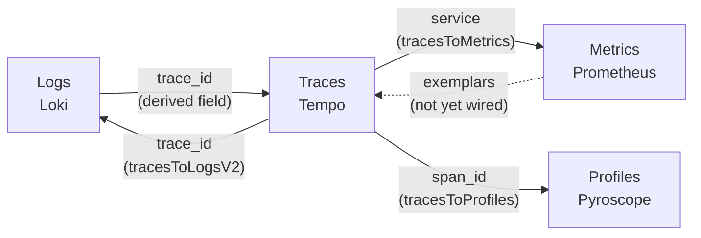

# Observability

Four signals, one vocabulary, eleven dashboards. This document is the map: what each signal is for,
how they link to each other, and which dashboard to open when.

The per-signal detail lives in [Logging.md](Logging.md), [Metrics.md](Metrics.md),
[Tracing.md](Tracing.md) and [Profiling.md](Profiling.md).

---

## 1. What each signal is actually for

The four overlap enough that it is worth being precise about which question each one answers:

| Signal | Answers | Cost | Retention here |
| --- | --- | --- | --- |
| **Metrics** | *Is something wrong, and how wrong?* Aggregate, cheap, alertable. | Per series | 24h (Prometheus), 30d (VictoriaMetrics) |
| **Logs** | *What happened to this one request?* Exact, high volume. | Per line | 7d |
| **Traces** | *Where did the time go, across services?* | Per span | 7d |
| **Profiles** | *Which lines of code burned the CPU / held the lock?* | Per sample | 7d |

The progression during an incident is the point:

```
alert fires ──> metrics say WHICH service and HOW BAD
            ──> traces say WHERE the time went
            ──> logs say WHAT happened to a specific request
            ──> profiles say WHICH CODE was responsible
```

Each step narrows the search. Skipping straight to logs is what makes an investigation take an hour.

## 2. One vocabulary

Every signal is labelled with the same three fields, and this is deliberate rather than incidental:

```
service        order-service | inventory-service
environment    local | dev | prod
version        1.0.0-SNAPSHOT
```

They come from a single source — `ServiceIdentity`, bound from `app.*` — and are applied by
`MetricsAutoConfiguration` (metrics), `CorrelationFilter` (logs), `OTEL_RESOURCE_ATTRIBUTES`
(traces) and `PYROSCOPE_LABELS` (profiles). Filtering all four by the same words is what makes
correlating them a matter of clicking rather than translating.

## 3. How the signals link

Every link is configured **in both directions**, because an identifier copied between browser tabs
is a workflow people abandon under pressure.



| From | To | Mechanism |
| --- | --- | --- |
| Log line | Trace | Loki derived field on `trace_id` → Tempo |
| Trace | Logs | `tracesToLogsV2`, filtered by trace id and service |
| Trace | Metrics | `tracesToMetrics`, request rate for the span's service |
| Trace | Profile | `tracesToProfiles`, via the span id Pyroscope's OTel extension attaches |

Two of those links only work because of decisions made earlier: the OTel agent writes `trace_id`
into the MDC under the *same key* the log schema already used, and the outbox stores `trace_id` and
`span_id` so the correlation survives the asynchronous hop.

---

## 4. The dashboards

Twelve, in folders. **Platform — Overview** is the landing page; the rest are what you open once
you know which thing is unhappy.

| Folder | Dashboard | Open it when |
| --- | --- | --- |
| overview | **Platform — Overview** | Always start here. Golden signals plus the health of the telemetry pipeline itself. |
| http | **HTTP — Requests** | Latency or errors are up and you need the endpoint. |
| jvm | **JVM — Memory, GC, Threads** | Memory climbing, GC pauses, thread growth. |
| data | **Databases — Connection Pools** | "The site is slow" — check pool saturation first. |
| data | **Redis — Cache and Commands** | Hit ratio collapsed, or the cache got slower than the database. |
| messaging | **Kafka — Producers, Consumers, Lag** | The asynchronous half is behind. |
| alerting | **Alerting — Firing, Routing and Delivery** | Something fired, or you want to know whether the notifications are actually being delivered. See [Alerting.md](Alerting.md). |
| grpc | **gRPC — Service Communication** | The internal synchronous hop: RED, the client/server duration gap, and the handler-pool saturation nothing else measures. See [Grpc.md](Grpc.md). |
| metrics | **Business — Order Flow** | Everything technical is green but orders are not settling. |
| security | **Vault — Secret Store** | Read the seal state first. A sealed Vault leaves every other dashboard here looking healthy for as long as the leases already held stay valid. See [Vault.md](Vault.md). |

There is deliberately **no logs dashboard**. Log exploration is an Explore-tab activity — you
arrive with a `trace_id` or a `correlation_id` and follow it — and a fixed panel of "recent errors"
is a worse version of that. The log-derived *alerts* are in
[Alerting.md](Alerting.md); the log-derived *counts* are on the Alerting dashboard.
| traces | **Traces — Span Metrics and Service Graph** | Which span is slow, and who calls whom. |
| profiles | **Profiles — CPU, Allocation, Locks** | You know the method is slow and need to know why. |

### They are generated, not hand-drawn

[`generate.py`](../infrastructure/grafana/dashboards/generate.py) is the source of truth; the JSON
beside it is output. That is not ceremony — it is what keeps eleven dashboards agreeing about what
`service` means, which colour an error is, and how a percentile is computed. Hand-maintained
dashboards drift, and a dashboard that disagrees with the one next to it is a dashboard nobody
trusts.

Grafana serves them read-only (`allowUiUpdates: false`) for the same reason: a dashboard saved in
someone's browser is lost the next time the volume is recreated.

### Conventions every panel follows

- **One unit per panel.** Never two y-axes. Requests-per-second and seconds on one axis makes both
  unreadable, and it is the single most common way a dashboard becomes decorative.
- **Status colours are reserved.** Red is error, orange is warning, green is healthy — on log levels,
  HTTP outcomes and settlement outcomes alike. Never reused as "series 4".
- **Percentiles come from buckets** via `histogram_quantile`, never from pre-computed percentiles,
  which cannot be aggregated across instances.
- **A healthy system renders zero, not "No data".** Queries that legitimately match nothing carry
  `or vector(0)`, because an empty panel is indistinguishable from a broken one at a glance.

---

## 5. Where to look, by symptom

| Symptom | First | Then |
| --- | --- | --- |
| Alert: `ServiceDown` | Overview → Services up | Logs, filtered to that service |
| Alert: `HighHttpErrorRate` | HTTP → responses by outcome | Traces → error spans → the log line |
| "The site is slow" | Databases → threads waiting | JVM → GC, then Traces → slowest spans |
| Orders stuck `PENDING` | Business → accepted vs settled | Kafka → consumer lag, outbox backlog |
| Memory climbing | JVM → heap by pool | Profiles → live heap |
| High CPU, no traffic increase | JVM → CPU | Profiles → CPU flame graph |
| One request was slow | Logs → its correlation id | its `trace_id` → the waterfall |
| Alert: `GrpcExecutorSaturated` | gRPC → executor pool | The one saturation with no other symptom: slow calls, idle CPU, healthy heap |
| gRPC slow but HTTP flat | gRPC → client vs server duration | Gap large ⇒ the channel. Gap small ⇒ Traces → inside the handler |
| Alert: `GrpcCircuitBreakerOpen` | gRPC → status distribution | Consul catalog: are the instances passing and advertising `grpc-port`? |

---

## 6. Running it

```bash
./scripts/infra.sh up          # everything except the `search` profile
./scripts/infra.sh urls        # every endpoint, reflecting .env
./scripts/infra.sh up                        # agents are baked into the service images
```

| UI | Address |
| --- | --- |
| **Grafana** | <http://localhost:3000> |
| Prometheus | <http://localhost:9090> |
| VictoriaMetrics | <http://localhost:8428> |
| Jaeger | <http://localhost:16686> |
| Zipkin | <http://localhost:9411> |
| Pyroscope | <http://localhost:4040> |
| Alertmanager | <http://localhost:9093> |
| **Mailpit** (delivered alert email) | <http://localhost:8025> |

The heavy search stack (OpenSearch, Elasticsearch and their dashboards) is opt-in, because it needs
roughly 4 GB that a machine already running Oracle and Kafka does not have spare:

```bash
docker compose --profile search up -d
```

---

## 7. What is deliberately still missing

- **Exemplars.** A latency bucket that links to an example trace. The buckets and the traces both
  exist; wiring them through the Micrometer registry is a connection to add, not new machinery.
- **The edge is not observed.** Kong and Nginx produce neither metrics nor spans here, so every
  dashboard's view starts at the service. That needs the Kong OpenTelemetry and Prometheus plugins —
  a revision of step 06 rather than something to bolt on.
- **The edge is still not alerted on.** Kong and Nginx produce no metrics here, so no rule can
  watch them. That needs the scrape configuration a revision of step 06 would add.
- **The flame graphs are boring.** The business logic is deliberately trivial, so profiles are
  dominated by framework startup and idle poll loops. Step 17's failure-simulation endpoints are what
  give all four signals something worth looking at.
