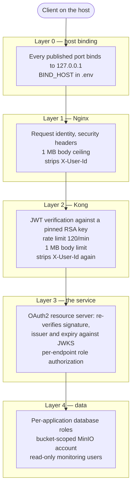

# Security

What protects what, why it is arranged that way, and — at equal length — what is deliberately not
protected and must change before this is exposed to anything.

> **Read §11 before reusing anything here.** This lab makes several simplifications that are correct
> for a loopback-bound teaching system and wrong everywhere else. A reader who mistakes a lab
> simplification for a production pattern has learned something worse than nothing.

---

## 1. What this system defends against

| Defended | Not defended |
| --- | --- |
| An unauthenticated caller reaching a business API | Anything on the host itself — every port binds to `127.0.0.1` and that *is* the outer boundary |
| A caller forging their own identity in a header | Network interception between components — everything is plaintext |
| A plain user performing an operator's action | A compromised container reaching another. One network, no policy |
| An oversized body reaching the application heap | Sustained abuse from an authenticated client beyond a per-route rate limit |
| A chaos endpoint being reachable in production | Data at rest — no volume is encrypted |
| An exporter's database credential being reusable for anything else | Credential theft from `.env`, which is a plain file |

The honest summary: **authentication and authorization are implemented properly; confidentiality and
network isolation are not implemented at all.** Every port binding to loopback is what makes that
survivable, and it is the assumption everything else rests on.

---

## 2. The layers



Each layer fails **closed** and independently. Kong decides only *whether* a caller is authenticated;
authorization is per endpoint and per role, which only the service knows. A service that trusted the
edge blindly would also be wide open the moment someone reached its port directly — and in this lab the
service ports are reachable on the host.

---

## 3. Identity

Keycloak, realm `observability`, imported from
[`infrastructure/keycloak/realm/observability-realm.json`](../infrastructure/keycloak/realm) on boot.

### Realm settings that matter

| Setting | Value | Consequence |
| --- | --- | --- |
| `accessTokenLifespan` | **300 s** | A token pasted into a terminal five minutes ago is expired |
| `ssoSessionIdleTimeout` | 1800 s | |
| `ssoSessionMaxLifespan` | 36000 s | |
| `bruteForceProtected` | `true` | Repeated failed logins lock the account temporarily |
| `registrationAllowed` | `false` | No self-service accounts |
| `sslRequired` | `external` | **The lab runs plain HTTP.** This is the first thing to raise before any exposure |

### Clients

| Client | Public | Flows | Purpose |
| --- | --- | --- | --- |
| `gateway` | No — confidential, holds a secret | Standard, direct access, service accounts | The confidential client, for machine-to-machine use |
| `swagger-ui` | **Yes** | Standard, **direct access (password grant)** | The documented token flow. `scripts/token.sh` uses it |
| `frontend` | Yes | Standard only — no password grant | A browser client, authorization-code flow |

**The password grant is a lab convenience, not a pattern.** A real client uses the authorization-code
flow so the password never reaches it. It is enabled here on a public client purely so a token is one
command away, and `frontend` exists to show the shape that would actually be deployed.

### Roles and users

| User | Password | Realm roles |
| --- | --- | --- |
| `alice` | `alice` | `USER` |
| `manager` | `manager` | `ADMIN`, `USER` |

Two realm roles only: `USER` and `ADMIN`. `KeycloakRealmRoleConverter` maps `realm_access.roles` to
Spring authorities, and `JwtAuthenticationConverter` sets the principal to `preferred_username` rather
than the opaque subject UUID — so both the `SecurityContext` and every log line read as the actual user.

### The signing key is pinned

The realm pins an RSA key provider named `rsa-lab-fixed`. Without it Keycloak generates a new key pair
on every fresh import, and the public half held by Kong would stop matching after any
`infra.sh destroy`. Pinning makes verification deterministic across rebuilds.

**Rotating that key is a two-file change**: the realm JSON and the `rsa_public_key` in
`infrastructure/kong/kong.yml`, in the same commit. Doing one without the other rejects every token.

---

## 4. Token verification, twice

Deliberate defence in depth. The two verifications are independent and use different mechanisms, so a
failure in either does not open the other.

| | Kong | The service |
| --- | --- | --- |
| Plugin / component | `jwt` plugin, enforcing, global | Spring Security OAuth2 resource server |
| Key source | **Static** RSA public key held on a consumer | **JWKS endpoint**, fetched lazily |
| Key selection | `key_claim_name: iss` | Standard JWKS `kid` |
| Claims verified | Signature, `exp` | Signature, `iss`, `exp`, `nbf` |
| Authorization | None — it does not know the endpoints | Per path, per method, per role |
| Token forwarded upstream | **Yes** | — |

The service's `JwtDecoder` is built with `withJwkSetUri`, not from the issuer URI. That fetches keys
lazily on the first token, so a service starts even when Keycloak is down; issuer-based construction
performs OIDC discovery eagerly and couples the service's boot to the identity provider's. The issuer
is still asserted on every token via `JwtValidators.createDefaultWithIssuer`, so the laziness costs no
security.

### The issuer trap

Keycloak derives the `iss` claim from the **`Host` header** of the request that minted the token. A
token fetched from `localhost:8080` therefore carries a different issuer than one fetched from
`keycloak:8080`, and exactly one of them is accepted.

The canonical form is the in-network one, `http://keycloak:8080/realms/observability`, because k6, both
services and every other container reach Keycloak that way. `scripts/token.sh` sends
`Host: keycloak:8080` so a token minted from the host is byte-identical in its issuer to one minted from
inside the network.

This produces a 401 that looks like an authorization bug and is a hostname. It is the single most
common auth failure in this stack — [Troubleshooting.md §4](Troubleshooting.md#4-authentication-and-authorization).

---

## 5. Authorization

Enforced in `ResourceServerAutoConfiguration`, in the shared library, so every service has the
identical policy rather than each reimplementing it slightly differently.

| Path | Method | Requires |
| --- | --- | --- |
| `/actuator/**` | any | **Nothing** |
| `/v3/api-docs/**`, `/swagger-ui/**`, `/swagger-ui.html` | any | **Nothing** |
| `/error` | any | Nothing |
| `/api/v1/chaos/**` | **every method** | `ADMIN` |
| `/api/**` | `DELETE` | `ADMIN` |
| `/api/**` | everything else | `USER` or `ADMIN` |
| anything else | any | Authenticated |

Three decisions worth stating:

- **`/actuator/**` is open, and not routed through the gateway.** Health and readiness feed the gateway
  and container probes, which present no token. It is not exposed publicly because Kong does not route
  it at all — operators reach it on the service port, which is bound to loopback. What is exposed is
  narrowed instead: see §8.
- **Chaos requires `ADMIN` on every method, not just `DELETE`.** A `POST` there can deadlock the
  process, so "destructive" is the wrong axis to reason about and the HTTP verb tells you nothing.
- **The chaos matcher is stated unconditionally**, even though the endpoints only exist under `local`
  and `dev`. A matcher for an unmapped path costs nothing; a profile-conditional *security rule* is how
  an endpoint ends up briefly unguarded when somebody changes which profiles register it.

### Session policy

`STATELESS`, and CSRF disabled. Those go together: there is no browser session and no server-side
state, every request re-presents its token, and that is precisely what makes CSRF inapplicable rather
than merely ignored.

---

## 6. The header trust model

**A client must never be able to assert its own identity.** `X-User-Id` is treated by the services as
the authenticated subject, so it is stripped **twice**, independently:

| Layer | Mechanism |
| --- | --- |
| Nginx | `proxy_set_header X-User-Id "";` — an empty value removes the header from the proxied request rather than forwarding a blank one |
| Kong | `request-transformer` plugin, `remove.headers: [X-User-Id]`, on both routed services |

Two independent removals mean a misconfiguration at either layer is not a privilege escalation.

What Nginx *mints* rather than trusts:

| Header | Source |
| --- | --- |
| `X-Request-Id` | `$request_id`, per request |
| `X-Correlation-Id` | The inbound `X-Correlation-Id` if present, otherwise `$request_id` |

Both are added with `always` so they are present on error responses too — which are exactly the
responses somebody will later quote in a support ticket. The upstream copies are hidden
(`proxy_hide_header`) so a client receives each header once: a duplicated header is ambiguous to parse
and invites a client to trust whichever one it happens to read.

### Response hardening

```
X-Content-Type-Options: nosniff
X-Frame-Options: DENY
Referrer-Policy: no-referrer
server_tokens off
```

Minimal and uncontroversial. A JSON API is not a document site, so there is no framing or sniffing use
case to preserve.

---

## 7. gRPC

The Inventory Service's gRPC port binds `0.0.0.0:9082` inside the container and is published to
loopback for `grpcurl`.

**Publishing the port is not what protects it.** Every call is authenticated by
`GrpcAuthenticationServerInterceptor` using the *same* `JwtDecoder` the HTTP resource server uses. The
comment in `application.yml` called out loopback binding as the setting that stops being safe once
containerised — which is why the authentication exists rather than the binding being relied upon.

> The network is not the control.

The interceptor chain also carries correlation, metrics, logging and exception mapping, so an
unauthenticated call is refused with a proper `UNAUTHENTICATED` status and appears in the metrics like
any other outcome. [Grpc.md](Grpc.md) has the full chain.

---

## 8. What is exposed, and what is not

### Actuator

```yaml
management.endpoints.web.exposure.include: health,info,metrics,prometheus
```

Named endpoints, **never `*`**. Actuator exposes `heapdump`, `env` and `configprops` among others, and
any of those on an open port is a credential leak rather than an observability feature.

`health.show-details: when-authorized` under the default profiles, and `never` under `prod` — component
detail names internal hosts and dependency topology.

### Not routed through the gateway

`/actuator` is deliberately absent from `kong.yml`. Health detail, environment properties and metrics
describe internal topology and have no business being reachable from outside.

### Published ports, and the risk of each

Every one binds to `${BIND_HOST}`, `127.0.0.1`. Setting it to `0.0.0.0` changes the risk of each row
below from "a process on this machine" to "anything on the network".

| Port | Component | If exposed |
| --- | --- | --- |
| **8474** | **Toxiproxy control API** | **Unauthenticated, and able to break every dependency in the stack.** The single worst thing to expose here |
| 8001 / 8002 | Kong admin API and manager | Gateway policy is DB-less, so the admin API cannot persist a change — but it can still be read |
| 8081 / 8082 / 9082 | The service ports | Authenticated, but they bypass Kong's rate limiting |
| 8500 | Consul | **ACLs disabled, `default_policy = allow`** — full read and write of the registry and KV |
| 3000 | Grafana | **Anonymous viewing enabled** (`Viewer`). Editing needs the admin account |
| 9090 / 8428 | Prometheus / VictoriaMetrics | Unauthenticated read of every metric |
| 9093 | Alertmanager | Unauthenticated; silences can be created |
| 8080 | Keycloak | The admin console, with a bootstrap admin credential from `.env` |
| 5432 / 1521 / 6379 / 9000 | Datastores | Credentialled, with lab passwords |
| 8090 / 9001 / 16686 / 9411 / 4040 / 8025 / 8099 | UIs and sinks | Unauthenticated read |

---

## 9. Credentials

### Where they live

| Location | Contains | Tracked |
| --- | --- | --- |
| `docker/compose/.env` | Every credential the stack uses | **No** — git-ignored |
| `docker/compose/.env.example` | The same keys with obvious placeholder values | Yes, and must never contain a real credential |
| `infrastructure/kong/kong.yml` | A **public** key only | Yes |
| `infrastructure/keycloak/realm/*.json` | Lab user passwords, the pinned key pair | Yes — lab-only, and the reason the realm must not be reused |
| `infrastructure/redis/redis.conf` | **No password.** It arrives as a command argument | Yes |
| `infrastructure/alertmanager/alertmanager.yml` | Recipients and the webhook URL | Yes |

The Redis split is the pattern worth copying: the config file in the repository keeps the *policy*
(`maxmemory`, eviction, persistence) and the environment keeps the *secret*. CLI arguments override the
file, so `--requirepass` from the environment wins without the file ever holding it.

Alertmanager is the counter-example, and deliberately: it does **not** expand environment variables in
its configuration file, so a value set in `.env` would be silently ignored while looking configured —
the worst of both. Its recipients therefore live in the file, which is also where a reviewer would look
for them.

### Least privilege, applied

| Account | Scope | Created by |
| --- | --- | --- |
| `order_user` | `orderdb` only | `infrastructure/postgres/init`, on an empty volume |
| `keycloak_user` | `keycloakdb` only | Same. Neither role can read the other's data |
| `inventory_user` | The Oracle PDB app schema | `infrastructure/oracle/init`, on an empty volume |
| `MONITOR_DB_USER` | **Read-only**, PostgreSQL | Same init script |
| `ORACLE_MONITOR_USER` | **Read-only**, Oracle | Same |
| `MINIO_APP_USER` | The invoice bucket only | `minio-init`, every start |
| MinIO root | Never used by a service | — |

The monitoring accounts are separate on purpose: an exporter is a process holding a database password
that is then scraped over plain HTTP, so it gets the narrowest role that answers the question.

One engine hosting two databases with separate owning roles is a laptop compromise. A laptop cannot
afford an engine per consumer; role separation preserves the property that actually matters, which is
that neither can read the other's data.

---

## 10. Container and build hardening

| Control | Where |
| --- | --- |
| **Non-root**, fixed uid/gid `10001` | `docker/service/Dockerfile`. Fixed because the log directory is a volume shared with the shipping agents — a uid that changes between rebuilds leaves files the new container cannot write |
| **JRE, not JDK**, in the runtime stage | The compiler, javadoc and the whole toolchain are build-time concerns, and every one left in the final image is attack surface that cannot be used for anything legitimate at run time |
| Read-only config mounts | Every `infrastructure/` mount is `:ro` |
| Pinned image tags | `.env.example`, never `:latest` — a rebuild months from now behaves identically |
| No external build frontend | The Dockerfile deliberately omits a `# syntax=` directive, so a build resolves nothing from Docker Hub before reading its first instruction |
| Memory and CPU ceilings | `deploy.resources.limits` on every container |
| `-XX:+ExitOnOutOfMemoryError` | A fast exit and a restart, rather than a JVM limping in a state nobody can reason about |
| Bounded request bodies | 1 MB at Nginx *and* at Kong |
| Bounded page size | `max-page-size: 100` — without it, `size=1000000` is one request that loads the table into memory |

Consul is configured with `enable_script_checks = false` and `enable_local_script_checks = false`.
Script checks let a registering service ask the agent to execute a command — that is remote code
execution by design, so it stays off and services use HTTP and TTL checks instead.

---

## 11. The chaos endpoints

Fourteen endpoints under `/api/v1/chaos` that deliberately leak memory, spike CPU, deadlock threads and
poison messages. They are guarded **three independent ways**:

1. **Profile.** `ChaosAutoConfiguration` registers them only under `local` and `dev`. Under `prod` they
   are not mapped at all.
2. **Configuration.** `app.chaos.enabled`, set to `false` explicitly in `application-prod.yml` — stated
   in the file an operator reads when asking "can this environment be made to deadlock itself
   remotely", rather than left to a Java annotation a refactor can widen by accident.
3. **Authorization.** `ADMIN` on every method, stated unconditionally in the security chain.

Plus bounded blast radius: every ceiling in `app.chaos.*` (`max-memory-leak-mb: 512`,
`max-cpu-threads: 8`, `max-latency: 30s`, `max-payload-kb: 65536`, …) bounds what a *caller* may ask
for, and every toggle expires on its own — `default-ttl: 5m`, `max-ttl: 30m`.

> A chaos endpoint reachable in production is not a learning tool. It is a vulnerability.

Verify the guard:

```bash
# with a USER token — 403
curl -s -o /dev/null -w '%{http_code}\n' -H "Authorization: Bearer $(./scripts/token.sh alice)" \
  http://localhost:8081/api/v1/chaos

# with an ADMIN token — 200
curl -s -o /dev/null -w '%{http_code}\n' -H "Authorization: Bearer $(./scripts/token.sh manager)" \
  http://localhost:8081/api/v1/chaos
```

Under `SERVICE_PROFILE=prod` the same ADMIN request returns 404, because the endpoint does not exist.

---

## 12. What is deliberately not secured

Stated plainly, because a reader who copies this needs to know exactly which lines to fix.

| Gap | Why it is acceptable here | What it costs elsewhere |
| --- | --- | --- |
| **No TLS anywhere** | Every port binds to loopback; terminating TLS would encrypt a loopback hop and add certificate handling that obscures the gateway behaviour | Credentials, tokens and data in cleartext on the wire |
| **Plaintext between services** | Same | No mutual authentication; any container can impersonate any other |
| **One flat network** | Four tier networks were collapsed deliberately; the segmentation was already fictional once services ran on the host. See [Infrastructure.md §2](Infrastructure.md#2-network-topology) | Lateral movement is unconstrained |
| **Consul ACLs disabled**, `default_policy = allow` | A single-node loopback lab gains little, and ACLs would obscure the registration mechanics step 08 teaches | Anyone reaching :8500 owns discovery and configuration |
| **Toxiproxy API unauthenticated** | It is a fault-injection tool that must be trivially reachable to be used | Anyone reaching :8474 can break every dependency |
| **Grafana anonymous viewing** | Being asked to log in to look at a graph teaches nothing | Dashboards and metrics readable by anyone |
| **Credentials in a plain `.env`** | Obvious placeholders, git-ignored, safe only because of the loopback binding | No rotation, no audit, no scoping |
| **Password grant on a public client** | A token is one command away | The password reaches the client |
| **No data at rest encryption** | Docker volumes on a developer machine | Everything readable from the host filesystem |
| **No backups, no restore test** | Data is expendable | No recovery |
| **No audit log** | — | No record of who did what |
| **No rate limit beyond Kong's per-route counter** | `policy: local` on a single node | A cluster would need `policy: redis`, or each node allows the full quota |
| **`fault_tolerant: true` on the rate limiter** | An outage of the limiter must not become an outage of the API | A limiter failure silently removes the limit |

### The order to fix them in, if this were exposed

1. **TLS at Nginx**, HTTP→HTTPS redirect, and raise `sslRequired` from `external` in the realm.
2. **Delete the simulation tier entirely** — `docker-compose.simulation.yml` — or at minimum keep
   `BIND_HOST=127.0.0.1` for :8474. Point the datastore addresses in `.env` at the real service names.
3. **`SERVICE_PROFILE=prod`**, which removes the chaos endpoints, Swagger UI and caller-visible stack
   traces in one move.
4. **Rotate every credential** in `.env` and move them to a secret manager. They are placeholders and
   are documented as such.
5. **Enable Consul ACLs** with `default_policy = deny`, and issue per-service tokens.
6. **Grafana anonymous off**; real accounts, or SSO against the same Keycloak.
7. **Re-introduce network segmentation**, or replace it with a mesh that enforces mTLS and policy.
8. **Backups, and a restore actually performed once.**

---

## 13. Verifying the controls

These are the checks that prove each layer is doing its job. A control nobody has watched fail is an
assumption.

```bash
# No token at the edge → 401
curl -s -o /dev/null -w '%{http_code}\n' http://localhost/api/v1/orders

# USER token on a DELETE → 403
TOKEN=$(./scripts/token.sh alice)
curl -s -o /dev/null -w '%{http_code}\n' -X DELETE \
  -H "Authorization: Bearer $TOKEN" http://localhost/api/v1/orders/ORD-1

# ADMIN token on the same → not 403
TOKEN=$(./scripts/token.sh manager)
curl -s -o /dev/null -w '%{http_code}\n' -X DELETE \
  -H "Authorization: Bearer $TOKEN" http://localhost/api/v1/orders/ORD-1

# A forged identity header does not survive the edge —
# the response's subject is alice, not the header value
curl -s -H "Authorization: Bearer $(./scripts/token.sh alice)" \
     -H 'X-User-Id: root' http://localhost/api/v1/orders

# The service port enforces independently of the gateway → 401
curl -s -o /dev/null -w '%{http_code}\n' http://localhost:8081/api/v1/orders

# Actuator is not routed through the gateway → 404 from Nginx, 200 on the service port
curl -s -o /dev/null -w '%{http_code}\n' http://localhost/actuator/health
curl -s -o /dev/null -w '%{http_code}\n' http://localhost:8081/actuator/health

# The body ceiling holds
head -c 2000000 /dev/zero | tr '\0' 'a' > /tmp/big.txt
curl -s -o /dev/null -w '%{http_code}\n' -X POST --data-binary @/tmp/big.txt \
  -H "Authorization: Bearer $TOKEN" -H 'Content-Type: application/json' \
  http://localhost/api/v1/orders                      # 413

# The rate limiter is real
for i in $(seq 1 130); do
  curl -s -o /dev/null -w '%{http_code} ' -H "Authorization: Bearer $TOKEN" \
    http://localhost/api/v1/orders
done | tr ' ' '\n' | sort | uniq -c              # 429s appear past 120
```

The gRPC port needs a token too:

```bash
grpcurl -plaintext -H "authorization: Bearer $TOKEN" \
  localhost:9082 inventory.v1.InventoryService/CheckStock    # without the header: UNAUTHENTICATED
```

---

## 14. Related documents

| Document | For |
| --- | --- |
| [Keycloak.md](Keycloak.md) | The realm, clients, roles, users and the JWT flow in full |
| [Grpc.md](Grpc.md) | The interceptor chain, including authentication |
| [Deployment.md](Deployment.md) | The configuration surface, and what must change before exposure |
| [Infrastructure.md](Infrastructure.md) | Network topology, and what the single network gave up |
| [Troubleshooting.md](Troubleshooting.md) | Diagnosing 401s and 403s |
| [FailureSimulation.md](FailureSimulation.md) | What the chaos endpoints actually do |
