# Sequence Diagrams

Every interaction in this system that is worth drawing, with what to notice under each.

> **Why a separate document.** [Architecture.md §7](Architecture.md#7-end-to-end-business-flow) has one
> diagram: the happy path, at the altitude where it explains the design. These are the working
> versions — transaction phases, event listener ordering, failure branches, and the paths that only
> exist because something went wrong.
>
> Where a diagram and the code disagree, the code is right and this document is a bug.

---

## Contents

| # | Flow | Teaches |
| --- | --- | --- |
| 1 | [Minting a token](#1-minting-a-token) | Why the issuer is an in-network address |
| 2 | [Creating an order](#2-creating-an-order) | The outbox, and transaction phase ordering |
| 3 | [The express reservation race](#3-the-express-reservation-race) | An optimisation that cannot lose |
| 4 | [Settlement through Kafka](#4-settlement-through-kafka) | The asynchronous half, and idempotency |
| 5 | [Reading an order](#5-reading-an-order) | Cache-aside, and after-commit eviction |
| 6 | [Checking availability — gRPC vs REST](#6-checking-availability--grpc-versus-rest) | Why one round trip beat twenty-five |
| 7 | [The invoice](#7-the-invoice) | Signed URLs, and why a missing object is not an error |
| 8 | [Cancel and delete](#8-cancel-and-delete) | Where authorization actually bites |
| 9 | [Retry and dead letter](#9-retry-and-dead-letter) | Why a business refusal is not retried |
| 10 | [Service startup](#10-service-startup) | What is coupled to what at boot, and what deliberately is not |
| 11 | [One request, four signals](#11-one-request-four-signals) | How the pillars link |
| 12 | [Fault injection](#12-fault-injection) | Why the exporters bypass the proxy |
| 13 | [The circuit breaker](#13-the-circuit-breaker) | State transitions, and the fallback |
| 14 | [An alert, end to end](#14-an-alert-end-to-end) | Rule → routing → inbox |
| 15 | [Log shipping](#15-log-shipping) | Three pipelines, one source |

---

## 1. Minting a token

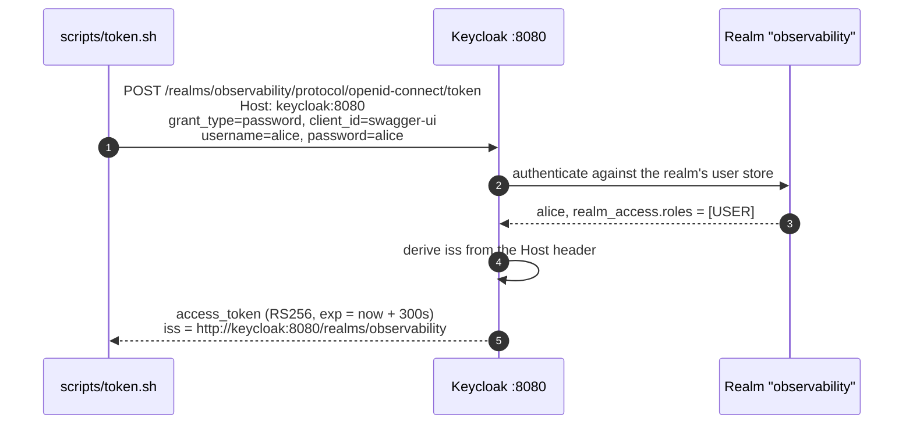

**What to notice.**

- Step 4 is the whole reason `token.sh` exists. Keycloak derives `iss` from the **`Host` header** of
  the request that minted the token, so a hand-written `curl` against `localhost:8080` produces a token
  with a different issuer — which Kong then rejects as unknown. The script sends
  `Host: keycloak:8080` so a token minted from the host is byte-identical to one minted inside the
  network.
- `exp` is 300 seconds. A token from five minutes ago is expired, and both Kong and the services check.
- The password grant is a lab convenience. `frontend` exists in the realm to show the
  authorization-code shape that would actually be deployed.

---

## 2. Creating an order

The single most instructive flow in the system. Note where the transaction boundary sits, and that
three different things happen at three different transaction phases.

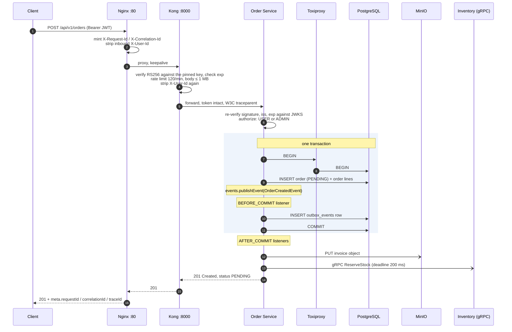

**What to notice.**

- **`BEFORE_COMMIT` for the outbox, `AFTER_COMMIT` for everything else, and the phases are the design.**
  The outbox row is written *inside* the same transaction as the order, so an order that rolls back
  never announces itself and an event that is recorded always has an order behind it. That is the only
  honest fix for the dual-write problem: there is no moment where one exists without the other.
- **The invoice upload and the express reservation are `AFTER_COMMIT`**, for the opposite reason. Both
  are network calls; holding a database connection across one is how a pool of ten becomes a pool of
  zero.
- **`201` means accepted, not fulfilled.** The order is `PENDING` until Inventory decides, which is what
  lets orders be taken while Inventory is down.
- **The token is verified twice**, at steps 4 and 6, by different mechanisms — a pinned static key at
  the edge, JWKS in the service. They fail closed independently.
- Every datastore hop goes through Toxiproxy. With no toxics it is a transparent relay.

---

## 3. The express reservation race

An optimisation that races the Kafka path. It is drawn separately because its correctness argument is
subtle: **it cannot lose.**

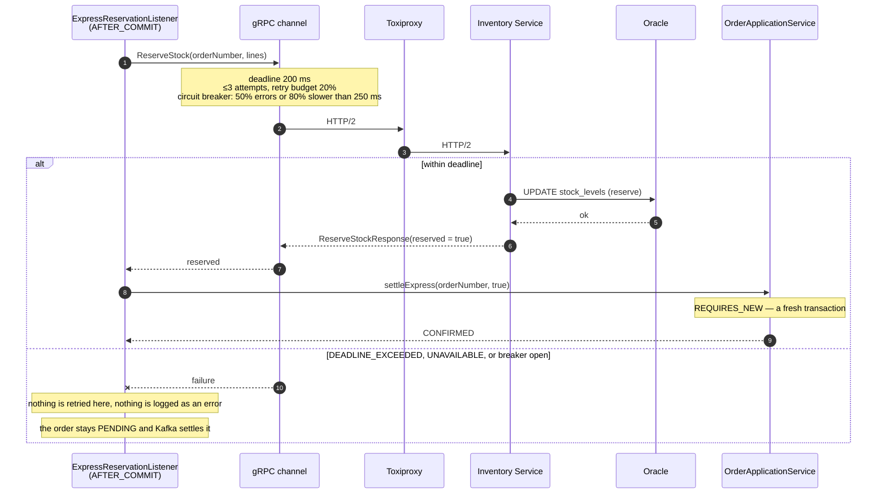

**What to notice.**

- **`REQUIRES_NEW` is load-bearing.** This listener runs inside the completion of the order's own
  transaction. A method with default propagation would join a transaction that is already committing,
  and the update would be silently discarded — one of the quieter ways Spring can lose a write.
- **A tight deadline on an optimisation is free.** 200 ms, and missing it costs nothing but a
  fall-through to the path the system had before gRPC existed. A tight deadline on the *only* path is
  an outage.
- Turning `express-reservation` off leaves every order `PENDING` until Kafka settles it, which is the
  invariant. The optimisation is additive, and provably so.

---

## 4. Settlement through Kafka

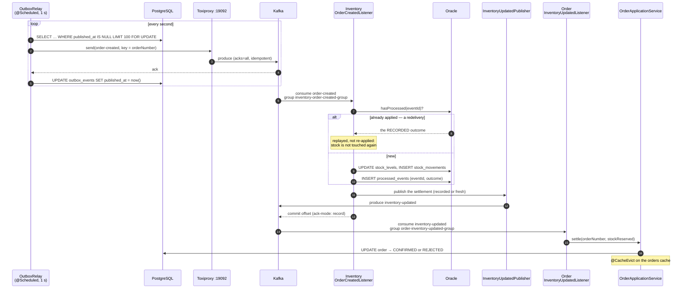

**What to notice.**

- **The relay is what makes the outbox work.** The transaction wrote a row; this loop turns rows into
  messages. `published_at IS NULL` is the definition of pending — there is no status column.
- **`ack-mode: record` with `enable-auto-commit: false`.** Offsets are committed by the container after
  a record is handled, not on a timer, so a crash cannot acknowledge unprocessed records and replays at
  most one.
- **`processed_events` is the idempotency ledger, and it stores the *outcome*, not just the fact.** At
  least-once delivery means a redelivery is normal, not exceptional — and settling twice would
  decrement stock twice. Storing the decision is what lets a redelivery **replay** the same answer
  rather than silently dropping it: the announcement is published either way, so a settlement lost
  between the two services is recoverable by redelivering the original event.
- **The announcement happens before the offset is committed.** The offset advances only once the Order
  Service has been told; a failure to publish throws, the record is redelivered, and the recorded
  decision is replayed rather than re-applied.
- **`settle` treats a redelivery as a no-op** and an impossible transition as a warning, not an error. An
  order cancelled while its reservation was in flight is the system behaving correctly; marking that
  span failed would put ordinary operation into the error rate every alert is built on.
- The key is the order number, so all events for one order land on one partition and are ordered.

---

## 5. Reading an order

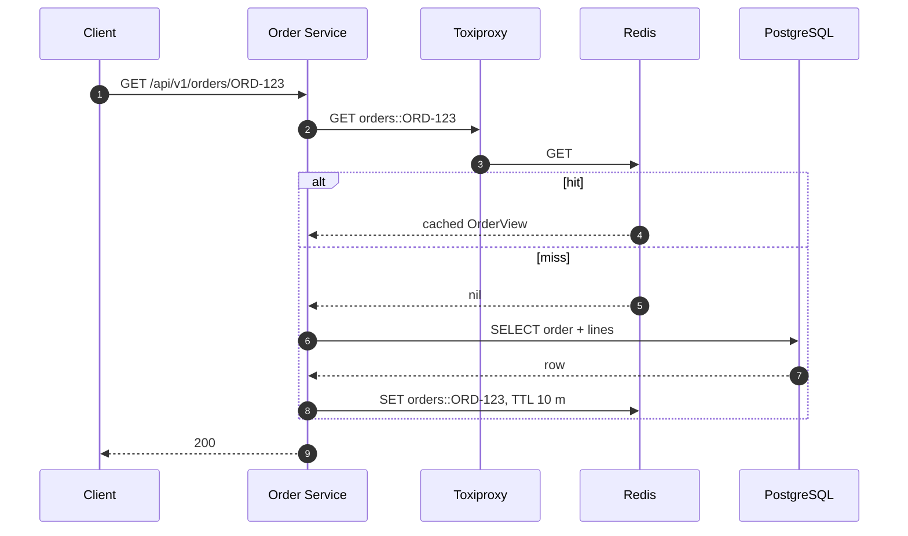

**What to notice.**

- Cache-aside, `@Cacheable(cacheNames = "orders", key = "#orderNumber")`. A single order is read far
  more often than it changes — a client polling for confirmation hits this repeatedly.
- **Every method that can change an order evicts the same key**, so the cache cannot serve a stale
  status. That includes `settle`, which is invoked from a Kafka listener rather than from a request.
- TTL is 10 minutes: short enough that a stale order is an annoyance rather than a correctness problem,
  long enough to absorb a read-heavy burst.
- Redis holds only derived state, which is why `FLUSHALL` is a safe way to reproduce a cold-cache
  profile.

---

## 6. Checking availability — gRPC versus REST

The same question asked two ways. This is the measured justification for introducing gRPC at all.

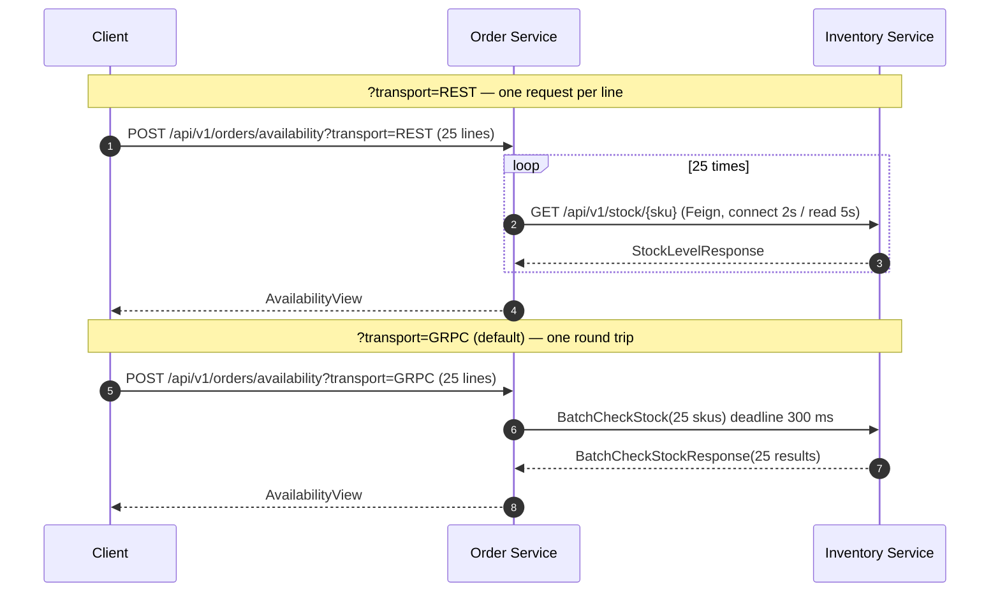

**What to notice.**

- **25 round trips became 1.** That is the whole argument, and it came from a real N+1 defect in the
  REST path rather than from a preference —
  [GRPC_ENHANCEMENT_ANALYSIS.md](../GRPC_ENHANCEMENT_ANALYSIS.md) has the measurement.
- The REST path is **retained deliberately**, and is still the honest one-request-per-SKU
  implementation, so the protocol comparison has two real sides on identical traffic.
- Neither reserves anything. This is advisory; the reservation happens in flow 3 or flow 4.
- Both resolve `inventory-service` through Consul. Feign balances through Spring Cloud LoadBalancer;
  the gRPC channel balances **itself**, because a channel multiplexes every RPC over one long-lived
  HTTP/2 connection and anything balancing at layer 4 would pin all traffic to one instance.

---

## 7. The invoice

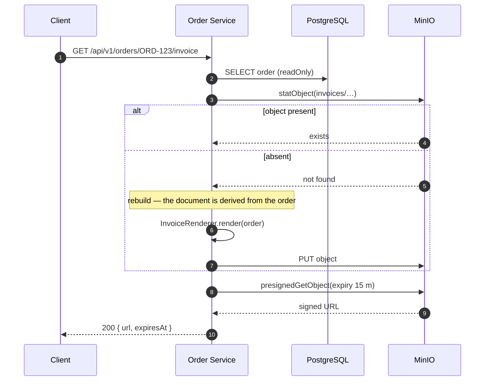

**What to notice.**

- **A missing object is not an error.** The archive is written after the order commits and that write
  can fail — the bucket may have been briefly unreachable — so treating absence as an error would turn
  a transient upload failure into a permanently broken invoice. The document is derived from the order,
  so regenerating it always produces the same answer for an unchanged order.
- **The link is not cached.** The URL embeds an expiry, so a cached one would eventually be served after
  it had stopped working.
- 15 minutes: long enough for a person to follow the link, short enough that a URL leaked through a log
  or a referrer header stops working quickly.
- The service authenticates to MinIO as the bucket-scoped `MINIO_APP_USER`, never as root.

---

## 8. Cancel and delete

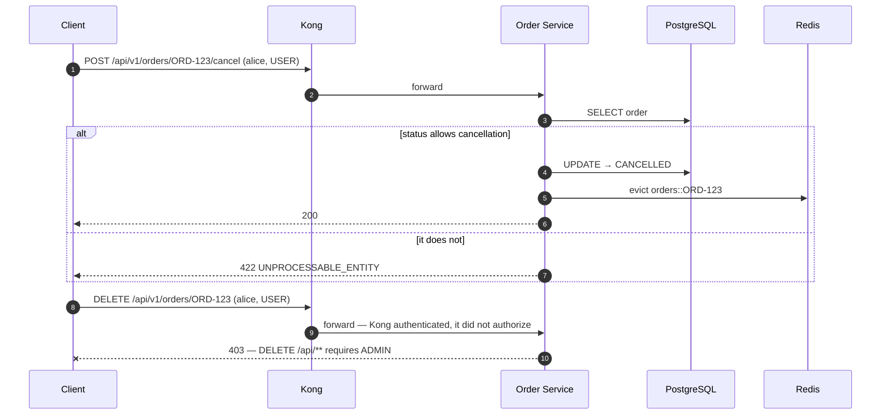

**What to notice.**

- **Kong forwarded the `DELETE`.** The edge decides only *whether* a caller is authenticated;
  authorization is per endpoint and per role, which only the service knows. This is the picture of
  defence in depth doing its job at the second layer, not the first.
- `422`, not `400` or `409`: the request was well-formed and understood, and the *state* refuses it.
  The full error mapping is [SystemDesign.md §6.1](SystemDesign.md#61-error-model-and-http-mapping).
- Deleting is refused while a reservation exists on the Inventory side too — the same principle, one
  service further in.

---

## 9. Retry and dead letter

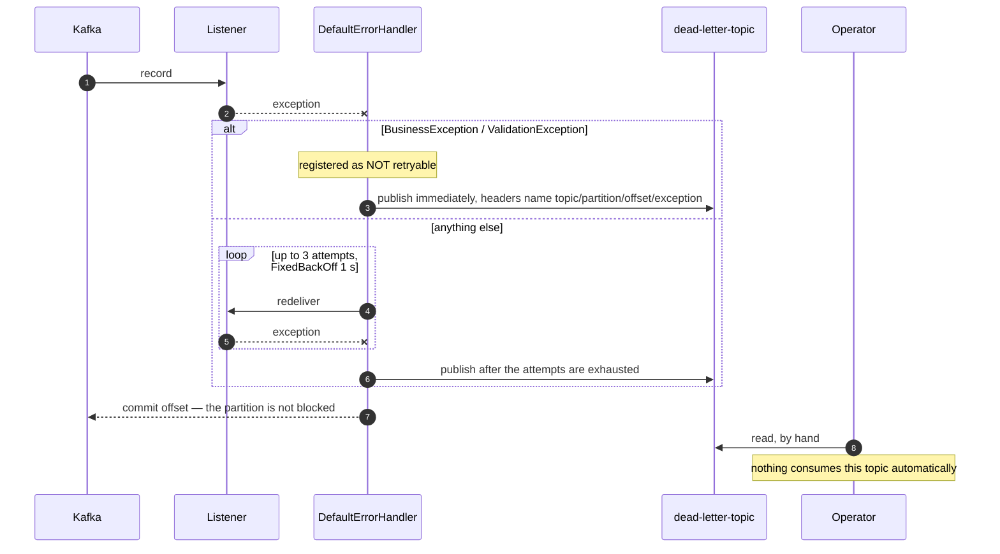

**What to notice.**

- **A business refusal is not retried.** A rule that refused once refuses identically every time;
  retrying "there is not enough stock" three times wastes the budget and blocks the partition behind it.
- **Nothing consumes the dead-letter topic.** A poison message replayed on a loop is how a dead-letter
  queue becomes an outage.
- **`retry-topic` exists in the broker and is not used.** Retries are in-process and blocking. The topic
  name is reserved; an empty partition list there is not a broken pipeline.
- **This path was broken and looked correct.** Until step 17, the recoverer used a template whose
  serializer could not handle the record, so the DLQ publication itself threw: the record was never
  dead-lettered, the consumer blocked its partition, and lag sat at 1 with nothing to explain it. A
  dead-letter path that has never been exercised is a dead-letter path that does not work —
  `./scripts/scenario.sh dead-letter` exercises it.

---

## 10. Service startup

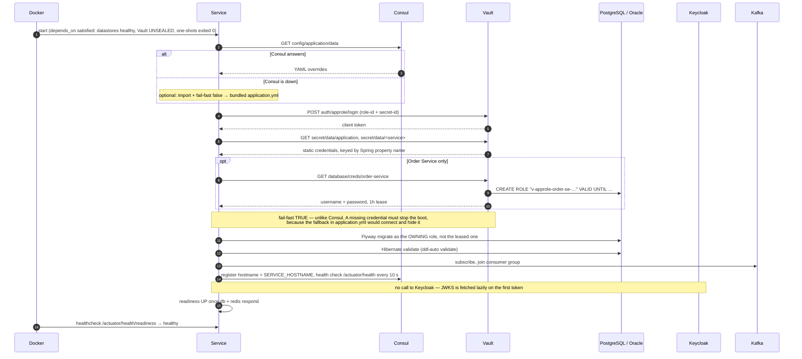

**What to notice.**

- **Two dependencies are deliberately absent.** The service does not wait for Keycloak
  (`withJwkSetUri` fetches keys lazily; issuer and expiry are still validated on every token) and does
  not wait for Consul (`optional:consul:` plus `fail-fast: false`). Neither laziness costs anything;
  both buy a service that starts when a neighbour is down.
- **`baseline-on-migrate: false`** — an existing database with no Flyway history is a situation that
  needs a human, not a silent assumption.
- **`ddl-auto: validate`** — drift between entities and migrations is a startup failure, not something
  discovered at the first query.
- **The registered hostname is `SERVICE_HOSTNAME`**, which for the Inventory Service defaults to
  `toxiproxy`. Consul health-checks that address, which is correct: if the path is broken the service is
  unreachable, whatever the process thinks. It is also how a service mesh behaves — an instance behind
  a sidecar advertises the sidecar.

---

## 11. One request, four signals

```mermaid
sequenceDiagram
    autonumber
    participant C as Client
    participant N as Nginx
    participant O as Order Service
    participant OT as OTel Collector
    participant PR as Prometheus
    participant LO as Loki
    participant TE as Tempo
    participant PY as Pyroscope

    C->>N: POST /api/v1/orders
    N->>N: access log (JSON) → stdout, with request_id + correlation_id
    N->>O: X-Request-Id, X-Correlation-Id, traceparent

    activate O
    O->>O: CorrelationFilter puts request_id / correlation_id in the MDC
    O->>O: OTel agent starts a server span; MDC gains trace_id / span_id
    O->>O: log lines → /var/log/lab/order-service.json, carrying all four ids
    O->>O: Micrometer records http.server.requests with SLO buckets
    O-)PY: itimer / alloc / lock samples, labelled with the active span id
    O-)OT: OTLP span, attributes order_number, customer_id, currency, total
    deactivate O

    OT->>TE: traces (also Jaeger, Zipkin)
    PR->>O: scrape /actuator/prometheus every 10 s
    Note over LO: Promtail / Fluent Bit tail the JSON file
```

**What to notice.**

- **One vocabulary across four signals.** `trace_id`, `span_id`, `request_id`, `correlation_id`,
  `service`, `environment`. That is what makes metric → trace → log → profile a series of clicks rather
  than a search.
- **Business attributes are added by hand.** The agent's span knows the URL and the status code; it
  cannot know *which order* this was — which is exactly what someone searching a trace by order number
  needs. `Spans.attribute(…)` supplies it.
- **The Pyroscope OTel extension stamps the active span id onto profile labels.** That is what turns
  "this span was slow" into "and here is the flame graph of the CPU it burned".
- **Metrics and logs are not exported over OTLP** (`OTEL_METRICS_EXPORTER=none`,
  `OTEL_LOGS_EXPORTER=none`). Prometheus scrapes the metrics and the file pipeline carries the logs;
  exporting either here would double-count them.

---

## 12. Fault injection

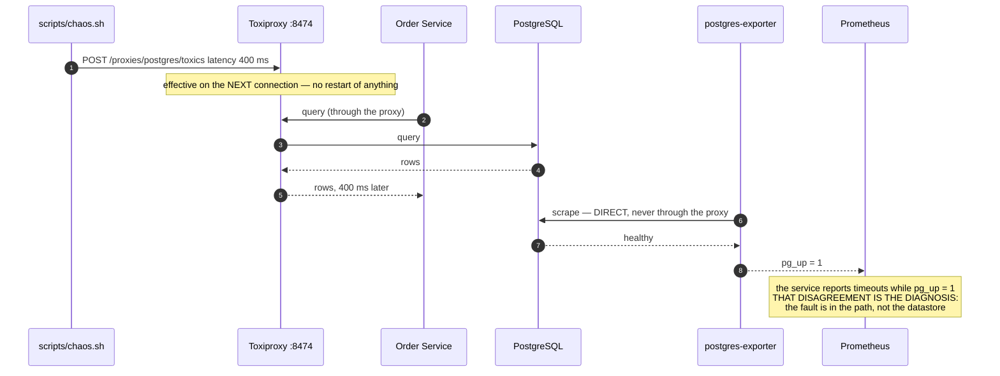

**What to notice.**

- **The exporters are deliberately not behind the proxy.** During a fault, `postgres-exporter` keeps
  reporting a healthy database while the service reports timeouts. Being able to read that disagreement
  is the skill the arrangement exists to teach.
- **Toxics take effect on the next connection.** A warm pool keeps using established sockets, so an
  injected fault can appear to do nothing for a few seconds.
- Toxics live in the Toxiproxy process. They survive everything except a restart of that container —
  which is why `chaos.sh list` belongs at the start of every investigation.
- In-process faults (`chaos.sh app …`) work differently: they are toggles inside the JVM, take effect on
  the next request, and expire on their own after `app.chaos.default-ttl`.

---

## 13. The circuit breaker

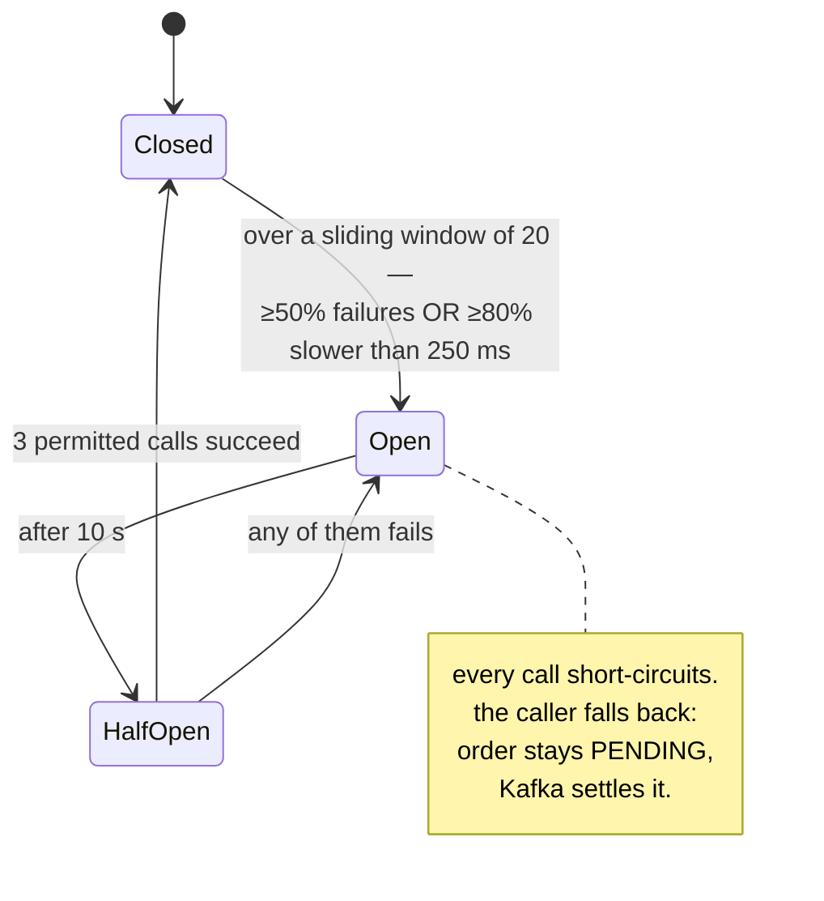

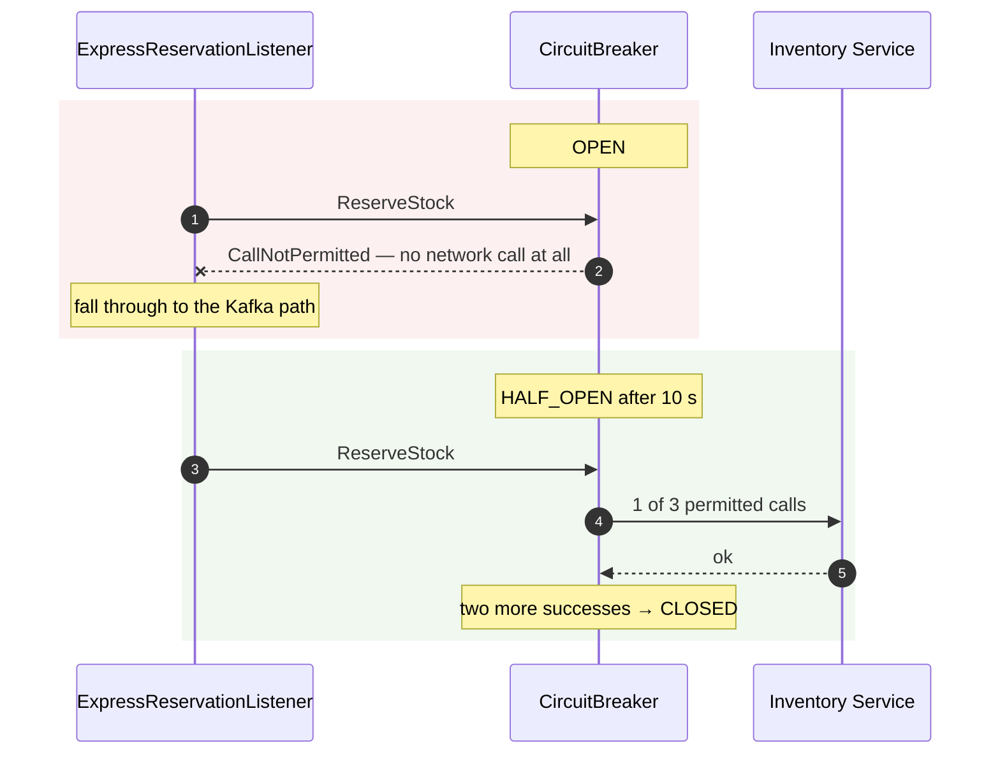

**What to notice.**

- **It trips on slowness as well as errors.** A dependency answering every call in five seconds is as
  damaging as one returning errors, and a pure error-rate breaker never notices.
- **An open breaker is the mechanism working.** The action is to fix what it is protecting you from, not
  to raise the threshold.
- The fallback is not an error path — it is the system's ordinary behaviour with the optimisation
  removed.
- `GrpcCircuitBreakerOpen` fires after one minute in that state, as a warning.

---

## 14. An alert, end to end

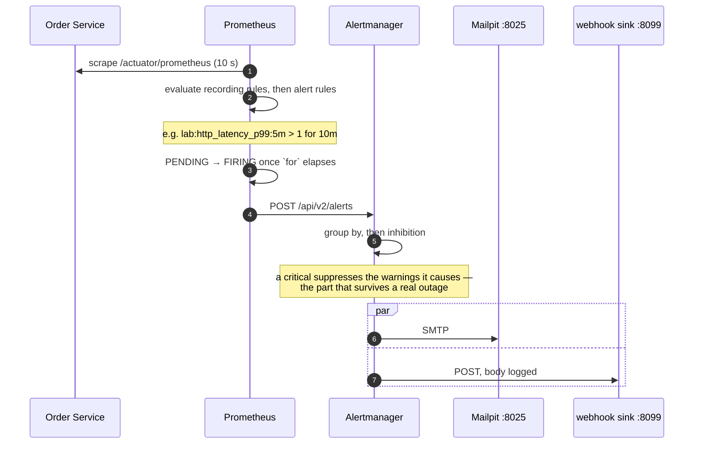

**What to notice.**

- **`for` is not cosmetic.** It is the difference between an alert and a graph. `HighHttpLatency` waits
  10 minutes; `PostgresDown` waits 1.
- **Inhibition is what makes an outage readable.** Without it, one root cause pages five times.
- **Both sinks exist so an alert can be *seen* arriving** rather than assumed. Mailpit captures SMTP in a
  browser; the echo container logs every webhook body.
- **An alert that has never fired is untested** — the expression, the label set, the routing and the
  receiver are four independent things that can each be wrong while looking correct.
  `./scripts/scenario.sh cpu-spike` drives the whole chain.

---

## 15. Log shipping

```mermaid
sequenceDiagram
    autonumber
    participant S as Service
    participant F as /var/log/lab/&lt;service&gt;.json<br/>(lab-logs volume)
    participant PT as Promtail
    participant FB as Fluent Bit
    participant FD as Fluentd
    participant LO as Loki
    participant OS as OpenSearch

    S->>F: Logback JSON, async appender
    S->>S: also to stdout under dev/prod, so `docker logs` shows the same records

    par three independent pipelines, one source
        PT->>F: tail
        PT->>LO: push, job="promtail"
    and
        FB->>F: tail
        FB->>LO: push, job="fluent-bit"
    and
        FD->>F: tail
        FD->>OS: index   (search profile only)
    end
```

**What to notice.**

- **Three shippers on one file, and each labels its records with the pipeline that carried them.**
  Without that label they would be indistinguishable, and comparing them would be impossible — which is
  the point of running all three.
- **Only low-cardinality fields become labels.** Loki indexes labels; promoting `order_number` would
  create a stream per order and take the database down with it. The rest stays in the log line.
- **A service run from the IDE ships nothing.** `run-service.sh` writes to `<repo>/logs`, not the
  `lab-logs` volume the agents mount. That is expected, and stated here because it looks like a broken
  pipeline.
- **The async appender drops rather than blocks.** A log pipeline that applies back-pressure to request
  threads has turned an observability component into an availability one.

---

## Related documents

| Document | For |
| --- | --- |
| [Architecture.md](Architecture.md) | The same flows at design altitude, plus the decision log |
| [InfrastructureDiagram.md](InfrastructureDiagram.md) | The static picture these flows move through |
| [Kafka.md](Kafka.md) | The outbox, idempotency, retry and DLQ in depth |
| [Grpc.md](Grpc.md) | The interceptor chain, deadlines and status taxonomy |
| [Redis.md](Redis.md) | What is cached, and what deliberately is not |
| [Observability.md](Observability.md) | How the four signals link, and where to look by symptom |
| [SystemDesign.md](SystemDesign.md) | Package design, error model, port allocation |
