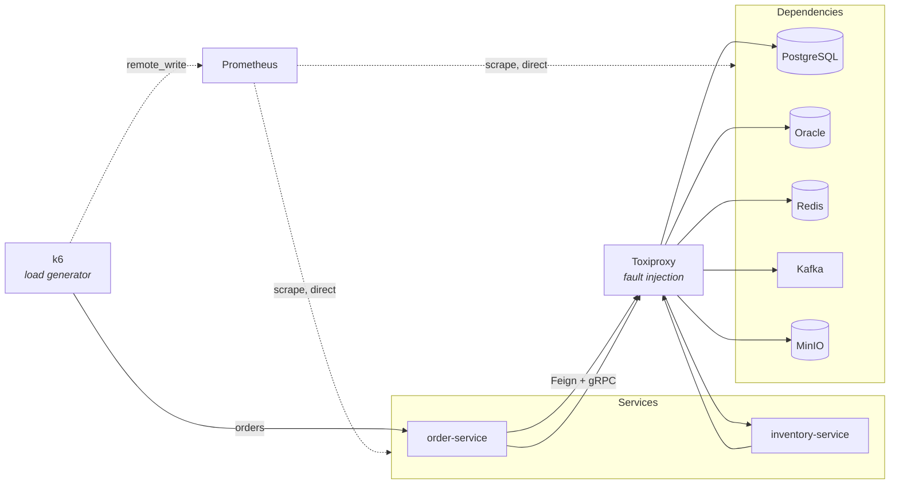

# Simulation — load, failure and latency

Everything in this lab runs inside one Docker network, `lab-net`. Nothing runs outside it: not the
services, not the load generator, not the fault proxy. That is what makes this document possible —
you cannot put a proxy in front of a dependency, cap a service's CPU, or measure a network hop
honestly when half the system is a process on a laptop.

Two tools, driven by two scripts:

```bash
./scripts/load.sh  load                   # sustained high load, from inside the network
./scripts/chaos.sh slow postgres 400      # +400ms on every response from PostgreSQL
./scripts/chaos.sh reset                  # undo everything
```

---

## 1. How it is wired



Two things in that diagram carry most of the value.

**Every application hop goes through Toxiproxy.** With no toxics configured — the default — it is a
transparent TCP relay costing well under a millisecond. The moment a toxic is added, that hop becomes
slow, lossy or dead, and no restart is involved. Including the service-to-service hop: the Inventory
Service registers itself in Consul as `toxiproxy`, so the Order Service's Feign client and its gRPC
channel both reach it through the proxy. That is not a hack — it is what a service mesh sidecar does.

**Prometheus does not.** Neither do the exporters. When a toxic is applied, `postgres-exporter` keeps
reporting a perfectly healthy database while the Order Service reports timeouts. That disagreement is
the diagnosis: the fault is in the path, not in the datastore. A monitoring stack sharing the
application's network path would be broken in the same way and could not tell you.

---

## 2. High load

```bash
./scripts/load.sh smoke      # 1 VU, 1 min — is the system wired up?
./scripts/load.sh load       # ramp to 10 orders/s and hold for 5 min
./scripts/load.sh stress     # climb to 100/s until something gives
./scripts/load.sh spike      # idle, then 80/s in ten seconds, then idle
./scripts/load.sh soak       # 5/s for two hours — finds what accumulates

RATE=20 DURATION=10m ./scripts/load.sh load
PEAK=300 ./scripts/load.sh stress
BASE_URL=http://nginx ./scripts/load.sh load      # through the gateway
```

### The numbers are measured, not chosen

This lab saturates at **around 10 orders/s**, and every default above is calibrated to that. Measured
on the shipped configuration:

| Offered rate | Result |
| --- | --- |
| 10/s | 0% errors, p95 **49 ms**, p99 134 ms — all thresholds pass |
| 20/s | **28% errors**, p95 5.7 s |
| 40/s | **53% errors**, ~130 requests queued on the connection pool |

Every failure is the same one: `order-db-pool - Connection is not available, request timed out after
3000ms (total=10, active=10, idle=0, waiting=134)`.

That ceiling is a **deliberate property of the lab**, not a defect. The Order Service runs with a
10-connection Hikari pool and a 1.5-CPU limit (`ORDER_SERVICE_CPUS` in `.env`) precisely so that
saturation, queueing and pool exhaustion are reachable in ninety seconds on a laptop. Raise either and
the symptoms this lab exists to show stop happening — which is a legitimate experiment, as long as you
re-measure and raise `RATE` in `load.js` with it.

Run `smoke` first. A failure diagnosed at 1 VU is a much shorter afternoon than the same failure
diagnosed at 100/s.

### Arrival rate, not virtual users

Every scenario holds an **arrival rate**. With a fixed number of virtual users, each waits for its
response before sending the next request — so a system that slows down receives less traffic and
hides its own degradation behind a throughput number that stays flat. A fixed arrival rate offers the
same load regardless of how the system copes, so saturation appears where it should: rising latency, a
rising VU count, and eventually `dropped_iterations`.

If `dropped_iterations` is non-zero, k6 could not sustain the offered load and the run measures k6.
Check it before believing anything else in the summary.

### What each signal should show under `load`

| Signal | Expectation at 10/s | What a deviation means |
| --- | --- | --- |
| **HTTP** | p95 < 500 ms (measured: ~49 ms), error rate 0% | Past the SLO buckets configured on `http.server.requests` |
| **JVM heap** | sawtooth, flat floor after each full GC | A rising floor is accumulation, not load |
| **GC** | pause time < 1% of wall clock | More means the heap limit is the bottleneck, not the CPU |
| **Tomcat threads** | busy well under max | At max, requests queue and latency grows with no CPU rise |
| **Hikari** | active < pool size, `pending` at 0 | Sustained `pending` is the database, not the service |
| **Kafka** | producer rate tracks order rate; lag near 0 | Growing lag means the consumer is slower than the producer |
| **Profiles** | flame graph dominated by JDBC and serialisation | Anything else dominating is the surprise worth reading |

The last row is the one people skip. Under load the flame graph reshapes, and the method that grows is
usually not the one anybody would have guessed.

### Results land in Grafana

k6 remote-writes every metric to the same Prometheus that scrapes the platform, so
`k6_http_req_duration` sits beside `jvm_gc_pause_seconds` and `hikaricp_connections_pending` on one
time axis. A load test whose results live in a separate tool leaves you eyeballing two clocks and
guessing at the offset.

---

## 3. Failure and latency

```bash
./scripts/chaos.sh list                       # proxies and active toxics
./scripts/chaos.sh slow <proxy> <ms> [jitter] # add latency
./scripts/chaos.sh down <proxy>               # refuse connections
./scripts/chaos.sh blackhole <proxy>          # accept, then never answer
./scripts/chaos.sh reset-peer <proxy> [ms]    # RST mid-flight
./scripts/chaos.sh throttle <proxy> <kb/s>    # cap bandwidth
./scripts/chaos.sh heal <proxy>               # undo one proxy
./scripts/chaos.sh reset                      # undo everything
```

Proxies: `postgres`, `oracle`, `redis`, `kafka`, `minio`, `inventory-http`, `inventory-grpc`.

Every fault here is a **network** fault, deliberately. A dependency that returns a clean error is easy
to simulate and is rarely how production breaks. Production breaks by getting slow, by half-answering,
and by accepting connections it never replies to.

### The four shapes of failure

| Shape | Command | Why it matters |
| --- | --- | --- |
| **Refused** | `down` | Fails fast and unambiguously. The *easy* one. |
| **Slow** | `slow` | Consumes resources on both sides. Worse than an outage. |
| **Black hole** | `blackhole` | A TCP health check still passes. Only a caller with a timeout ever finds out. |
| **Reset** | `reset-peer` | The request may already have been processed — where retries get dangerous. |

---

## 4. Scenarios

Each states what **every signal should show**. If the observed behaviour differs, that is a gap in the
observability or the resilience configuration, not a mistake in the scenario. Writing the expectation
down first is the entire point.

Scenarios specific to the gRPC hop — deadline propagation, status-code mapping, streaming failures —
are in [GRPC_FAILURE_SIMULATION.md](../GRPC_FAILURE_SIMULATION.md).

---

### Scenario 1 — The database gets slow

The most common production incident there is, and the one everything else is a variation on.

```bash
./scripts/load.sh load &
sleep 60
./scripts/chaos.sh slow postgres 400
```

| Signal | Expectation |
| --- | --- |
| **HTTP** | p95 climbs past 400 ms within one scrape interval. Error rate stays at 0 **at first** |
| **Hikari** | `hikaricp_connections_active` saturates, then `hikaricp_connections_pending` starts climbing — this is the leading indicator |
| **Then HTTP** | 500s appear once `connection-timeout: 3000` starts firing. Note the delay: the pool absorbs the fault before the user sees it |
| **Tomcat** | busy threads climb, because each is blocked on the pool rather than doing work |
| **Traces** | the JDBC span carries the entire added latency; the surrounding spans are unchanged. That is how you know it is the database and not the service |
| **Profiles** | `itimer` shows the blocked time. `cpu` would show almost nothing — which is precisely why this lab profiles with `itimer` |
| **postgres-exporter** | **completely healthy.** No slow queries, normal connection count. The fault is in the path |
| **Alerts** | `HighLatency` after its `for:` window, then `ServiceDown` only if the pool exhausts entirely |

**What it teaches.** The gap between "the dependency got slow" and "users saw an error" is the
connection pool, and its `pending` metric is the earliest honest warning you get. By the time the
error rate moves, the incident is several minutes old.

The exporter staying green is the other half. Two sources disagreeing is not noise — it localises the
fault to what they do *not* share, which here is the network path.

```bash
./scripts/chaos.sh heal postgres
```

Recovery is its own measurement. Latency should return to baseline within seconds; if it does not,
something queued up that is still draining.

---

### Scenario 2 — Redis disappears

```bash
./scripts/chaos.sh down redis
```

| Signal | Expectation |
| --- | --- |
| **HTTP** | latency **rises** — every read now reaches PostgreSQL. Errors stay at 0 |
| **Cache** | hit ratio collapses to 0 |
| **Database** | query rate jumps by the former cache hit rate. This is the moment the cache's real value becomes a number |
| **Health** | `/actuator/health/readiness` goes DOWN — `redis` is in the readiness group |
| **Kong** | takes the instance out of rotation on the readiness check within ~15 s |
| **Alerts** | `RedisDown` from `redis-exporter`, which is **still connected** — again, the path is broken, not Redis |

**What it teaches.** A cache outage is a capacity incident, not an availability one — right up until
the origin cannot carry the uncached load, at which point it becomes both at once. Run this one under
`./scripts/load.sh load` to find out which side of that line your database sits on.

Also worth noticing: readiness going DOWN is a *choice*, made in `application.yml`. A degraded cache
arguably should not remove a service from rotation. The lab makes the choice visible so you can argue
with it.

---

### Scenario 3 — The Inventory Service becomes slow

The service-to-service hop, and the scenario the gRPC resilience configuration exists for.

```bash
./scripts/chaos.sh slow inventory-grpc 800
```

800 ms, against a `batch-check-deadline` of 300 ms.

| Signal | Expectation |
| --- | --- |
| **gRPC client** | `DEADLINE_EXCEEDED` at 300 ms — the client gives up before the server finishes |
| **Retry** | **none.** `DEADLINE_EXCEEDED` is deliberately not in the retryable set; the budget is already spent |
| **Circuit breaker** | opens on the **slow-call** threshold (80% over 250 ms), not the error threshold. A pure error-rate breaker would never notice |
| **Fallback** | orders are still accepted, as `PENDING`, settled later over Kafka |
| **User impact** | **none on order acceptance.** This is the asynchronous design paying off |
| **Traces** | client span ~300 ms with an error; server span ~800 ms and *longer than its parent*. That inversion is the visual signature of a deadline breach |
| **Consul** | the HTTP health check also runs through this proxy — so a slow enough fault deregisters the instance, which is correct |

**What it teaches.** Slow is worse than down. A dead dependency fails in microseconds and the breaker
opens cleanly; a slow one holds a thread, a connection and a deadline timer on both sides of the call
for the duration.

Compare directly:

```bash
./scripts/chaos.sh heal inventory-grpc
./scripts/chaos.sh down inventory-grpc     # UNAVAILABLE immediately, breaker opens on errors
```

---

### Scenario 4 — The black hole

The nastiest failure in the set, and the reason `down` is not enough.

```bash
./scripts/chaos.sh blackhole oracle
```

The proxy accepts the TCP connection and never sends a byte back. No RST, no FIN, no error.

| Signal | Expectation |
| --- | --- |
| **TCP health check** | **passes.** The port is open. Anything checking reachability at layer 4 says everything is fine |
| **Inventory Service** | every query hangs until the JDBC timeout fires. Without one, it hangs forever |
| **Hikari** | pool drains to zero available and never recovers on its own |
| **Threads** | one leaked per in-flight request. `tomcat_threads_busy` climbs monotonically |
| **Heap** | climbs with the thread count — each blocked request holds its whole object graph |
| **The end state** | thread exhaustion. CPU, heap and the database all look *fine* individually, which is why this failure is the last one anybody diagnoses |

**What it teaches.** Every network call needs a timeout, and "the port is open" is not health. This is
the scenario that justifies `connection-timeout: 3000` and `validation-timeout: 2000` in
`application.yml` — settings that look like paranoid over-configuration until you watch this.

---

### Scenario 5 — The object store black-holes

Included because it is what this lab found the first time it was run against itself, and because the
result was **not** what the design predicted.

```bash
./scripts/chaos.sh blackhole minio
```

| Signal | Prediction | Observed |
| --- | --- | --- |
| Order acceptance | unaffected — an invoice is not required for an order to be accepted | **`504` after 15.0 s** |
| Where the 15 s comes from | — | Kong's `read_timeout`, not any timeout in the service |

**What it teaches.** The MinIO client has no configured timeout, so a black-holed object store holds
the request thread until something upstream gives up. The order is accepted asynchronously either
way; what fails is the caller's ability to find that out.

This is exactly the shape Scenario 4 warns about, found in a dependency nobody would have listed as
critical — and it is the argument for the whole exercise. `down minio` does **not** reproduce it: a
refused connection fails in microseconds and the request completes normally. Only the black hole
finds it, which is why `down` is not enough.

The fix is a connect and read timeout on the MinIO client, and it is deliberately not applied yet:
the finding is more useful to read than the patch.

---

### Scenario 6 — Kafka partition

```bash
./scripts/chaos.sh down kafka
```

| Signal | Expectation |
| --- | --- |
| **Order acceptance** | **unaffected.** The transactional outbox writes to PostgreSQL; the publisher is what fails |
| **Outbox** | undelivered rows accumulate. This table's depth is the queue-of-record during a broker outage |
| **Producer** | retries within `delivery.timeout.ms: 30000`, then gives up. The row stays undelivered and is retried by the poller |
| **Consumer** | the Inventory Service's group stops receiving; orders stay `PENDING` |
| **Lag** | `kafka_consumergroup_lag` cannot be read — `kafka-exporter` is scraping the broker directly, so this one *does* go down with it |
| **On heal** | the outbox drains, the consumer catches up, and every `PENDING` order settles. No orders lost |

**What it teaches.** This is what the outbox pattern is for, and the only way to be sure it works is
to break the broker while writing. Watch the outbox table depth rise and then drain: that curve is the
proof.

---

### Scenario 7 — Load and fault together

The two halves combined, which is the realistic case — faults do not politely wait for idle systems.

```bash
./scripts/load.sh stress &
sleep 180
./scripts/chaos.sh slow postgres 200      # only 200ms
```

200 ms of added latency is nothing on an idle system and is enough to collapse a saturated one. The
pool is already fully used; adding latency to each checkout multiplies the queue rather than adding
to it.

The measured saturation table at the top of this page is the evidence: the pool has ten connections
and reaches ~130 queued requests at 40/s *with no fault at all*. Two hundred milliseconds on top of
that is not a perturbation, it is a multiplier.

Expect the failure to arrive far faster and far less gracefully than in Scenario 1. That
non-linearity — a small fault under load producing an outsized effect — is the single most important
thing on this page, and it is the reason a fault test on an idle system is not evidence of anything.

---

## 5. Faults without Toxiproxy

Some things are easier at the container level. All of them are still inside the network.

```bash
docker stop lab-inventory-service          # clean shutdown: graceful drain, deregistration
docker kill lab-inventory-service          # SIGKILL: no drain, stale Consul entry until TTL
docker pause lab-inventory-service         # frozen: the process exists and answers nothing
docker restart lab-order-service           # cold start under load — watch the JIT warm up
```

`pause` deserves attention. It is a black hole with a process attached: the container is running, the
port is open, and nothing is scheduled. It reproduces a stop-the-world GC pause or an over-committed
host more faithfully than any proxy can.

Scaling is also available, and is the one that tests client-side load balancing:

```bash
docker compose --project-directory docker/compose up -d --scale inventory-service=3
```

Note what has to change for that to work: `container_name` must be removed from the service, since
three containers cannot share one name. Both instances register in Consul under the same service id,
and the Order Service's gRPC channel should balance across them — which is worth verifying, because a
gRPC channel multiplexes every RPC over one HTTP/2 connection and anything balancing at layer 4 pins
all traffic to one instance.

Resource limits are set in `.env` and are deliberately tight:

```bash
ORDER_SERVICE_MEMORY=384M ./scripts/infra.sh up    # watch it OOM under load
```

---

## 6. The other half

Everything on this page is injected from **outside** the process — a proxy in the network path, a
signal to a container, a limit on a cgroup. That boundary is not an accident: a fault injected from
outside needs no application code, cannot be left switched on in production, and behaves identically
whatever the service is written in.

Some failures cannot be produced that way. A memory leak, a CPU spike, a lock-ordering deadlock, a
forced exception at a chosen point, a poisoned message — each is a thing the process must do to
itself. Those are in **[FailureSimulation.md](FailureSimulation.md)**, thirteen scenarios in the same
four-part form — plus two more for the secret store, which fail on a longer fuse than either level here, driven by the same `chaos.sh` plus a scenario runner:

```bash
./scripts/scenario.sh list                     # every in-process scenario
./scripts/scenario.sh memory-leak              # inject, hold, heal, report
./scripts/scenario.sh db-exhaustion --under-load
```

`./scripts/chaos.sh reset` clears **both** levels — network toxics and in-process toggles, on both
services. There is one reset command and it always returns the system to clean.

Two of those thirteen scenarios found real defects on their first run: a dead-letter path that could
never publish, and an injected exception whose response shape differed from a real one. Both are
written up where they were found.

---

## 7. Rules for running experiments

**Write the expectation down first.** A scenario whose expected signals were decided after seeing the
output confirms nothing.

**One fault at a time.** Two simultaneous faults produce an interaction, and attributing an effect to
either becomes guesswork.

**Reset between runs.** `./scripts/chaos.sh reset`. A toxic left over from an earlier experiment turns
the next run into a regression hunt. `./scripts/load.sh` prints the active toxic count on start for
exactly this reason.

**Give it time to recover.** Connection pools, circuit breakers and consumer groups recover on their
own schedules, not on the command's. A breaker in the open state waits out its window before it
half-opens.

**A quiet alert is not a passing alert.** If a scenario should have fired something and did not, the
finding is the alert, not the scenario.

---

## Related

| Document | What it covers |
| --- | --- |
| [Infrastructure.md](Infrastructure.md) | The single network, what runs in it, and what the collapse from four networks gave up |
| [Alerting.md](Alerting.md) | Which alerts these scenarios should fire, and their thresholds |
| [Observability.md](Observability.md) | Reading the four signals together |
| [GRPC_FAILURE_SIMULATION.md](../GRPC_FAILURE_SIMULATION.md) | gRPC-specific scenarios: deadlines, status codes, streaming |
| [infrastructure/toxiproxy/README.md](../infrastructure/toxiproxy/README.md) | The proxies and the API behind `chaos.sh` |
| [infrastructure/k6/README.md](../infrastructure/k6/README.md) | The load scenarios and how to extend them |
