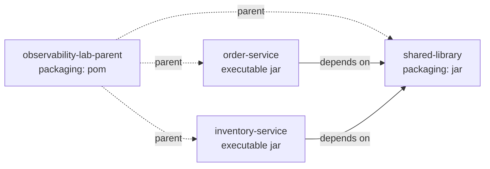

# System Design

Implementation-level design for the Enterprise Microservice Observability Lab: how the code is
organised, how it is configured, what the contracts look like, and what conventions everything must
follow.

The architectural view — components, communication and telemetry topology — is in
[Architecture.md](Architecture.md).

---

## 1. Build topology

The repository is a single Maven reactor. One parent POM owns the toolchain contract and all
dependency governance; modules declare *what* they need, never *which version*.



Reactor order follows from the dependency edges: `parent → shared-library → order-service,
inventory-service`.

### 1.1 What the parent POM owns

| Responsibility | Mechanism |
| --- | --- |
| Java language level | `java.version = 21`, driving `maven-compiler-plugin` inherited from `spring-boot-starter-parent`. Bytecode is always Java 21 regardless of the building JDK. |
| Toolchain floor | `maven-enforcer-plugin` requires Maven 3.9+ and JDK 21+, failing at `validate` with a message that names the fix. |
| Spring dependency versions | `spring-boot-starter-parent` 3.5.16 as parent. |
| Spring Cloud versions | `spring-cloud-dependencies` 2025.0.3 imported into `dependencyManagement`. |
| Internal module versions | `shared-library` pinned to `${project.version}` in `dependencyManagement`. |
| Coverage | `jacoco-maven-plugin`, `prepare-agent` at `initialize` and `report` at `verify`, wired once for every module. |

**Rule:** a `<version>` tag inside a module POM is a defect unless the artifact is genuinely
unmanaged by any BOM. Version drift between modules is the failure mode this prevents.

### 1.2 Module responsibilities

| Module | Packaging | Depends on | Responsibility |
| --- | --- | --- | --- |
| `shared-library` | jar | nothing internal | Cross-cutting platform code that must behave identically everywhere. No business rules, no service dependencies. |
| `order-service` | executable jar | `shared-library` | Ordering bounded context. PostgreSQL system of record. |
| `inventory-service` | executable jar | `shared-library` | Stock bounded context. Oracle system of record. |

The shared library must never depend on a service. If something in it needs to know about orders, it
does not belong there.

## 2. Package design

Each service follows a clean-architecture layering, DDD-lite. The base package is
`com.observability.lab.<service>`.

```
com.observability.lab.order
├── OrderServiceApplication.java
├── api/                 inbound adapters — controllers and validated request models
├── application/         use cases, transaction boundaries, read models, outbound ports
├── domain/              aggregates, entities, enums with rules, error codes
├── infrastructure/      outbound adapters — JPA, Feign, Kafka
└── config/              Spring configuration
```

### 2.1 The dependency rule

```
api  ──►  application  ──►  domain  ◄──  infrastructure
```

- `domain` holds the rules and depends on no framework beyond JPA mapping annotations. It is
  unit-tested with plain JUnit and no Spring context.
- `application` orchestrates the domain, owns the transaction boundary, and **declares the outbound
  ports it needs** — `OrderRepository` lives here, not in `domain`, because it is the application
  that decides which capabilities its use cases require. Spring types are permitted here.
- `infrastructure` implements those ports against real technology and is the only place Spring Data,
  Feign or Kafka appear.
- `api` translates HTTP into application calls and back. It never touches `infrastructure` directly.

An import from `domain` into `infrastructure` is always a defect. This is the boundary that keeps the
business logic testable and the technology swappable.

**On JPA annotations in `domain`.** A stricter reading would keep the aggregate free of every
annotation and map it to a separate persistence model. That buys one thing — the freedom to change
ORM — at the cost of a duplicate class and a mapper per aggregate. This project takes the DDD-lite
trade: `jakarta.persistence` is a specification, not a framework, and the annotations are metadata
that no domain logic reads. The rules that matter — invariants, transitions, totals — stay
framework-free and testable without a container.

### 2.2 Read models

A use case returns a read model record (`OrderView`), never a managed entity. Returning the entity
would expose lazy associations outside the transaction, tie the JSON contract to the table layout,
and put a mutable managed object into a distributed cache. The same record serves the HTTP response
and the cache; a second identical DTO in the API layer would be ceremony, and the trade accepted is
that changing the public contract means changing this type deliberately.

### 2.3 Shared library packages

| Package | Contents |
| --- | --- |
| `shared.api` | `ApiResponse<T>` envelope, `ApiError`, `FieldViolation`, `ResponseMeta`, `PageResponse<T>` |
| `shared.exception` | `ErrorCategory`, `ErrorCode`, the `BaseException` hierarchy, `ErrorResponseFactory` and the advice classes |
| `shared.correlation` | `ServiceIdentity`, correlation and request ids, `CorrelationFilter`, MDC lifecycle and `MdcTaskDecorator` |
| `shared.tracing` | `TraceParent` (W3C parsing) and `TraceContext` |
| `shared.logging` | `LogContext`, a scoped set of extra structured log fields |
| `shared.persistence` | `BaseEntity`, `AuditableEntity`, `CorrelationAuditorAware` |
| `shared.util` | `Validations` (programmatic Bean Validation), `Masking` (redaction for logs) |
| `shared.autoconfigure` | Spring Boot auto-configuration, so a service gets the behaviour by depending on the module |

**Dependency policy.** Every Spring dependency except `spring-boot-starter` is declared
`<optional>true</optional>`: available to compile and test this module, not propagated to consumers.
A library that forces JPA onto a service which only speaks HTTP is a library that dictates
architecture. Auto-configuration activates per capability, based on what it finds on the consuming
service's classpath.

Splitting conditions per capability is not optional detail. An earlier revision gated the whole
exception configuration on `jakarta.validation`; a service declaring only `spring-boot-starter-web`
then got *no* handler and fell back to the framework's whitelabel error body — no error code, no
trace id, no envelope, and nothing logged to say so. The core handler now depends only on Spring MVC,
and only the Bean Validation advice is conditional.

## 3. Naming conventions

| Element | Convention | Example |
| --- | --- | --- |
| Group id / base package | `com.observability.lab.<service>` | `com.observability.lab.order` |
| Maven artifact | kebab-case, matches the directory | `order-service` |
| REST path | `/api/v{n}/<plural-resource>`, kebab-case | `/api/v1/orders`, `/api/v1/stock-levels` |
| Kafka topic | kebab-case, past tense — topics carry facts | `order-created`, `inventory-updated` |
| Consumer group | `<service>-<topic>-group` | `inventory-order-created-group` |
| Consul service id | matches `spring.application.name` | `order-service` |
| Metric name | dot-separated, lowercase, unit-suffixed | `orders.created.total`, `order.processing.duration` |
| Metric tag | snake_case | `order_status`, `payment_method` |
| Log field | snake_case | `trace_id`, `correlation_id`, `user_id` |
| Config key | kebab-case under a service-owned root | `app.kafka.retry.max-attempts` |
| Error code | `<CTX>-<HTTP class><serial>` | `ORD-4001`, `INV-5003` |
| Database table | snake_case, plural | `orders`, `order_lines`, `stock_levels` |

## 4. Configuration strategy

Configuration is layered. Later layers override earlier ones.

```
application.yml               values identical in every environment
    ↓
application-{profile}.yml     values that vary by environment
    ↓
Consul KV                     values that change without a redeploy
    ↓
environment variables         credentials, endpoints, per-instance identity
```

| Profile | Intent | Key differences |
| --- | --- | --- |
| `local` | Developer workstation | `DEBUG` application logging, stack traces available on request |
| `dev` | Shared integration environment | `DEBUG` application logging, framework noise suppressed, no stack traces to callers |
| `prod` | Conservative baseline | `WARN` root, no banner, nothing internal exposed to callers |

`local` is the default profile (`spring.profiles.default`), so a service started with no arguments
behaves sensibly on a workstation.

**Rules**

- No credential is ever written to a file in this repository. Config files may reference a variable;
  they may not contain its value.
- Anything varying per environment goes in a profile file — not behind an `if` in Java.
- Anything a service must be able to change without a redeploy goes to Consul KV.

### 4.1 Service identity

Every service carries three values used by all four telemetry pillars:

| Key | Source | Used as |
| --- | --- | --- |
| `app.name` | `spring.application.name` | Log field `service`, metric tag `application`, span resource attribute `service.name`, Consul service id |
| `app.version` | `@project.version@`, filtered in at build time | Log field `version`, span resource attribute `service.version` — lets a regression be tied to a release |
| `app.environment` | Profile file | Log field `environment`, metric tag `env`, span resource attribute `deployment.environment` |

Because `app.version` is filtered from the Maven coordinates at build time, it cannot drift from the
artifact it describes.

### 4.2 Correlation model

| Field | Origin | Lifetime |
| --- | --- | --- |
| `trace_id` | W3C `traceparent`, created at the edge if absent | The whole distributed operation |
| `span_id` | Per operation | One unit of work |
| `request_id` | Generated per inbound HTTP request | One request |
| `correlation_id` | Supplied by the caller, or derived from `trace_id` | One business transaction, possibly many requests |
| `user_id` | JWT `sub` claim | The authenticated request |

All five are placed in the SLF4J MDC on entry, propagated over HTTP headers and Kafka record headers,
cleared on exit — including on the error path, since a leaked MDC on a pooled thread silently
mislabels the *next* request. `correlation_id` is echoed back to the caller so a user-reported
problem can be found without guessing.

## 5. Port allocation

One host, so ports must not collide. Ports are assigned once, here.

| Component | Host port | Notes |
| --- | --- | --- |
| Nginx | 80, 443 | Single network entry point |
| Kong proxy | 8000 | API traffic |
| Kong admin | 8001 | Administrative API |
| Kong manager | 8002 | Web UI |
| Keycloak | 8080 | OIDC endpoints, admin console |
| **Order Service** | **8081** | |
| **Inventory Service** | **8082** | |
| Kafka UI | 8090 | |
| VictoriaMetrics | 8428 | Long-term metric storage |
| Consul | 8500 | UI and HTTP API |
| OTel Collector — OTLP gRPC | 4317 | Sole telemetry ingress from services |
| OTel Collector — OTLP HTTP | 4318 | |
| OTel Collector — self metrics | 8888 | |
| OTel Collector — health | 13133 | |
| Grafana | 3000 | Metrics, logs, traces, profiles in one place |
| Loki | 3100 | |
| Tempo | 3200 | Query API; ingest arrives from the Collector internally |
| Pyroscope | 4040 | |
| Prometheus | 9090 | |
| Jaeger UI | 16686 | |
| Zipkin | 9411 | |
| OpenSearch | 9200 | |
| OpenSearch Dashboards | 5601 | |
| Elasticsearch | 9201 | Offset to avoid the OpenSearch collision |
| Kibana | 5602 | Offset to avoid the Dashboards collision |
| PostgreSQL | 5432 | Order Service |
| Oracle XE | 1521 | Inventory Service |
| Redis | 6379 | |
| MinIO API | 9000 | |
| MinIO console | 9001 | |
| Fluentd forward | 24224 | |
| Fluent Bit HTTP | 2020 | Monitoring endpoint |

Tempo, Jaeger and Zipkin accept traces from the Collector over the internal Docker network; only
their UIs and query APIs are published to the host.

## 6. API conventions

- **Versioned paths.** `/api/v1/...`. A breaking change means `v2`, never a redefinition of `v1`.
- **Plural resource nouns.** `/api/v1/orders`, `/api/v1/orders/{orderId}`.
- **Uniform envelope.** Every response — success or failure — is an `ApiResponse<T>` carrying `data`
  or `error`, plus metadata (`timestamp`, `requestId`, `correlationId`, `traceId`). A caller can
  always find the trace id of the request that failed them.
- **Validation at the edge.** Bean Validation on request models; violations become a structured
  field-level error list, never a stack trace.
- **Idempotency.** Unsafe operations accept an `Idempotency-Key` header; replays return the original
  result rather than acting twice.

### 6.1 Error model and HTTP mapping

An exception carries an `ErrorCode`, which carries an `ErrorCategory`. The category — not the
exception type — decides the status code and the log level, so adding a failure mode means declaring
a code, never editing the handler.

| Category | Exception | HTTP | Log level | Meaning |
| --- | --- | --- | --- | --- |
| `VALIDATION` | `ValidationException` | 400 | `WARN` | The request is malformed. The caller must change something. |
| `AUTHENTICATION` | `UnauthorizedException` | 401 | `WARN` | Missing or invalid token. |
| `AUTHORIZATION` | `ForbiddenException` | 403 | `WARN` | Valid token, insufficient role. |
| `NOT_FOUND` | `ResourceNotFoundException` | 404 | `WARN` | The addressed resource does not exist. |
| `CONFLICT` | `BusinessException` | 409 | `INFO` | The request conflicts with current state. |
| `BUSINESS_RULE` | `BusinessException` | 422 | `INFO` | A rule was correctly enforced — insufficient stock, illegal status transition. **Not** an error. |
| `INTEGRATION` | `IntegrationException.failed` | 502 | `ERROR` | A downstream dependency failed. |
| `TIMEOUT` | `IntegrationException.timedOut` | 504 | `ERROR` | A downstream dependency did not answer in time. |
| `TECHNICAL` | `TechnicalException` | 500 | `ERROR` | Anything unexpected. Always logged with a stack trace. |

`UnauthorizedException` and `ForbiddenException` are named to avoid colliding with Spring Security's
`AuthenticationException` and `AccessDeniedException`. Two types with one simple name in a codebase
guarantees somebody eventually imports the wrong one and catches nothing.

**Why the log level matters.** "Insufficient stock" is the system working. Logging it at `ERROR`
would train operators to ignore `ERROR`, and would make any alert built on error rate useless. The
level is a design decision, not a formatting one. Only a fault on our side of the boundary
(`INTEGRATION`, `TIMEOUT`, `TECHNICAL`) is logged with a stack trace.

**Server faults never return their message.** A connection string or internal hostname in an
exception message would otherwise become a 500 body and then a client-side log entry. The caller
receives the code, the generic message and the trace id; the detail stays in the logs.

Error codes are namespaced per context (`ORD-`, `INV-`, and `PLT-` for platform-level failures) so a
code identifies its owner unambiguously in a shared log store.

## 7. Resilience design

| Mechanism | Applied to | Design intent |
| --- | --- | --- |
| Connect / read timeouts | Every remote call | No call may block indefinitely. An unbounded wait is how one slow dependency takes down a whole service. |
| Retry with exponential backoff + jitter | Idempotent operations only | Jitter prevents retry storms synchronising into a thundering herd. |
| Circuit breaker | Feign clients | Stop hammering a dependency that is already failing; fail fast and shed load. |
| Bulkhead | Remote call pools | One saturated dependency cannot consume every thread. |
| Consumer retry topic | Kafka consumers | Delayed redelivery without blocking the partition. |
| Dead-letter topic | Kafka consumers | A poisoned message is parked for inspection instead of blocking the partition forever. |
| Idempotent consumers | Kafka consumers | At-least-once delivery makes redelivery normal; deduplication by event key makes it safe. |
| Graceful shutdown | Both services | In-flight requests drain and the current consumer batch finishes before exit. |

Every one of these emits metrics. A circuit breaker that opens silently is worse than none.

## 8. Data design

| Aspect | Order Service | Inventory Service |
| --- | --- | --- |
| Engine | PostgreSQL | Oracle XE |
| Owns | `orders`, `order_lines` | `stock_levels`, `stock_movements` |
| Access | Spring Data JPA | Spring Data JPA |
| Migration | Versioned scripts, applied at startup | Versioned scripts, applied at startup |
| Auditing | `created_at`, `created_by`, `updated_at`, `updated_by` via `AuditableEntity` | Same |

Cross-service reads happen through APIs or events. There is no shared schema and no cross-database
join — that constraint is what makes the services independently deployable.

**Caching.** Redis holds read-heavy projections with an explicit TTL and eviction policy, plus
distributed locks and rate-limit counters. Every cache has a defined invalidation trigger; a cache
without one is a bug with a delay fuse.

## 9. Testing strategy

| Level | Tools | Scope |
| --- | --- | --- |
| Unit | JUnit 5, AssertJ, Mockito | `domain` and `application`. No Spring context, milliseconds to run. |
| Slice | `@WebMvcTest`, `@DataJpaTest` | One adapter at a time against a minimal context. |
| Context smoke | `@SpringBootTest` | The context starts and service identity resolves from configuration. Present from step 01. |
| Integration | Testcontainers | Real PostgreSQL, Oracle, Kafka, Redis and MinIO. Introduced with the capabilities they cover. |

Coverage is measured by JaCoCo on every module (`target/site/jacoco/index.html`). Coverage is treated
as a signal about untested branches, not as a target to be gamed.

## 10. Versioning and release

- **Single version, lockstep.** Every module is `1.0.0-SNAPSHOT`, set once in the parent. Modules
  inherit it; none declare their own.
- **Semantic versioning** for the artifact; independent `v{n}` versioning for HTTP APIs.
- **The build tool is pinned** by the committed Maven Wrapper, so a laptop and a CI runner build with
  the same Maven.
- **Bytecode is pinned** to Java 21 regardless of which JDK runs the build, so artifacts are
  reproducible across contributor machines.

## 11. Non-functional targets

Lab-scale, chosen to be observable on one host rather than to be impressive.

| Property | Target |
| --- | --- |
| Order creation latency (p95, happy path) | < 300 ms end to end through the gateway |
| Feign call timeout | 2 s connect, 5 s read |
| Kafka end-to-end lag (steady state) | < 5 s from `order-created` to order confirmation |
| Service startup | < 30 s to healthy |
| Graceful shutdown | ≤ 30 s (Order), ≤ 45 s (Inventory, to finish the current batch) |
| Trace sampling | 100% in `local` and `dev` — the lab exists to be looked at |
| Metric scrape interval | 15 s |
| Log retention (Loki / OpenSearch) | 7 days |
| Metric retention (Prometheus / VictoriaMetrics) | 15 days / 90 days |

## 12. Current state

Step 01 delivers the build topology in section 1, the configuration strategy and service identity in
section 4, and the smoke-test level of section 9. Sections 2, 3, 5, 6, 7 and 8 describe the contracts
that the steps in the [roadmap](../README.md#implementation-roadmap) implement, and are recorded here
first so every step has one place to conform to rather than inventing conventions as it goes.
